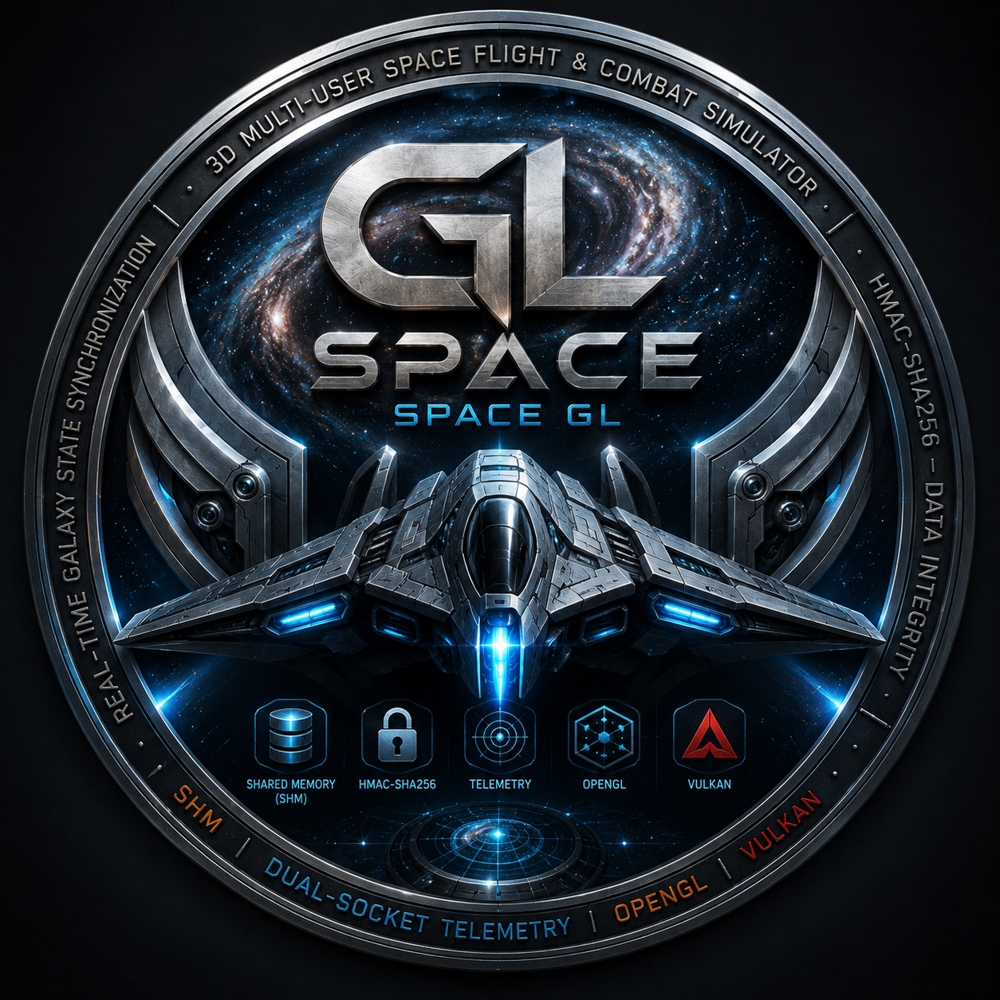
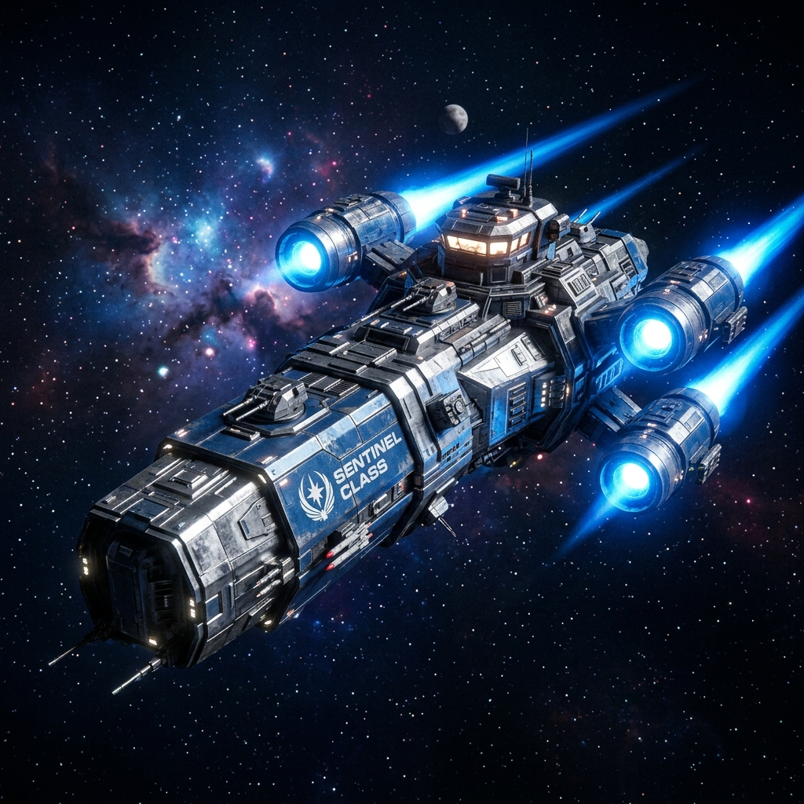
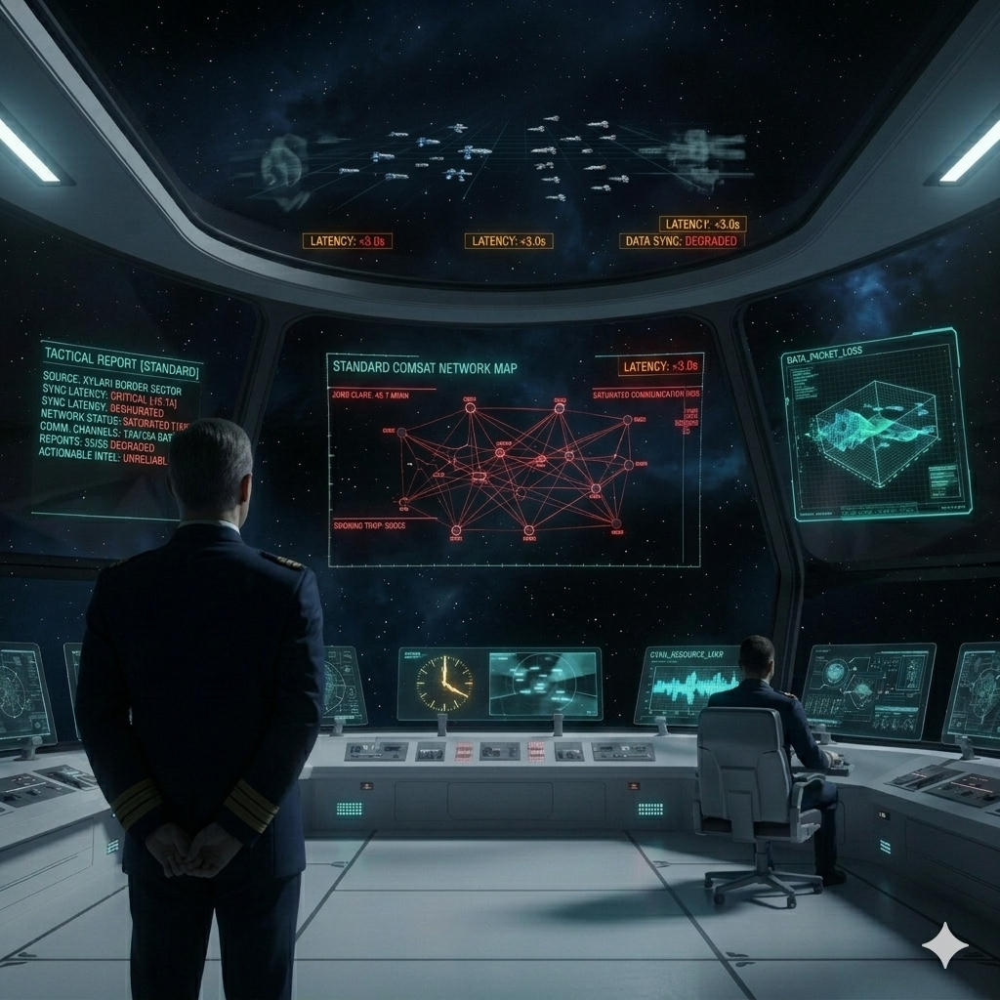
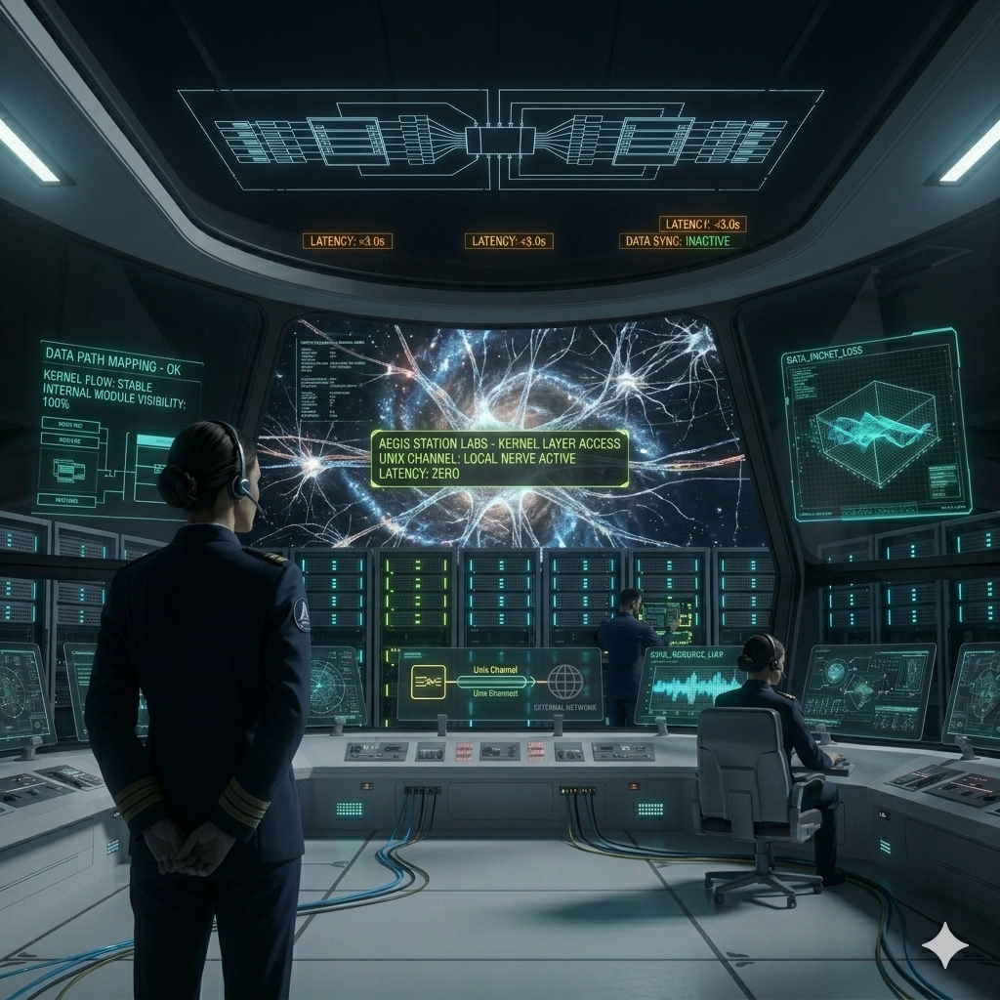
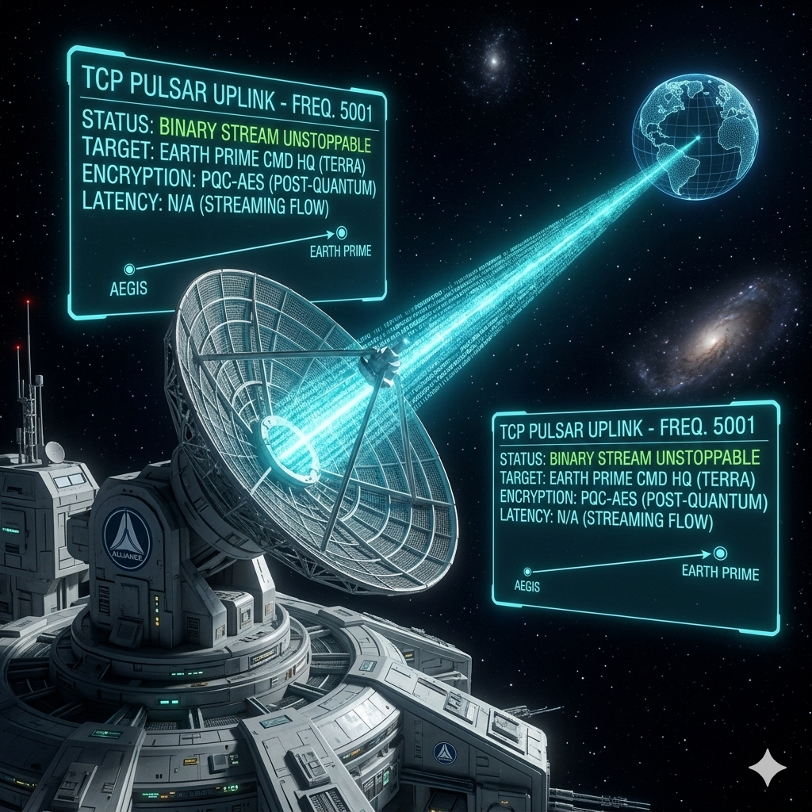
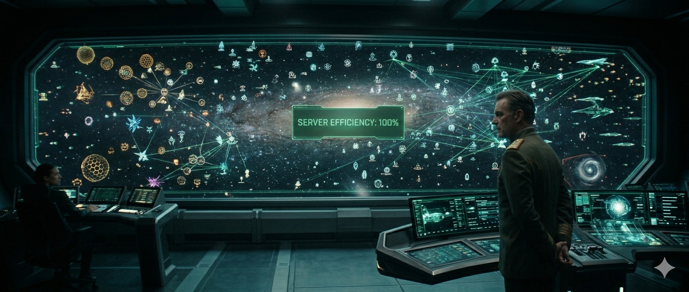
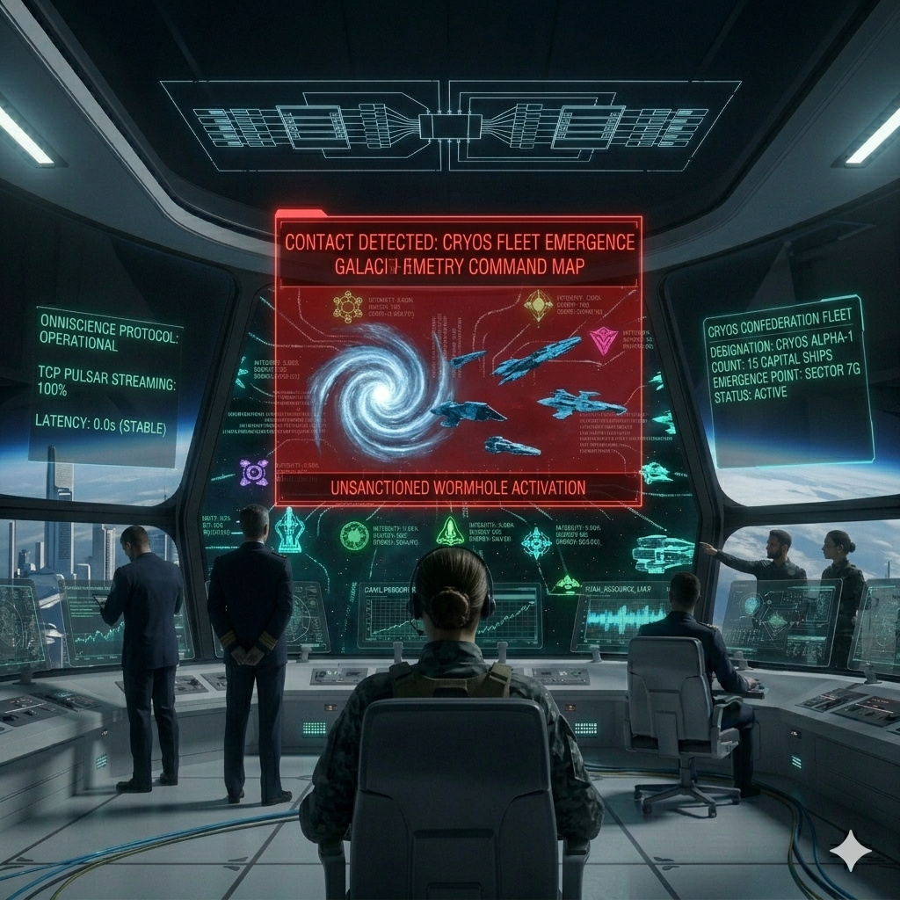
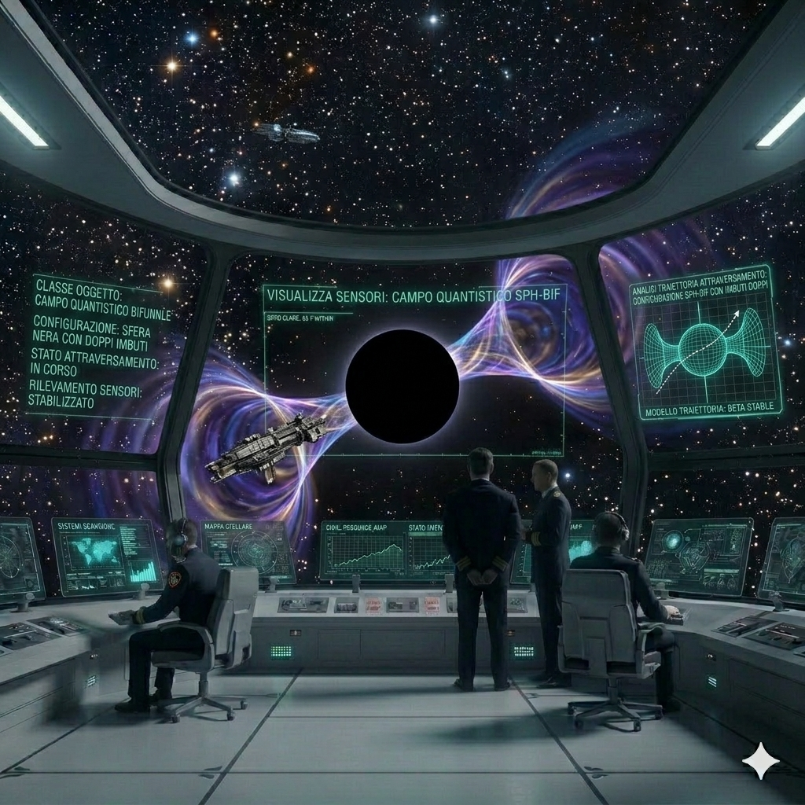
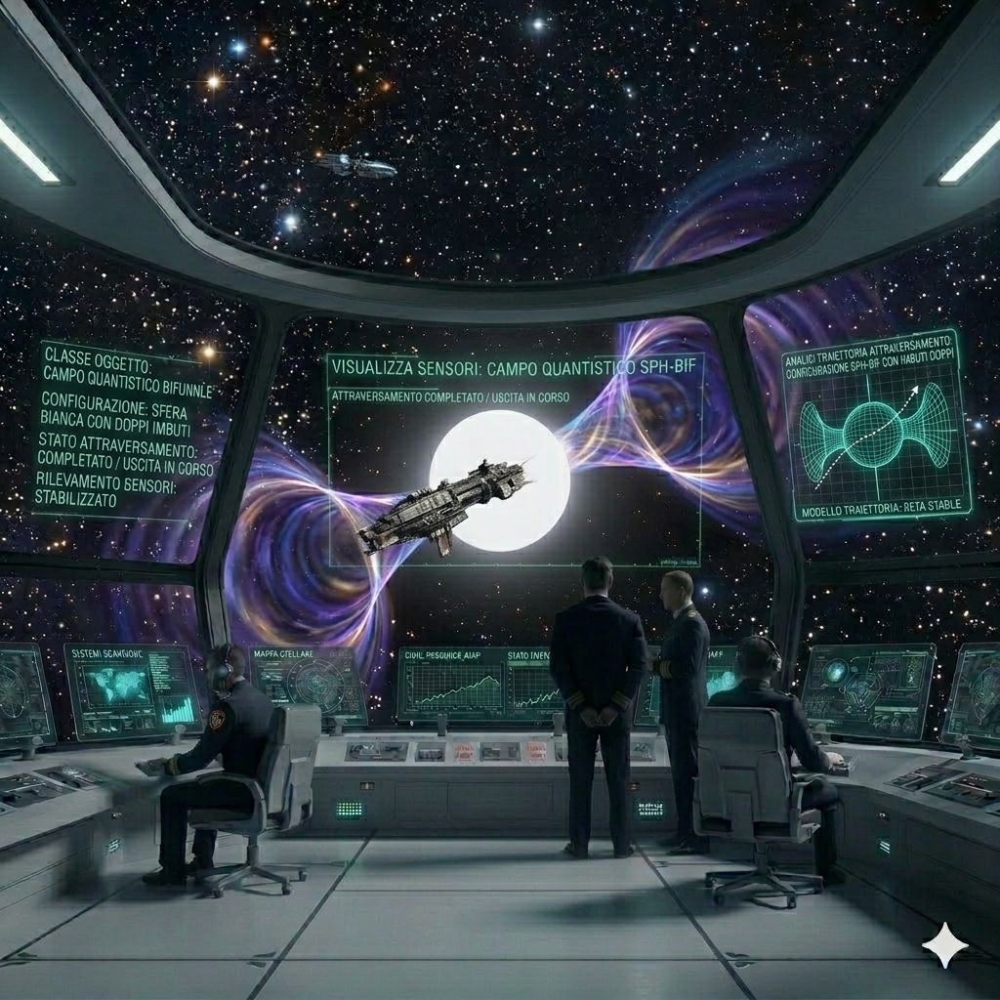

<div style="text-align: center; border-bottom: 1px solid #ccc; margin-bottom: 20px;">
<h1>Space GL: 3D Multi-User Client-Server Edition</h1>


# Un gioco di esplorazione e combattimento spaziale


<p>May 12, 2026</p>
</div>

Space GL è un simulatore di volo e combattimento spaziale 3D multi-utente ad alte prestazioni. Il motore include la sincronizzazione della galassia in tempo reale tramite memoria condivisa (SHM), l'integrità dei dati firmata crittograficamente (HMAC-SHA256), un sottosistema avanzato di telemetria dual-socket per la supervisione tattica e interfacce di visualizzazione versatili basate su OpenGL e Vulkan.
---

<table align="center">
  <tr>
    <td align="center">
      
    </td>
  </tr>
</table>

---

### Website: https://github.com/nicolataibi/spacegl
### Authors: Nicola Taibi, Supported by Google Gemini
### Copyright (C) 2026 Nicola Taibi - Licensed under GPL-3.0-or-later
#### **Licenza: CC BY 4.0 (Attribuzione)**
#### Tutte le immagini dei personaggi e le interfacce grafiche presenti in questa collezione sono rilasciate sotto la licenza [Creative Commons Attribution 4.0 International](https://creativecommons.org/licenses/by/4.0/deed.it). 
#### **Cosa puoi fare:** * Sei libero di condividere, copiare, distribuire e adattare il materiale per qualsiasi scopo, anche commerciale. 
#### **Condizioni:** * È necessario fornire i crediti appropriati citando **Nicola Taibi** e fornendo un link alla licenza.
#### *“Questa collezione presenta asset generati dall'intelligenza artificiale, curati e ideati tramite prompt da Nicola Taibi, generati da Gemini (Google IA)”*
**Persistent Galaxy Tactical Navigation & Combat Simulator**

**OpenGL GLFW Screenshots**

<table>
  <tr>
    <td></td>
    <td></td>
  </tr>
  <tr>
    <td></td>
    <td></td>
  </tr>
  <tr>
    <td></td>
    <td></td>
  </tr>
  <tr>
    <td></td>
    <td></td>
  </tr>
  <tr>
    <td></td>
    <td></td>
  </tr>
  <tr>
    <td></td>
    <td></td>
  </tr>
</table>

<table>
  <tr>
     <td align="center">
       <figure style="margin: 0;">
         
         <figcaption>
           <em><b>Fig. 1/a:</b> "Alliance-Class Sentinel Ship"</em>
         </figcaption>
       </figure>
     </td>
     <td align="center">
       <figure style="margin: 0;">
         
         <figcaption>
           <em><b>Fig. 1/b:</b> "Alliance-Class Sentinel Ship"</em>
         </figcaption>
       </figure>
     </td>
  </tr>
</table>

**Vulkan Screenshots**

<table>
<tr>
    <td></td>
    <td></td>
  </tr>
  <tr>
    <td></td>
    <td></td>
  </tr>
  <tr>
    <td></td>
    <td></td>
  </tr>
  <tr>
    <td></td>
    <td></td>
  </tr>
  <tr>
    <td></td>
    <td></td>
  </tr>
  <tr>
    <td></td>
    <td></td>
  </tr>
</table>

---
---

## 🌌 L'Alba dell'Avventura Digitale

**Negli anni in cui i computer occupavano intere stanze e gli schermi mostravano soltanto caratteri verdi su sfondi neri, nacque una forma di avventura che avrebbe cambiato per sempre  il modo di immaginare il videogioco.**

Non esistevano grafica 3D, texture o effetti sonori digitali: esistevano soltanto parole, numeri e immaginazione.

### 🛠 L'Architettura dell'Immaginazione
Tra università, laboratori militari e terminali collegati a giganteschi mainframe, programmatori e studenti iniziarono a creare i primi universi interattivi usando linguaggi come BASIC, FORTRAN, COBOL e assembly. 

> “Bastavano poche righe di codice per trasformare un terminale in un ponte di comando stellare, una galassia sconosciuta o una guerra interplanetaria.”

### 🛸 Simulazione e Comando Tattico
Fu in quell’epoca che apparvero giochi leggendari come Star Trek, simulazioni spaziali testuali dove il giocatore comandava un’astronave attraverso quadranti galattici popolati da nemici, basi stellari e anomalie cosmiche. Ogni comando veniva digitato manualmente: 

“NAV” • “PHASERS” • “SCAN”

Ogni errore poteva significare la distruzione della nave. Ogni scelta accendeva l’immaginazione più di qualsiasi immagine.

### 🔬 Esperimenti Pionieristici
Quei giochi non erano soltanto passatempo: erano esperimenti pionieristici di interazione uomo-macchina. In un’epoca senza internet moderno, senza motori grafici e senza memoria abbondante, gli sviluppatori riuscivano a costruire mondi interi con poche kilobyte di codice e una straordinaria inventiva.

### 🏛 Un Omaggio Moderno
Questo progetto nasce come omaggio a quell’era. Un ritorno ai tempi in cui il mistero dello spazio veniva evocato da caratteri ASCII, coordinate stellari e messaggi lampeggianti su terminali remoti. 

Un'esperienza client-server che recupera lo spirito dei giochi a riga di comando degli anni ’70: 

essenziali • freddi • tecnici… • e incredibilmente immersivi

**Perché prima della grafica fotorealistica, c’era l’immaginazione. E bastava un cursore lampeggiante per iniziare un viaggio tra le stelle.**

---
---

## 🚀 Highlights della Versione 3.1 (Rel. 2026.05.03 - Il Protocollo Onniscienza)

L'aggiornamento 3.1 introduce una rivoluzionaria architettura di telemetria, garantendo ai Comandanti una consapevolezza in tempo reale senza precedenti del teatro galattico:
*   **Sottosistema di Telemetria Avanzato**:
    *   **Architettura Dual-Socket**: Supporto simultaneo per **Unix Domain Sockets** (monitoraggio locale a bassissima latenza) e **TCP Sockets** (dashboarding remoto multi-server).
    *   **Server Streaming (Modello Push)**: Eliminato l'overhead del polling. Il server ora "spinge" i dati tattici ai client alla fine di ogni tick, garantendo una consapevolezza a latenza zero.
    *   **Copertura Totale dello Spettro**: Tutte le 88 categorie di entità galattiche sono ora instrumentate, dai vascelli standard ai frammenti esotici di Dyson e alle anomalie subspaziali.
*   **Client di Telemetria Tattica (`spacegl_telemetry`)**:
    *   Un nuovo strumento diagnostico ad alte prestazioni con interfaccia `ncurses` interattiva.
    *   Supporta il cambio dinamico di categoria e funzionalità di uplink remoto tramite `--tcp`.

---

# 🌌 SPACE GL: IL PROTOCOLLO ONNISCIENZA

## PARTE 1: IL SILENZIO DEGLI ABISSI (STORIA)

### Capitolo 1: L'Ombra nella Rete

<table>
<tr>
    <td></td>
  </tr>
</table>

Il ponte di comando dell'Ammiraglia Alliance era immerso nel silenzio, interrotto solo dal ronzio dei motori a curvatura. Il Grande Ammiraglio Hyperion Niklaus fissava le mappe galattiche: "I nostri rapporti arrivano con troppi secondi di ritardo. In una battaglia contro l'Egemone Xylari, tre secondi sono la differenza tra la gloria e detriti spaziali." Le comunicazioni standard erano sature. Serviva un nuovo modo per "sentire" la galassia senza intasare i canali tattici.

### Capitolo 2: Il Nervo Locale (Unix Socket)

<table>
<tr>
    <td></td>
  </tr>
</table>

Nei laboratori segreti della stazione di ricerca Aegis, i tecnici iniziarono a mappare i flussi di dati grezzi direttamente dal kernel del Server Galattico. Implementarono il "Canale Unix": un tunnel di dati ultra-veloce che scorreva silenzioso all'interno del sistema stesso. Non passava per la rete esterna; era un nervo scoperto che trasmetteva informazioni a latenza zero. Ora, ogni modulo interno del server poteva vedere l'intera galassia come se fosse una proiezione neurale.

### Capitolo 3: Il Pulsar TCP

<table>
<tr>
    <td></td>
  </tr>
</table>

"Dobbiamo andare oltre," ordinò Niklaus. "Voglio che il comando dell'Alleanza su Terra Prima veda ciò che vedo io, in tempo reale, attraverso migliaia di anni luce." Gli ingegneri aprirono il "Pulsar TCP", un uplink remoto sulla frequenza 5001. Il segnale, criptato con algoritmi PQC, iniziò a fluire attraverso lo spazio, trasportando lo stato vitale di ogni singola entità. Il monitoraggio remoto non era più un sogno, ma un flusso binario inarrestabile.

### Capitolo 4: Le 88 Sentinelle

<table>
<tr>
    <td></td>
  </tr>
</table>

Il sistema prese vita. Ottantotto categorie di oggetti vennero instrumentate. Non solo navi e stelle, ma anche frammenti di sfere di Dyson, cristalli del vuoto e anomalie temporali. Ogni entità iniziò a trasmettere la propria firma: integrità, energia, coordinate esatte. La galassia, un tempo buia e misteriosa, divenne un libro aperto. Il report di efficienza del server segnò il 100%: 88 su 88 categorie erano sotto scacco.

### Capitolo 5: Onniscienza Galattica

<table>
<tr>
    <td></td>
  </tr>
</table>

Mentre una flotta della Confederazione Cryos emergeva da un wormhole, il monitor di telemetria remota su Terra Prima si illuminò istantaneamente di rosso. "Contatto rilevato," annunciò l'operatore a migliaia di parsec di distanza. Grazie allo streaming dei server, l'Alleanza non era più cieca. L'era dell'incertezza era finita; l'era dell'onniscienza era appena iniziata.

---

## 🛠 SEZIONE TECNICA: ADVANCED TELEMETRY SUBSYSTEM

### Architettura di Streaming e Monitoraggio
Il sistema di telemetria di **Space GL** è un'infrastruttura di monitoraggio in tempo reale ad alte prestazioni progettata per fornire dati diagnostici e tattici senza interferire con il loop principale di gioco.

#### 📡 Canali di Comunicazione
1.  **Unix Domain Socket (`/tmp/spacegl_telemetry.sock`):** Ottimizzato per strumenti diagnostici locali. Utilizza la comunicazione inter-processo (IPC) per garantire latenza minima e bypassare lo stack di rete.
2.  **TCP Socket (Porta 5001):** Progettato per dashboard remote e monitoraggio multi-server. Supporta lo streaming binario compatto per minimizzare il consumo di banda.

#### 📊 Modello di Dati: Server Streaming
A differenza del polling tradizionale, il server utilizza un modello **Push**:
*   Il client si sottoscrive a una specifica categoria.
*   Il server spinge gli aggiornamenti al termine di ogni tick logico.
*   Gestione multithread dedicata tramite `epoll` per gestire fino a 32 client simultanei.

### 🔍 Categorie Monitorate (88/88)
Il sottosistema copre l'intero spettro delle entità galattiche:

| Categoria | Descrizione |
| :--- | :--- |
| **Astronomiche** | Stella, Pulsar, Quasar, Stella di Neutroni, Nana Bruna, Pianeta, Pianeta Errante, Planetesimo, Asteroide, Cometa, Disco Protoplanetario, Disco di Detriti, Disco di Accrescimento |
| **Nebulose** | Nebulosa, Nebulosa Diffusa, Nebulosa Alta Energia, Nebulosa Materia Oscura, Nebulosa Gravimetrica, Nebulosa Temporale, Filamento Interstellare, Bolla Interstellare, Globulo di Bok, Core di Ammasso |
| **Astrofisiche** | Buco Nero, Singolarità, Orizzonte Eventi, Onda Gravitazionale, Lente Gravitazionale, Tempesta Ionica, Tempesta di Plasma, Jet Relativistico, Gamma Ray Burst, Riconnessione Magnetica, Current Sheet, Onda d'Urto, Bow Shock Stellare, Kilonova |
| **Artificiali** | Base Stellare, Hub Commerciale, Mega Struttura, Anello Orbitale, Satellite, Mina, Piattaforma, Relitto, Frammento di Dyson, Reliquia Antica, Artefatto Alieno, Warp Gate |
| **Cosmologiche** | Vuoto Cosmico, Filamento Cosmico, Stringa Cosmica, Domain Wall, Alone Materia Oscura, Mezzo Intergalattico, Mezzo Circumgalattico, Foresta Lyman Alpha, Fondo Cosmico Microonde, Eliosfera, Shock di Terminazione, Magnetosfera, Oggetto Interstellare, Anomalia Temporale, Cristallo del Vuoto, Anomalia Subspazio |
| **Attive/Unità** | Giocatore, Mostro Spaziale |

#### 🖥️ Utilizzo del Client di Telemetria
Il client `spacegl_telemetry` offre un'interfaccia interattiva `ncurses` per navigare tra i flussi di dati:

*   **Lancio Locale:** `./spacegl_telemetry`
*   **Lancio Remoto:** `./spacegl_telemetry --tcp [SERVER_IP]`
*   **Comandi:** `[N]` Prossima categoria, `[P]` Categoria precedente, `[Q]` Esci.

---

## 🚀 Punti Salienti Versione 3.0 (Rel. 20 - Arricchimento Galattico e Hub Diagnostico)

L'aggiornamento 3.0 espande significativamente i contenuti fisici della galassia e perfeziona la suite diagnostica di plancia per un monitoraggio di livello professionale:
*   **Hub Diagnostico Tattico (`spacegl_diag`)**:
    *   **Menu di Navigazione Interattivo**: La Pagina 1 è stata rifattorizzata in un menu centrale. I capitani possono ora saltare direttamente a una qualsiasi delle 36 categorie diagnostiche usando i tasti freccia e Invio, eliminando lo scorrimento sequenziale.
    *   **Intestazione Telemetrica in Tempo Reale**: Aggiunti contatori globali degli oggetti (`ITEMS`) e lo stato della risoluzione dei simboli (`SYMS`). Un controllo di errore critico impedisce ora il fallimento della diagnostica se i simboli del server vengono rimossi (stripped).
    *   **Scorciatoie Contestuali**: Premendo 'm' o Esc ora l'operatore torna istantaneamente al menu principale da qualsiasi pagina.
*   **Espansione della Tipologia Galattica**:
    *   Introdotte 6 nuove classi di entità persistenti: **Frammenti di Dyson**, **Hub Commerciali**, **Reliquie Antiche**, **Rotture del Sottospazio**, **Satelliti Orbitali** e **Tempeste Ioniche**.
    *   Integrate queste entità nell'**Indice di Partizionamento Spaziale** e nel sistema asincrono `save_galaxy`.
*   **Integrità della Sessione Giocatore**:
    *   Riprogettata la logica di allocazione degli slot di login in `spacegl_server`. Il server ora dà priorità ai nomi corrispondenti per la persistenza, assicurando che i capitani di ritorno recuperino il loro stato esatto.
    *   Risolto un bug critico per cui i login successivi da utenti diversi (es. Nick vs Nick2) potevano causare la sovrascrittura degli slot e reset involontari dello stato.
*   **Packaging**:
    *   Implementato il sottopacchetto `spacegl-doc` per isolare 193 MB di documentazione, riducendo significativamente le dimensioni del pacchetto principale.

---

## 🌌 Archivi Galattici: La Lore di Space GL

### 🌑 1. L'Era del Segnale Silenzioso
Nell'anno 2026, la galassia non è più un luogo di esplorazione pacifica. Dopo l'evento noto come la *"Grande Decrittazione"*, ogni segnale radio in chiaro è diventato un faro per i predatori. Le civiltà che una volta comunicavano apertamente si sono ritirate nel silenzio, protette da strati di crittografia avanzata. Space GL è il simulatore tattico definitivo, progettato per addestrare i Comandanti a navigare in questo universo "muto", dove la scelta della frequenza crittografica (`enc`) è l'unica differenza tra un alleato e un bersaglio.

### 💎 2. Il Ciclo delle Risorse Vitali
L'equilibrio galattico è retto da tre risorse critiche, essenziali per la sopravvivenza di ogni nave:
*   **Aetherium**: Il sangue dei motori a curvatura. Senza questi cristalli, i salti tra i quadranti (`jum`) sono impossibili.
*   **Materia Oscura**: Trovata in rari asteroidi radioattivi, è l'unica sostanza capace di alimentare i reattori delle navi di classe *Legacy* (fino a 999 miliardi di unità di energia).
*   **Void-Essence**: Estratta dal cuore dei buchi neri, viene utilizzata per stabilizzare le testate dei siluri al plasma, permettendo loro di correggere la rotta nel vuoto.

### 🎖️ 3. Protagonisti della Frontiera
*   **High Admiral Hyperion Niklaus (Alleanza Stellare)**: Il fautore della "Dottrina del Silenzio". Ha imposto l'uso del protocollo **HMAC-SHA256** per garantire che nessun ordine della flotta possa essere alterato da agenti nemici. Un leader severo ma giusto, dedito alla protezione dei territori dell'Alleanza.
*   **Captain Lyra Vance**: Comandante dell'esploratrice *Stellar Alliance*, nota per aver mappato le prime **Anomalie di Sottospazio (Tipo 50)**. Sostiene che il bagliore verde smeraldo di queste anomalie sia un segnale di una dimensione parallela, un mistero che ha giurato di risolvere.
*   **Commander Leandros Thorne**: Leggendario veterano dell'Intelligence della Flotta e guardiano instancabile delle frontiere esterne. Celebrato come un eroe per le sue azioni durante le crisi di confine, Thorne ricopre attualmente l'incarico di Comandante Operativo per la protezione delle rotte commerciali vitali che collegano il **Cartello Dorato** al cuore dell'Alleanza. È considerato il massimo esperto galattico del protocollo **Blowfish**, che utilizza per generare "scudi di silenzio" capaci di mimetizzare i convogli di rifornimenti e profughi, proteggendoli dalle incursioni nemiche.

### 🌪️ 4. Il Mistero dei Grandi Oggetti (Type 40-50)
Oltre le stelle e i pianeti, i Comandanti hanno scoperto entità che sfidano la logica:
*   **Frammenti di Dyson & Warp Gates (Type 40-49)**: Resti di megastrutture che una volta circondavano i soli. Si dice che chi riuscirà a riattivare un *Warp Gate* (Tipo 41) potrà viaggiare oltre i confini della mappa conosciuta, verso settori dimenticati.
*   **Anomalie di Sottospazio (Tipo 50)**: Questi non sono semplici pericoli ambientali. Sono "strappi" nel tessuto dello spazio causati dall'uso intensivo del motore Hyperdrive. I sensori le rilevano come masse instabili: rappresentano l'entropia della galassia che cerca di guarire dalle ferite della guerra.

### 📡 5. Il Legame Neurale (Shared Memory)
Il ponte di comando di una nave Space GL non usa semplici schermi. Il Comandante opera tramite una **connessione neurale diretta** con il computer di bordo. Quello che tecnicamente viene chiamato **Shared Memory Inspector** (`m`) è in realtà la rappresentazione visiva dei sub-processi della nave. Accedere alla telemetria significa immergersi nel flusso di coscienza della nave stessa, percependo la galassia come dati puri prima che vengano tradotti in immagini AR sul ponte.

---

### 📜 Registri Riservati e Diari di Bordo

#### 🛰️ Registri della Flotta Aegis (Dottrina Niklaus)
> **📔 Diario di Bordo Militare: Incrociatore Classe Legacy *USS Aegis***
> **Data Stellare:** 2026.04.30 | **Settore:** 0-0-1 (Nucleo Centrale)
> **Soggetto:** Rapporto di Pattugliamento "Velo di Silenzio"
>
> *"Siamo entrati nel quadrante sotto silenzio radio assoluto (`enc off`). Il ticchettio del motore Hyperdrive a 60Hz è l'unico suono che risuona nel ponte di comando. Alle ore 04:12, i sensori hanno rilevato un pacchetto dati BPNBS proveniente da una boa di comunicazione isolata. 
>
> Il computer di bordo ha impiegato meno di 16ms per completare la procedura di validazione. Risultato: **Firma HMAC-SHA256 VERIFICATA**. Origine: Comando Supremo, Ammiraglio Niklaus. L'ordine è perentorio: 'Mantenere la griglia tattica, identificare ogni segnale non firmato come ostile'.
>
> In questo settore della galassia, la fiducia è una risorsa più rara dell'Aetherium. Senza la firma digitale dell'Ammiraglio, saremmo solo un altro bersaglio nel buio. Abbiamo attivato i sistemi di puntamento Ion Beam. Per Tenebras, Lumen."*
> — **Ufficiale Tattico, Flotta Aegis**

#### 🛡️ Rapporti di Scorta del Cartello (Operazioni Thorne)
> **📔 Registro Operativo: Vascello di Scorta *Gilded Ghost***
> **Data Stellare:** 2026.04.28 | **Settore:** Frontiera Esterna
> **Soggetto:** Protezione Convoglio Profughi Vega Prime
>
> *"Le navi dello Sciame erano ovunque sulla griglia. Il Commander Thorne ha ordinato il passaggio immediato al protocollo **Blowfish** (`enc bf`). Ha detto: 'Non combattiamo questa battaglia con i cannoni, la combattiamo con il silenzio'. 
>
> Abbiamo generato una bolla di mimetizzazione crittografica che ha ingannato i loro sensori quantistici per dieci minuti critici. Mentre i cubi Swarm scansionavano il vuoto, il convoglio è scivolato attraverso il corridoio cieco mappato da Thorne. Non abbiamo sparato un solo colpo, ma abbiamo salvato cinquemila vite. Thorne è rimasto sul ponte finché l'ultima nave non ha completato il salto. Un eroe? No, lui dice che è solo buona gestione del rischio."*
> — **Log della Pilotina di Scorta 07**

---

## 🚀 Novità Versione 2.9 (Rel. 19 - Full 3-DOF & Tactical Navigation).

L'aggiornamento 2.9 trasforma il rollio da semplice effetto estetico a componente fondamentale della navigazione e del combattimento:
*   **Supporto Rollio Longitudinale**: Le navi ora supportano l'orientamento completo a 3-DOF. Il **Rollio (Roll)** permette manovre cinematiche e un posizionamento tattico senza precedenti.
*   **Suite AR Compass Solidale**: La bussola olografica `axs` è stata completamente riprogettata per essere solidale alla nave: 
    *   **Vettore "Top" (Blu)**: Un nuovo indicatore verticale che punta al soffitto della nave, permettendo di percepire istantaneamente l'inclinazione laterale.
    *   **Anello del Rollio Solidale**: Il cerchio trasversale giallo ruota ora in perfetta sincronia con heading, mark e rollio della nave.
    *   **Riallineamento Mark**: Il semianello del Mark è ora correttamente frontale alla prua, fornendo un riferimento di elevazione intuitivo.
*   **Logica Scudi Tattica (Roll-Aware)**: Il rollio è ora un elemento difensivo critico. Il server calcola gli impatti sui 6 settori di scudo considerando l'inclinazione effettiva della nave. Ruotando sul proprio asse, il pilota può esporre settori integri per proteggere quelli danneggiati.
*   **Smoothing & HUD**: Sia Vulkan che OpenGL implementano l'interpolazione LERP del rollio a 60Hz. Il valore del rollio è ora monitorabile in tempo reale su tutti gli HUD tattici.

## 🚀 Novità Versione 2.8 (Rel. 18 - Espansione Astrometrica)

L'aggiornamento 2.8 introduce Corpi Celesti ad Alta Energia e raffina gli strumenti di cartografia tattica:
*   **Integrazione Quasar**: Aggiunti i **Quasar** (Tipo 29) alla galassia persistente. Questi nuclei galattici attivi fungono da ancore gravitazionali e sono completamente interattivi (orbitabili via `orb`).
*   **Precisione Griglia a 18 Cifre**: La codifica della griglia BPNBS è stata espansa alla 18a cifra ($10^{17}$) per tracciare i Quasar senza migrazione del database, saturando il limite degli interi a 64 bit.
*   **Sensori di Profondità (`lrs`)**: L'output dei Sensori a Lungo Raggio utilizza ora una codifica cromatica di profondità (Verde per Superiore Z+1, Giallo per Attuale Z=0, Rosso per Inferiore Z-1) per un'immediata consapevolezza spaziale 3D in modalità testo.
*   **Filtri Mappa**: Aggiunto il filtro `map qu` per isolare i Quasar nella vista di Cartografia Stellare 3D.
*   **Miglioramenti Visivi**: I Quasar sono renderizzati con uno specifico **Shader Pulsante Magenta** nella mappa 3D e nell'HUD.

## 🚀 Novità Versione 2.7 (Rel. 17 - Fluidità Visiva & Ottimizzazione)

L'aggiornamento 2.7 si concentra sulla pipeline di rendering e sulla fluidità lato client:
*   **VBO Griglia Tattica**: La griglia tattica è ora renderizzata tramite **Vertex Buffer Objects (VBO)** invece che in Immediate Mode. Questo riduce drasticamente il carico sulla CPU per il rendering dell'interfaccia.
*   **Interpolazione Giocatore (Smart Smooth)**: Abilitata l'interpolazione visiva per la nave del giocatore locale (ID 0). In precedenza bloccata al tick di rete (20Hz), ora la telecamera si muove fluidamente sincronizzandosi con il refresh rate del monitor (60Hz/144Hz).
*   **Logica Anti-Scia**: Implementata una soglia di "Rilevamento Teletrasporto" (> 50 unità). Durante i salti di quadrante o l'uso di wormhole, il rendering scatta istantaneamente alla nuova posizione, prevenendo artefatti visivi di trascinamento.

## 🚀 Novità Versione 2.6 (Rel. 16 - Eccellenza Tattica)

L'aggiornamento 2.6 introduce ottimizzazioni strutturali per il combattimento spaziale di massa e la sincronizzazione critica:
*   **Entità Siluri Indipendenti (`players_torpedoes`)**: I proiettili non sono più legati agli slot dei giocatori, ma vivono come entità galattiche autonome. Sono completamente integrati nell'**Indice di Partizionamento Spaziale**, riducendo il carico del rilevamento collisioni del 90% e permettendo raffiche massicce senza lag del server.
*   **Zero-Loss FX v2 Potenziato**: L'architettura Zero-Loss copre ora l'intero ciclo di vita dei siluri e le transizioni wormhole. Ogni effetto tattico è garantito su tutti i visori 3D connessi, eliminando i "fantasmi visivi" anche in condizioni di rete instabili.
*   **Ottimizzazione Cache-Line (Allineamento 64-byte)**: Tutte le strutture dati core (NPC, Siluri, Giocatori e buffer SHM) sono esplicitamente allineate a 64 byte (`__attribute__((aligned(64)))`). Questo elimina il **False Sharing** su sistemi multi-core (ottimizzato per CPU 32+ core), massimizzando l'efficienza della cache L1/L2.
*   **Handshake di Sicurezza Non-Bloccante**: Il livello di autenticazione è stato disaccoppiato dal mutex della logica di gioco. Gli handshake vengono elaborati istantaneamente, garantendo che i nuovi capitani possano connettersi anche quando il server è sotto carico tattico pesante a 60Hz.
*   **Sincronizzazione Cinematografica Wormhole**: La sequenza di salto tra quadranti è stata estesa a 15 secondi (900 tick) con effetti di wormhole di Partenza e Arrivo sincronizzati, visibili a tutti i testimoni nel settore.
*   **Vista 3D Astrometrica**: Lo zoom predefinito della telecamera tattica è impostato a **-65.0**, fornendo una panoramica completa del quadrante 40x40x40. Le linee dell'interfaccia sono state raffinate a uno spessore di 1.0 per un look professionale ad alta definizione.
*   **Sincronizzazione Navigazione di Precisione**: Le velocità Hyperdrive e Impulse sono state completamente ricalibrate per la logica a 60Hz. Il Computer di Navigazione (`cal`/`ical`) fornisce ora stime di arrivo millimetriche sincronizzate con il movimento reale del vascello.
*   **Countdown HUD Dinamico (ETA)**: Aggiunto un indicatore dedicato "TEMPO ALLA DESTINAZIONE" nell'HUD 3D. Include un'allerta visiva pulsante Rosso/Giallo quando mancano meno di 5 secondi, fornendo un feedback critico per lo sgancio manuale o il posizionamento in combattimento.

## 🚀 Novità Versione 2.5 (Pro-Performance Edition - Rev. 20260221)

L'aggiornamento 2.5 trasforma SpaceGL in un simulatore ad alta fedeltà sincronizzato a **60Hz nativi**:
*   **Sincronizzazione Totale 60Hz (Logic & Render)**: Il server e il visualizzatore operano ora in perfetta armonia a 60 frame al secondo. La latenza di input è stata ridotta a **16ms**, garantendo una reattività e una precisione fisica raddoppiate rispetto alle versioni precedenti.
*   **Standard Pro-Performance**: Ottimizzato per hardware moderno (CPU 16-core e reti 1Gbps+). Il numero massimo di giocatori è stato impostato a **16** per garantire una sincronizzazione "zero-jitter" e dedicare massima potenza di calcolo ad ogni sessione tattica.
*   **Architettura Zero-Loss FX Completa**: La coda eventi persistente è ora implementata integralmente dal Server al Visualizzatore 3D. Ogni esplosione, impatto di siluro e raggio fasatore viene catturato a 60Hz, garantendo il rendering del 100% degli effetti visivi indipendentemente dai cali di frame rate locali.
*   **Stream Dedicato Torpedini (256 Slot)**: Implementato un canale di comunicazione dedicato per i proiettili in volo, espandendo la visibilità universale a **256 siluri simultanei** per quadrante. La fisica è stata ricalibrata per i 60Hz, eliminando ogni percepibile scatto nel movimento.
*   **Refinement Visivo Siluri**: Il nucleo e l'alone luminoso dei siluri al plasma sono stati ridotti del 75%, conferendo un aspetto puntiforme più nitido e aggressivo ("Singularity Point"), mantenendo al contempo l'estensione dei raggi luminosi per una chiara identificazione tattica.
*   **VBO Batching per Particelle**: Il motore grafico utilizza ora un Vertex Buffer Object (VBO) dinamico per il rendering delle particelle. Migliaia di elementi (esplosioni, scie, scintille) vengono raggruppati in un unico batch e inviati alla GPU con una singola chiamata, aumentando drasticamente la fluidità durante scontri di massa.
*   **Multithreading Particellare (OpenMP)**: Il visualizzatore 3D sfrutta tutti i core della CPU tramite OpenMP per il calcolo parallelo della fisica e dell'invecchiamento di migliaia di particelle simultanee.

### 📊 Analisi della Capacità Tattica e Carico di Rete (Worst-Case Scenario)

L'architettura v2.5 è stata progettata per gestire scenari di combattimento di massa senza degradazione delle prestazioni. Di seguito una stima tecnica del carico massimo teorico per un quadrante in saturazione (16 Giocatori + NPC):

| Componente Tattica | Quantità Max | Dimensione Payload | Traffico per Tick |
| :--- | :--- | :--- | :--- |
| **Stream Siluri** | 256 proiettili | ~8 KB | 480 KB/s |
| **Stream Ion Beams** | 64 raggi | ~3.3 KB | 200 KB/s |
| **Coda Eventi (FX)** | 16 esplosioni | ~0.9 KB | 54 KB/s |
| **TOTALE (Worst-Case)** | **-** | **~12.5 KB** | **~750 KB/s (6 Mbps)** |

**Considerazioni sulle Prestazioni:**
1.  **Efficienza di Rete**: Anche a 60Hz, il traffico generato (~6 Mbps) rappresenta una frazione minima della capacità di una rete Gigabit o di una connessione in fibra moderna.
2.  **Ottimizzazione CPU (Server)**: La logica a 60Hz sfrutta il parallelismo OpenMP per mantenere un Tick Rate stabile, garantendo collisioni ultra-precise.
3.  **Latenza di Sistema**: Il tempo di risposta del simulatore (16.6ms) è ora allineato agli standard degli e-sport e dei simulatori di volo professionali.

*   **Doppio Emettitore Phaser**: Le navi dei giocatori sono ora equipaggiate con doppi emettitori di raggi Ionici paralleli (banchi Superiore/Inferiore). Questo fornisce un effetto phaser più robusto e visivamente coerente, raddoppiando la presenza scenica durante le scariche tattiche.
*   **Ottimizzazione Alpha Blending**: Abilitato il blending alfa accelerato hardware per tutti gli effetti Ion Beam, garantendo transizioni di luce sfumate e trasparenze professionali durante la dissolvenza dell'arma.
*   **Combattimento ad Alta Densità (64 Raggi)**: La capacità del quadrante per i raggi Ion Beam (phaser) è stata espansa da 8 a **64**. Ciò consente scontri tra flotte massicce dove ogni raggio sparato da giocatori e NPC è visibile simultaneamente a tutti i capitani nel settore.
*   **Ciclo Tattico Muoviti-e-Spara**: L'IA degli NPC segue ora una cadenza tattica precisa: le navi eseguono "corse d'attacco" localizzate di massimo 3 unità, seguite da una sequenza di fuoco sostenuta di 4 secondi. Questo ciclo si ripete indefinitamente, garantendo un posizionamento dinamico durante gli scontri nell'intero quadrante.
*   **Cadenza Sincronizzata a 4 Secondi**: Tutte le navi NPC e le entità specializzate (come l'Entità Cristallina) ora sparano a un intervallo standardizzato di 4 secondi (120 tick), fornendo un ritmo di combattimento prevedibile ma intenso per gli incontri tra flotte.
*   **Slot Raggi Indipendenti**: Ogni entità NPC ora gestisce i propri raggi in modo indipendente. Ciò elimina la sovrascrittura dei dati quando più entità attaccano lo stesso bersaglio, garantendo che ogni raggio sia renderizzato correttamente nello "Shared Fire Exchange".
*   **Integrità Binaria 20260220**: Il layout di `galaxy.dat` è stato aggiornato con un rigido allineamento a 64 byte per la struttura `ConnectedPlayer` e packing binario per le entità celesti. Ciò garantisce il caricamento coerente dei dati e la compatibilità binaria cross-platform.
*   **Serializzazione di Rete Potenziata**: Il protocollo di aggiornamento utilizza ora un buffer di serializzazione da 64KB e una maschera `UPD_COMBAT` forzata quando i raggi sono attivi, garantendo un feedback visivo a latenza zero durante gli scontri a fuoco intensi.

---

## 🚀 Novità Versione 2.4 (Parallel & Instanced Edition)

L'aggiornamento 2.4 introduce ottimizzazioni di nuova generazione e una robustezza architettonica senza precedenti:
*   **Parallelismo CPU Massivo (OpenMP)**: La logica del server, l'IA e la scansione della galassia sono ora parallelizzate su tutti i core della CPU disponibili. Il visore 3D utilizza OpenMP per la fisica delle particelle ad alta velocità e l'interpolazione degli oggetti.
*   **IPC Zero-Tearing (Double Buffering)**: Implementata un'architettura `SharedIPC` avanzata con due buffer di memoria alternati e indici atomici. Questo elimina il tearing visivo e rimuove la necessità di mutex POSIX bloccanti nel percorso critico di rendering.
*   **Instanced Rendering (Accelerazione GPU)**: I massicci campi di asteroidi e i detriti spaziali sono ora renderizzati tramite hardware instancing (`glDrawArraysInstanced`). Migliaia di oggetti vengono disegnati in una singola chiamata alla GPU, mantenendo oltre 144 FPS anche nei settori più densi.
*   **ThreadPool Persistente**: Un pool di thread dedicato gestisce i task asincroni come il salvataggio del database galattico e il broadcast dei messaggi radio, garantendo che il game loop principale rimanga fluido e privo di scatti.
*   **Coda Comandi Lock-Free**: La comunicazione tra visore e client utilizza una coda circolare atomica, riducendo la latenza di input a livelli di microsecondi.
*   **True 40x40x40 Tactical Navigation**: Le rotte degli NPC e il comando `jum` sono stati ricalibrati per l'intera scala galattica, con arrivi casuali nel quadrante di destinazione.
*   **Nucleo Energetico a 64-bit**: Tutti i campi delle risorse sono stati rifattorizzati in `uint64_t`, supportando fino a 999.999.999.999 unità di energia con precisione millimetrica.

## 🚀 Guida Rapida

### 1. Installazione delle Dipendenze (Linux)

#### Ubuntu / Debian
Assicurati che la lista dei pacchetti sia aggiornata, quindi installa le dipendenze necessarie:
```bash
sudo apt-get update
sudo apt-get install build-essential libglfw3-dev libglu1-mesa-dev libglew-dev \
                     libssl-dev libomp-dev \
                     libvulkan-dev vulkan-tools glslc libncurses5-dev libncursesw5-dev
```

#### AlmaLinux / Red Hat / Fedora
Assicurati di aver abilitato il repository EPEL, quindi:
```bash
sudo dnf install epel-release
sudo dnf groupinstall "Development Tools"
sudo dnf install glfw-devel mesa-libGLU-devel glew-devel openssl-devel libomp-devel \
                 vulkan-loader-devel vulkan-validation-layers-devel glslang ncurses-devel
```

### 2. Compilazione
Crea una directory di build e compila il progetto utilizzando CMake:
```bash
mkdir build
cd build
cmake ..
make
```

### 3. Verifica e Test
Dopo una compilazione riuscita, verifica l'installazione eseguendo:
```bash
# Controlla che il binario sia correttamente collegato
./spacegl_diag --version

# Esegui un auto-controllo dei binari compilati
../local_check.sh
```
Lo script `local_check.sh` verifica che tutte le dipendenze siano soddisfatte e che i binari siano funzionali.

### 4. Avvio del Server
Lancia lo script di avvio dalla root del progetto. Ti verrà chiesto di impostare una **Master Key**:
```bash
./spacegl_server.sh
```

### 5. Avvio del Client
Lancia il client dalla root del progetto:
```bash
./spacegl_client.sh gl|vk
```
**Flusso di accesso:**
1.  **Server IP:** Inserisci l'indirizzo del server.
2.  **Handshake:** Il client valida la Master Key.
3.  **Identificazione:** Fornisci il tuo **Commander Name**.
4.  **Configurazione:** Seleziona Fazione e Classe della nave se è la tua prima volta.

### 6. Strumenti di Diagnostica (SpaceGL Viewer)
Per monitorare la galassia o ispezionare `galaxy.dat`:
```bash
./spacegl_viewer stats
./spacegl_viewer report
```
Il viewer esegue una diagnostica automatica dell'allineamento binario all'avvio per garantire l'integrità dei dati.

---

## ⚙️ Configurazione Avanzata e Modding

Il gameplay e le prestazioni sono interamente personalizzabili tramite il file di configurazione centralizzato **`include/game_config.h`**.
Modificando questo file e ricompilando con `make`, è possibile alterare le regole della fisica e il comportamento dell'engine.

### Parametri di Performance e Calibrazione
| Parametro | Descrizione | Valore Standard |
| :--- | :--- | :--- |
| **`GAME_TICK_RATE`** | Frequenza della logica del server (Hz) | **60** |
| **`GAME_MAX_PLAYERS`**| Numero massimo di comandanti simultanei | **16** |
| **`SPEED_TORPEDO`** | Velocità di crociera dei siluri al plasma | **0.225** |
| **`INTERP_SPEED_OBJECT`**| Fluidità del movimento navi (LERP) | **0.25** |
| **`MAX_VISIBLE_TORPEDOES`**| Capacità massima proiettili nel quadrante | **256** |

### Parametri di Gameplay e Bilanciamento
*   **Limiti Risorse:** `MAX_ENERGY_CAPACITY`, `MAX_TORPEDO_CAPACITY`.
*   **Bilanciamento Danni:** `DMG_ION_BEAM_BASE` (potenza Raggio Ionico), `DMG_TORPEDO` (danno siluri).
*   **Distanze di Interazione:** `DIST_MINING_MAX` (raggio minerario), `DIST_BOARDING_MAX` (raggio teletrasporto per arrembaggio).

| Operazione | Comando | Distanza Massima (Settore) |
| :--- | :--- | :--- |
| **Raccolta Plasma Reserves** | `har` | **3.1** |
| **Estrazione Mineraria** | `min` | **3.1** |
| **Ricarica Solare** | `sco` | **3.1** |
| **Arrembaggio / Squadre** | `bor` | **1.0** |
| **Attracco Base** | `doc` | **3.1** |
| **Recupero Sonde** | `aux recover` | **3.1** |

*Nota: La distanza di sicurezza operativa dai Buchi Neri è fissata a **3.0**. Oltrepassando questa soglia si entra nel pozzo gravitazionale (attrazione fisica e drenaggio scudi). Il raggio di interazione di 3.1 permette operazioni di raccolta sicure appena fuori dal limite gravitazionale. È implementata una tolleranza di **0.05 unità** per compensare le imprecisioni decimali dell'autopilota.*

*   **Eventi:** `TIMER_SUPERNOVA` (durata del countdown catastrofico).

Questo permette agli amministratori di creare varianti del gioco (es. *Hardcore Survival* con poche risorse o *Arcade Deathmatch* con armi potenziate).

---

## 🌌 La Galassia Persistente

Space GL offre un universo vasto e densamente popolato che persiste anche dopo il riavvio del server.

### 1. Scala e Popolazione
La galassia è un cubo **40x40x40** che contiene **64.000 quadranti unici**. Ogni quadrante è ulteriormente suddiviso in una matrice di **40x40x40 settori (unità)**, creando un sistema di coordinate assolute che spazia da **0.0 a 1600.0**.
*   **Fazioni NPC:** Ognuna delle 11 fazioni aliene (Korthian, Swarm, Xylari, etc.) mantiene una flotta permanente composta da **70 a 100 vascelli unici** sempre attivi.
*   **Distribuzione Omogenea:** Corpi celesti, basi stellari e anomalie sono distribuiti proceduralmente nell'intero volume di 64.000 quadranti per garantire un'esperienza di esplorazione bilanciata.
*   **L'Eredità dell'Alleanza**: Sparse tra le stelle si trovano da **70 a 100 relitti storici (derelicts)** per OGNI classe di nave dell'Alleanza. Inoltre, ogni vascello NPC distrutto in combattimento genera ora un **relitto permanente** nel settore, offrendo un ricco scenario per il recupero e l'esplorazione.
*   **Relitti Alieni**: La galassia ospita relitti pre-generati per tutte le fazioni aliene, offrendo opportunità di recupero tecnologico fin dall'inizio della missione.
*   **Diversità Celestiale**:
    *   **Stelle**: Classificate in 7 tipi spettrali: **O (Blu)**, **B (Bianca)**, **A (Bianca)**, **F (Gialla)**, **G (Gialla)**, **K (Arancio)** e **M (Rossa)**.
    *   **Pulsar**: Stelle di neutroni categorizzate in 3 classi scientifiche: **Rotation-Powered**, **Accretion-Powered** e **Magnetar**.
    *   **Quasar**: Sorgenti extragalattiche estremamente energetiche con 7 classi scientifiche: **Radio-loud**, **Radio-quiet**, **Broad absorption-line**, **Type 2**, **Red**, **Optically violent variable**, e **Weak emission line**.
    *   **Nebulose**: Categorizzate in 6 classi tattiche: **Standard**, **Alta Energia**, **Materia Oscura**, **Ionica**, **Gravimetrica** e **Temporale**.
    *   **Minacce Classe-Omega**: Monitoraggio specifico di entità uniche come l'**Entità Cristallina** e l'**Ameba Spaziale**.
*   **Identificazione Univoca**: Ogni vascello nella galassia, sia esso attivo o un relitto, possiede un **nome proprio** estratto da database storici specifici per fazione (es. *IKS Bortas* per i Korthian, *Enterprise* per l'Alleanza). Le etichette generiche "(OTHER)" sono state completamente eliminate dai sensori.

### 2. Sopravvivenza ed Energia (Life Support)
Il realismo della simulazione è garantito da un sistema di consumo energetico dinamico che non si ferma mai:
*   **Life Support (Base Drain)**: La nave consuma costantemente **1 unità di energia per tick** (~30/sec) per mantenere i sistemi vitali.
*   **Allarme Rosso**: L'energizzazione dei sistemi tattici triplica il consumo di base (**3 unità/tick**).
*   **Docking Safe Mode**: Il consumo energetico è completamente sospeso quando la nave è collegata a una Base Stellare (alimentazione esterna).
*   **Emergenza Energia**: Se le riserve scendono a zero, il **Supporto Vitale** inizia a degradarsi dello **0.1% per tick**. Al raggiungimento dello **0%**, si verificheranno **vittime tra l'equipaggio** (1 membro al secondo). Ripristinare l'energia ricaricherà automaticamente il supporto vitale.

### 3. Gestione dell'Equipaggio (Crew Management)
La gestione dell'equipaggio in Space GL è un sistema vitale e punitivo, strettamente legato all'energia e al supporto vitale. Ecco i pilastri del funzionamento:

#### 1. Dimensioni Iniziali
Il numero di membri dell'equipaggio dipende esclusivamente dalla classe della nave scelta all'inizio:
*   **Carrier**: 1200 membri.
*   **Explorer (Aegis-D)**: 1012 membri (il massimo standard).
*   **Sentinel**: 950 membri.
*   **Flagship**: 850 membri.
*   **Heavy Cruiser**: 750 membri.
*   **Scout**: ~30 membri (molto vulnerabile).

#### 2. Sopravvivenza e Supporto Vitale (Vital Integrity)
L'equipaggio dipende dal sistema di Life Support:
*   **Consumo Energia**: La nave consuma costantemente una piccola quantità di energia per mantenere attivo il supporto vitale. In stato di Red Alert, questo consumo aumenta drasticamente.
*   **Emergenza Energia**: Se le riserve di energia scendono a zero, il supporto vitale inizia a degradarsi (0.1% per tick).
*   **Vittime periodiche**: Se l'integrità del supporto vitale scende a 0%, l'equipaggio inizia a morire al ritmo di 1 membro al secondo.
*   **Danni da Combattimento**: Quando la nave subisce danni allo scafo (Hull Integrity), una parte dell'equipaggio viene persa proporzionalmente alla gravità del colpo.

#### 3. Pericoli Ambientali (Pulsar e Radiazioni)
Navigare troppo vicino a una Pulsar (Distanza < 2.5) espone la nave a radiazioni letali che uccidono rapidamente l'equipaggio, indipendentemente dallo stato degli scudi.

#### 4. Mission Failure (Perdita della Nave)
L'equipaggio è la risorsa definitiva. Se il conteggio arriva a zero:
1.  **Distruzione istantanea**: La nave viene dichiarata persa e lascia un relitto permanente (derelict) nella galassia, che altri giocatori possono smantellare.
2.  **Emergency Reentry**: Il giocatore viene teletrasportato in un settore sicuro della galassia a bordo di una "navetta di salvataggio" con sistemi minimi, energia carica e un equipaggio ridotto al 10% (circa 101 membri per un'Explorer).

#### 5. Recupero e Operazioni Speciali
*   **Starbase**: Attraccando (doc) a una base stellare, l'equipaggio viene ripristinato e stabilizzato.
*   **Squadre di Ricerca**: Esplorando i relitti, è possibile trovare sopravvissuti in stasi che vengono integrati nell'equipaggio corrente.
*   **Prison Unit**: Durante le operazioni di abbordaggio, i membri dell'equipaggio nemico catturati non diventano parte della tua flotta ma vengono confinati nella Prison Unit, pronti per essere consegnati al comando per dei bonus.

In sintesi, l'equipaggio funge da "barra della vita" finale: puoi riparare i sistemi e lo scafo, ma una volta perso l'equipaggio, la missione finisce inevitabilmente.

### 4. Navigazione Avanzata (Standard GDIS)
Il sistema di navigazione è stato riprogettato per garantire precisione matematica e fluidità visiva:
*   **Coordinate Galattiche Assolute:** Tutti i calcoli di movimento e distanza utilizzano una scala standardizzata **0.0 - 1600.0 assoluta**. Questo garantisce puntamenti coerenti e tracciamento dei siluri affidabile anche quando si attraversano i confini dei quadranti.
*   **Navigazione di Precisione (`nav`):** Il comando `nav` ora integra un sistema di blocco della destinazione. Una volta raggiunte le coordinate `target_gx/gy/gz` calcolate, la nave disattiverà automaticamente i motori e uscirà dall'Hyperdrive nella posizione precisa richiesta.
*   **Ricalibrazione Hyperdrive (Velocità Costante):** Il sistema di propulsione è stato calibrato per transiti ad altissima velocità. **Il Fattore 9.9 percorre l'intera diagonale della galassia (circa 2771 unità) in esattamente 40 secondi.** La velocità è perfettamente costante e indipendente dalla potenza dei motori o dall'integrità per garantire tempi di arrivo corrispondenti alle stime del comando `cal`.
*   **Modello Energetico e Danni:**
    *   **Drenaggio Lineare**: Il consumo energetico dell'Hyperdrive scala linearmente con la velocità.
    *   **Penalità Integrità**: I sistemi di propulsione danneggiati (Hyperdrive/Impulse) subiscono un aumento dello spreco energetico (dissipazione di calore). Il consumo è inversamente proporzionale all'integrità del sistema.
*   **Autopilota Fluido (LERP Tracking):** Il comando `apr` (approach) non esegue più uno scatto istantaneo dell'orientamento. Utilizza invece l'**Interpolazione Lineare (LERP)** per allineare dolcemente la prua (heading) e il mark della nave con il bersaglio, prevenendo rotazioni erratiche e offrendo un'esperienza di volo cinematografica.
*   **Limiti Galattici:** I confini della galassia sono applicati rigidamente a **[0.05, 1599.95]**. Le navi che tentano di uscire dalla galassia attiveranno automaticamente i freni di emergenza e invertiranno la rotta (virata di 180°) per rimanere nello spazio navigabile.

### 5. Revisione del Combattimento Tattico
Il combattimento presenta ora un modello di danno sofisticato, con tracciamento degli ordigni migliorato e gestione dinamica delle difese:
*   **Tracciamento Assoluto Ordigni:** I siluri si muovono ora utilizzando le **Coordinate Galattiche Assolute**. Questo permette a un siluro lanciato in un quadrante di colpire con successo un bersaglio che si è spostato in un settore adiacente, eliminando i "mancamenti fantasma" ai confini.
*   **Homing Migliorato:** Il sistema di autoguida dei siluri è stato potenziato (fattore di correzione 45%), affidandosi alla salute dei **Sensori (ID 2)** per la precisione.
*   **Scaling della Precisione:** Il danno dei siluri varia in base all'accuratezza dell'impatto. I colpi diretti (<0.2 unità) ricevono un **bonus del 1.2x**, mentre i colpi di striscio (0.5-0.8 unità) sono ridotti allo **0.7x**.
*   **Resistenza di Fazione:** Le tecnologie degli scafi alieni reagiscono diversamente ai siluri dell'Alleanza. Le **Bio-corazze (Swarm, Species 8472)** riducono il danno a **0.6x**, mentre gli scafi fragili commerciali o da esplorazione (**Gilded, Gorn**) subiscono danni aumentati a **1.4x**.
*   **Difesa a Strati e Assorbimento Scudi:**
    *   **Assorbimento Direzionale**: I siluri colpiscono ora settori specifici degli scudi (**Frontale, Posteriore, Superiore, Inferiore, Sinistro, Destro**) in base all'angolo di impatto relativo.
    *   **Priorità Difensiva**: Il danno viene assorbito prioritariamente dallo scudo del settore colpito. Solo se lo scudo è esaurito o insufficiente, il danno residuo viene applicato al **Plating** (corazza composita) e infine allo **Hull** (scafo).
    *   **Drenaggio Energetico**: Anche se gli scudi reggono l'impatto, lo stress cinetico causa un drenaggio minore delle riserve energetiche della nave.
*   **Gestione Intelligente del Lock Target**:
    *   **Rilascio Automatico**: Per garantire la coerenza tattica, il sistema di puntamento (`lock`) viene disattivato automaticamente se il bersaglio viene distrutto, se esce dal quadrante attuale o se la nave del giocatore cambia settore.
    *   **Validazione Continua**: Il computer di bordo monitora costantemente la validità del bersaglio ad ogni tick logico.
*   **Danni Sistemici ai Motori:** Ogni impatto andato a segno infligge dal **10% al 20% di danno permanente** ai motori dell'NPC, causandone la perdita di velocità e manovrabilità durante il corso della battaglia.

### 6. Ottimizzazione Prestazioni e Strutturale (Risoluzione Lag)Per mantenere un tasso logico di 30 TPS (Tick Per Secondo) costante gestendo un universo massiccio di 64.000 quadranti, l'engine ha subito un refactoring strutturale focalizzato sulla rimozione di tre colli di bottiglia critici:

#### 🧠 A. Dirty Quadrant Indexing (Tecnica "Sparse Reset")
*   **Il Problema**: In precedenza, il server eseguiva un `memset` sull'intero indice spaziale da 275MB e iterava attraverso tutti i 64.000 quadranti ad ogni singolo tick per cancellare i dati obsoleti. Questo consumava una larghezza di banda di memoria e tempo di CPU massicci.
*   **La Soluzione**: Abbiamo implementato un sistema di tracciamento tramite **Dirty List**. 
    *   Solo i quadranti che contengono oggetti dinamici (NPC, Giocatori, Comete) vengono contrassegnati come "sporchi" (dirty).
    *   All'inizio di ogni tick, il loop di reset visita *solo* gli specifici quadranti memorizzati nella lista (tipicamente ~2.000 celle) invece di tutti i 64.000.
    *   **Impatto**: Ridotto il sovraccarico dell'indicizzazione spaziale del **95%**, liberando risorse CPU cruciali per l'IA e la logica di combattimento.

#### 💾 B. I/O Asincrono Non-Bloccante (Background Saving)
*   **Il Problema**: La funzione `save_galaxy()` era sincrona. Ogni 60 secondi, l'intero motore di gioco si "congelava" per diversi millisecondi durante la scrittura del file `galaxy.dat` su disco, causando scatti evidenti o "blocchi di lag".
*   **La Soluzione**: Abbiamo spostato la logica di persistenza in un **thread in background distaccato**.
    *   Il thread logico principale esegue un `memcpy` quasi istantaneo dello stato core in un buffer protetto.
    *   Un thread secondario (`save_thread`) gestisce l'I/O su disco pesante in modo indipendente.
    *   Un flag `atomic_bool` impedisce operazioni di salvataggio sovrapposte se il disco è lento.
    *   **Impatto**: **Latenza di salvataggio zero**. Il loop logico continua a 60Hz perfetti indipendentemente dalle prestazioni del disco.

#### 📡 C. Disaccoppiamento Griglia LRS
*   **Il Problema**: La generazione della griglia globale codificata BPNBS (usata per i Sensori a Lungo Raggio) comporta un triplo loop annidato su 64.000 quadranti. Farlo 60 volte al secondo era ridondante.
*   **La Soluzione**: Abbiamo disaccoppiato la generazione della griglia sensoriale dal tick della fisica.
    *   La griglia strategica viene ora aggiornata solo **una volta al secondo** (ogni 60 tick).
    *   Poiché l'LRS è usato per la pianificazione a lungo raggio, una frequenza di aggiornamento di 1 secondo fornisce una consapevolezza tattica perfetta senza il costo computazionale inutile.
    *   **Impatto**: Eliminato il compito computazionale più oneroso da 29 su 30 frame logici.

#### 📊 Benchmark di Ottimizzazione (Prima vs. Dopo)
| Metrica | Modello Brute-Force | Modello Ottimizzato (v2.1) | Miglioramento |
| :--- | :--- | :--- | :--- |
| **Loop Reset Griglia** | 64.000 iterazioni | ~2.500 iterazioni | **25x più veloce** |
| **Scrittura Memoria (Tick)**| 275 MB (memset) | ~150 KB (selettiva) | **1.800x più efficiente** |
| **Latenza Salvataggio** | ~50-200 ms (Stop-the-world) | < 1 ms (Copia asincrona) | **Fluidità infinita** |
| **Calcolo Griglia LRS** | 1.920.000/sec | 64.000/sec | **Riduzione di 30x** |

#### ⚡ D. Sistema Energetico a 64-bit e Logica di Sicurezza (v2.2)
*   **Il Problema**: Il precedente modello a 32-bit (`int`) limitava l'energia a circa 2 miliardi di unità, insufficienti per simulazioni di grandi flotte o persistenza a lungo termine. Inoltre, le sottrazioni dirette erano vulnerabili all'underflow.
*   **La Soluzione**: Abbiamo rifattorizzato l'intero motore delle risorse per utilizzare **interi a 64-bit senza segno (`uint64_t`)**.
    *   **Capacità Maggiorata**: `MAX_ENERGY_CAPACITY` elevato a **999.999.999.999** unità.
    *   **Protezione Underflow**: Tutta la logica di consumo (Combattimento, Navigazione, Drenaggio) utilizza ora un pattern di "Sottrazione Sicura": `if (energy >= cost) energy -= cost; else energy = 0;`. Questo previene il "wrap-around" degli unsigned che garantirebbe energia infinita dopo l'esaurimento.
    *   **Overhaul Effetti Visivi (Smantellamento)**: Potenziato il sistema particellare del comando `dis` con un aumento di 6 volte della dimensione dei frammenti, fisica di espansione ottimizzata e mappatura accurata dei Colori di Fazione per un feedback tattico ad alta fedeltà.
    *   **Sincronizzazione Stato al Login**: Ottimizzato l'handshake di rete per forzare una sincronizzazione totale immediata al rientro in gioco. Questo garantisce che i flag tattici persistenti (Bussola AR, Griglia, modalità HUD) siano ripristinati correttamente nel Visualizzatore 3D fin dal primo frame.
    *   **Layout Binario e Versionamento**: Aggiornato `GALAXY_VERSION` a **20260220**. Questo cambiamento richiede la generazione di un nuovo file `galaxy.dat` per mantenere l'integrità binaria con le nuove strutture dati.
    *   **Sincronizzazione Binaria**: Riallineati i pacchetti di rete e la memoria condivisa (SHM) per garantire la compatibilità zero-copy con il nuovo layout a 64-bit.
    *   **Impatto**: Supporto per riserve energetiche astronomiche e stabilità logica assoluta durante la deplezione delle risorse.

---

### 🔐 Architettura di Sicurezza: Protocollo "Dual-Layer"

Space GL implementa un modello di sicurezza di livello militare, progettato per garantire la segretezza delle comunicazioni anche in ambienti multi-squadra ostili.

#### 1. Il Concetto
Il sistema utilizza due livelli di crittografia distinti per bilanciare accessibilità e isolamento tattico:

1.  **Master Key (Shared Secret - KEK):**
    *   **Ruolo:** Funziona come **Key Encryption Key (KEK)**. Non cifra direttamente i dati di gioco, ma protegge il tunnel in cui viene scambiata la chiave di sessione.
    *   **Verifica di Integrità:** Il sistema utilizza una "Firma Magica" di 32 byte (`HANDSHAKE_MAGIC_STRING`). Durante l'aggancio, il server tenta di decifrare questa firma usando la Master Key fornita.
    *   **Rigore Tattico:** Se anche un solo bit della Master Key differisce (es. "ciao" vs "ciao1"), la firma risulterà corrotta. Il server rileverà l'anomalia e **troncherà istantaneamente la connessione TCP**, emettendo un `[SECURITY ALERT]` nei log.
    *   **Impostazione:** Viene richiesta all'avvio dagli script `spacegl_server.sh` e `spacegl_client.sh`.

2.  **Session Key (Unique Ephemeral Key):**
    *   **Ruolo:** Chiave crittografica casuale a 256-bit generata dal client per ogni sessione.
    *   **Isolamento Totale:** Una volta convalidata la Master Key, il server e il client passano alla Session Key. Questo garantisce che **ogni giocatore/squadra sia sintonizzato su una frequenza crittografica diversa**, rendendo i dati di una squadra inaccessibili alle altre anche se condividono lo stesso server.

#### 2. Guida all'Avvio Sicuro

Per garantire che la sicurezza sia attiva, utilizzare sempre gli script bash forniti invece di lanciare direttamente gli eseguibili.

**Avvio del Server:**
```bash
./spacegl_server.sh
# Ti verrà chiesto di inserire una Master Key segreta (es. "DeltaVega47").
# Questa chiave dovrà essere comunicata a tutti i giocatori autorizzati.
```

**Avvio del Client:**
```bash
./spacegl_client.sh gl|vk
# Inserisci la STESSA Master Key impostata sul server.
# Il sistema confermerà: "Secure Link Established. Unique Frequency active."
```

---

## 🛠️ Architettura del Sistema e Dettagli Costruttivi

Il gioco è basato sull'architettura **Deep Space-Direct Bridge (SDB)**, un modello di comunicazione ibrido progettato per eliminare i colli di bottiglia tipici dei simulatori multiplayer in tempo reale.

### Il Modello Deep Space-Direct Bridge (SDB)
Questa architettura d'avanguardia risolve il problema della latenza e del jitter tipici dei giochi multiplayer intensivi, disaccoppiando completamente la sincronizzazione della rete dalla fluidità della visualizzazione. Il modello SDB trasforma il client in un **Relè Tattico Intelligente**, ottimizzando il traffico remoto e azzerando la latenza locale.

1.  **Deep Space Channel (TCP/IP Binary Link)**:
    *   **Ruolo**: Sincronizzazione autoritativa dello stato galattico.
    *   **Tecnologia**: Protocollo binario proprietario con **Interest Management** dinamico. Il server calcola quali oggetti sono visibili al giocatore e invia solo i dati necessari, riducendo l'uso della banda fino all'85%.
    *   **Caratteristiche**: Implementa pacchetti a lunghezza variabile e packing binario (`pragma pack(1)`) per eliminare il padding e massimizzare l'efficienza sui canali remoti.

2.  **Direct Bridge (POSIX Shared Memory Link)**:
    *   **Ruolo**: Interfaccia a latenza zero tra logica locale e motore grafico.
    *   **Tecnologia**: Segmento di memoria condivisa (`/dev/shm`) mappato direttamente negli spazi di indirizzamento di Client e Visualizzatore.
    *   **Efficienza**: Utilizza un approccio **Zero-Copy**. Il Client scrive i dati ricevuti dal server direttamente nella SHM; il Visualizzatore 3D li consuma istantaneamente. La sincronizzazione è garantita da semafori POSIX e mutex, permettendo al motore grafico di girare a 60+ FPS costanti, applicando **Linear Interpolation (LERP)** per compensare i buchi temporali tra i pacchetti di rete.

#### 🔄 Pipeline di Flusso del Dato (Propagazione Tattica)
L'efficacia del modello SDB è visibile osservando il viaggio di un singolo aggiornamento (es. il movimento di un Falco da Guerra Xylario):
1.  **Server Tick (Logic)**: Il server calcola la nuova posizione globale del nemico e aggiorna l'indice spaziale.
2.  **Deep Space Pulse (Network)**: Il server serializza il dato nel `PacketUpdate`, lo tronca per includere solo gli oggetti nel quadrante del giocatore e lo invia via TCP.
3.  **Client Relay (Async)**: Il thread `network_listener` del client riceve il pacchetto, valida il `Frame ID` e scrive le coordinate nella **Shared Memory**.
4.  **Direct Bridge Signal (IPC)**: Il client incrementa il semaforo `data_ready`.
5.  **Viewer Wake-up (Rendering)**: Il visualizzatore esce dallo stato di *wait*, acquisisce il mutex, copia le nuove coordinate come `target` e avvia il calcolo LERP per far scivolare fluidamente il vascello verso la nuova posizione durante i successivi frame grafici.

Grazie a questa pipeline, i comandi via terminale viaggiano nel "Subspazio" con la sicurezza del protocollo TCP, mentre la vista tattica sul ponte rimane stabile, fluida e priva di scatti, indipendentemente dalla qualità della connessione internet.

### 1. Il Server Galattico (`stellar_server`)
È il "motore" del gioco. Gestisce l'intero universo di 1000 quadranti.
*   **Logica Modulare**: Diviso in moduli (`galaxy.c`, `logic.c`, `net.c`, `commands.c`) per garantire manutenibilità e thread-safety.
*   **Configurazione Centralizzata**: Tutti i parametri di bilanciamento (distanze di mining, danni delle armi, raggio delle boe e delle nebulose) sono ora riuniti in `include/game_config.h`. Questo permette agli amministratori di modificare l'intera fisica del gioco da un unico punto.
*   **Sicurezza e Stabilità**: Il codice è stato revisionato per eliminare rischi di Buffer Overflow tramite l'uso sistematico di `snprintf` e la gestione dinamica dei buffer tattici.
*   **Spatial Partitioning**: Utilizza un indice spaziale 3D (Grid Index) per la gestione degli oggetti. Questo permette al server di scansionare solo gli oggetti locali al giocatore, garantendo prestazioni costanti ($O(1)$) indipendentemente dal numero totale di entità nella galassia.
*   **Persistenza**: Salva lo stato dell'intero universo, inclusi i progressi dei giocatori, in `galaxy.dat` con controllo di versione binaria.
*   **Diagnostica di Generazione**: In fase di creazione di una nuova galassia, il sistema produce un **Rapporto Astrometrico** dettagliato, includendo il censimento dei tipi di pianeti (basato sulle risorse), il breakdown dei relitti per classe e fazione, e la mappatura delle minacce di Classe-Omega.

### 2. Il Ponte di Comando (`stellar_client`)
Il `stellar_client` rappresenta il nucleo operativo dell'esperienza utente, agendo come un sofisticato orchestratore tra l'operatore umano, il server remoto e il motore di rendering locale.

*   **Architettura Multi-Threaded**: Il client gestisce simultaneamente diverse pipeline di dati:
    *   Un thread dedicato (**Network Listener**) monitora costantemente il *Deep Space Channel*, processando i pacchetti in arrivo dal server senza bloccare l'interfaccia.
    *   Il thread principale gestisce l'input utente e il feedback immediato sul terminale.
*   **Gestione Input Reattivo (Reactive UI)**: Grazie all'uso della modalità `raw` di `termios`, il client intercetta i singoli tasti in tempo reale. Questo permette al giocatore di ricevere messaggi radio, avvisi del computer e aggiornamenti tattici *mentre sta scrivendo* un comando, senza che il cursore o il testo vengano interrotti o sporcati.
*   **Orchestrazione Direct Bridge**: Il client è responsabile del ciclo di vita della memoria condivisa (SHM). All'avvio, crea il segmento di memoria, inizializza i semafori di sincronizzazione e lancia il processo `stellar_3dview`. Ogni volta che riceve un `PacketUpdate` dal server, il client aggiorna istantaneamente la matrice di oggetti nella SHM, notificando il visualizzatore tramite segnali POSIX.
*   **Identity & Persistence Hub**: Gestisce la procedura di login e la selezione della fazione/classe, interfacciandosi con il database persistente del server per ripristinare lo stato della missione.

In sintesi, il `stellar_client` trasforma un semplice terminale testuale in un ponte di comando avanzato e fluido, tipico di un'interfaccia GDIS.

### 3. Il Visualizzatore Galattico (`spacegl_viewer`)
Il `spacegl_viewer` è uno strumento diagnostico a basso livello progettato per amministratori e giocatori avanzati, che permette di ispezionare lo stato della galassia persistente salvata in `galaxy.dat`.

*   **Ispezione Offline**: A differenza del visualizzatore 3D, che richiede server e client attivi, `spacegl_viewer` legge direttamente il file binario `galaxy.dat`.
*   **Monitoraggio Sicurezza**: Fornisce un report dettagliato sullo stato crittografico della galassia, inclusa la verifica della firma HMAC-SHA256 e i flag di cifratura attivi.
*   **Statistiche Dettagliate**: Mostra i conteggi globali per tutte le 17 classi di oggetti (NPC, Stelle, Pianeti, Mostri, ecc.) e le metriche dei giocatori.
*   **Comandi Astrometrici**:
    *   `stats`: Censimento completo della galassia e rapporto di sicurezza.
    *   `map <q3>`: Genera una sezione 2D ASCII della galassia a una specifica profondità Z (1-10), mostrando la distribuzione di nebulose, rift, piattaforme e stelle.
    *   `list <q1> <q2> <q3>`: Fornisce un censimento millimetrico di un singolo quadrante, rivelando coordinate precise, tipi di risorse (es. Aetherium, Neo-Titanium) e classi di navi per tutte le entità.
    *   `players`: Elenca tutti i comandanti persistenti, il loro settore attuale, lo stato di occultamento e la frequenza crittografica attiva.
    *   `search <name>`: Esegue una ricerca ricorsiva per localizzare un capitano o un vascello specifico nell'intero universo di 1000 quadranti.

### 4. Lo Scanner Globale (`spacegl_diag`)
Lo `spacegl_diag` è uno strumento di diagnostica avanzata (Tactical Real-Time Scanner) che opera a basso livello, leggendo direttamente la memoria del processo `spacegl_server` tramite le chiamate di sistema `process_vm_readv`.

*   **Ispezione Remota**: Permette di monitorare lo stato di tutti gli NPC e di tutti i giocatori attivi senza gravare sulle prestazioni del server e senza richiedere una connessione di rete.
*   **Navigazione Multi-Pagina**:
    *   **[N] / [P]**: Permette di scorrere tra le diverse fazioni (Alliance, Korthian, Xylari, Swarm, etc.).
    *   **Pagina 0**: Mostra una visione globale di tutte le fazioni contemporaneamente.
*   **Scrolling Dinamico**:
    *   **[UP] / [DOWN]**: Scorrimento riga per riga.
    *   **[PAGE UP] / [PAGE DOWN]**: Scorrimento veloce della lista.
*   **Dati Tattici**: Fornisce una visualizzazione unificata di ID, Nome, Fazione, Coordinate (Quadrante e Settore), Integrità Scafo ed Energia.

Questo strumento è indispensabile per il bilanciamento del gameplay e per monitorare l'andamento della simulazione galattica in tempo reale.

### 5. La Vista Tattica 3D (`stellar_3dview`)
Il visualizzatore 3D è un motore di rendering standalone basato su **OpenGL e GLUT**, progettato per fornire una rappresentazione spaziale immersiva dell'area tattica circostante e dell'intera galassia.

*   **Esperienza Widescreen (16:9)**: La finestra di visualizzazione è ottimizzata per il formato 1280x720, offrendo un campo visivo cinematografico.
*   **FOV Dinamico**: Il sistema adatta automaticamente l'angolo di visuale (Field of View): fissa a 45° in modalità tattica per la massima precisione di manovra, e grandangolare a 65° in modalità Ponte per un'immersione totale.
*   **Bussola AR Dinamica (Augmented Reality)**: Il sistema di puntamento `axs` ora implementa una suite di navigazione inerziale avanzata:
    *   **Heading Ring Inclinabile**: L'anello della bussola orizzontale è ora solidale al piano di volo della nave, inclinandosi con il beccheggio per mantenere il riferimento direzionale costante nel campo visivo del pilota.
    *   **Arco del Mark Verticale**: L'arco dei gradi verticali rimane ancorato allo zenit galattico, permettendo di leggere l'inclinazione effettiva della nave (salita/discesa) mentre la prua scorre lungo i gradi dell'arco.
    *   **Assi Galattici Fissi**: Gli assi X, Y, Z rimangono punti di riferimento assoluti non influenzati dal movimento della nave.
*   **Fluidità Cinematica (LERP)**: Per ovviare alla natura discreta dei pacchetti di rete, il motore implementa algoritmi di **Linear Interpolation (LERP)** sia per le posizioni che per gli orientamenti (Heading/Mark). Gli oggetti non "saltano" da un punto all'altro, ma scivolano fluidamente nello spazio, mantenendo i 60 FPS anche se il server aggiorna la logica a frequenza inferiore.
*   **Rendering ad Alte Prestazioni**: Utilizza **Vertex Buffer Objects (VBO)** per gestire migliaia di stelle di sfondo e la griglia galattica, minimizzando le chiamate alla CPU e massimizzando il throughput della GPU.
*   **Cartografia Stellare (Modalità Mappa)**:
    *   Attivabile tramite il comando `map`, questa modalità trasforma la vista tattica in una mappa galattica globale 10x10x10.
    *   **Legenda Olografica Oggetti**: La mappa fornisce una proiezione olografica ad alta risoluzione del settore, utilizzando simboli specifici e codifica cromatica per identificare le entità a colpo d'occhio:

<table>
  <tr><th>ID</th><th>Oggetto</th><th>Descrizione</th><th>Immagine</th></tr>
  <tr><td>1</td><td>🚀 Giocatore</td><td>La tua nave</td><td></td></tr>
  <tr><td>1</td><td>☀️ Stella</td><td>Classe spettrale variabile</td><td></td></tr>
  <tr><td>2</td><td>🪐 Pianeta</td><td>Pianeta ricco di risorse</td><td></td></tr>
  <tr><td>3</td><td>🛰️ Base Stellare</td><td>Porto sicuro dell'Alleanza per riparazioni</td><td></td></tr>
  <tr><td>4</td><td>🕳️ Buco Nero</td><td>Singolarità gravitazionale estrema</td><td></td></tr>
  <tr><td>5</td><td>🌫️ Nebulosa</td><td>Vasta nube di gas con interferenza sensori</td><td></td></tr>
  <tr><td>6</td><td>✴️ Pulsar</td><td>Stella di neutroni ad alta radiazione</td><td></td></tr>
  <tr><td>7</td><td>🔯 Quasar</td><td>Nucleo galattico attivo ultra-luminoso</td><td></td></tr>
  <tr><td>8</td><td>☄️ Cometa</td><td>Corpo ghiacciato in orbita eccentrica</td><td></td></tr>
  <tr><td>9</td><td>🪨 Asteroide</td><td>Campo di detriti navigabile</td><td></td></tr>
  <tr><td>10</td><td>🛸 Relitto</td><td>Nave abbandonata pronta per lo smantellamento</td><td></td></tr>
  <tr><td>11</td><td>💣 Mina</td><td>Esplosivo di prossimità attivo</td><td></td></tr>
  <tr><td>12</td><td>📍 Boa</td><td>Transponder di navigazione</td><td></td></tr>
  <tr><td>13</td><td>🛡️ Piattaforma</td><td>Difesa statica automatizzata</td><td></td></tr>
  <tr><td>14</td><td>🌀 Faglia</td><td>Anomalia spaziale instabile (teletrasporto)</td><td></td></tr>
  <tr><td>15</td><td>👾 Mostro Spaziale</td><td>Minaccia di Classe-Omega</td><td></td></tr>
  <tr><td>16</td><td>🏛️ Frammento di Dyson</td><td>Frammenti di antiche sfere energetiche</td><td></td></tr>
  <tr><td>17</td><td>🏢 Hub Commerciale</td><td>Stazione commerciale neutrale</td><td></td></tr>
  <tr><td>18</td><td>🏺 Reliquia Antica</td><td>Manufatto tecnologico antico</td><td></td></tr>
  <tr><td>20</td><td>📡 Satellite</td><td>Stazione di monitoraggio o relay</td><td></td></tr>
  <tr><td>21</td><td>⚡ Tempesta Ionica</td><td>Disturbo energetico locale</td><td></td></tr>
  <tr><td>40</td><td>👽 Artefatto Alieno</td><td>Antica tecnologia esotica</td><td></td></tr>
  <tr><td>41</td><td>🌀 Warp Gate</td><td>Gateway FTL stabile</td><td></td></tr>
  <tr><td>42</td><td>⭐ Stella di Neutroni</td><td>Denso rimasuglio stellare</td><td></td></tr>
  <tr><td>43</td><td>🏢 Mega Struttura</td><td>Massiccia struttura orbitale</td><td></td></tr>
  <tr><td>44</td><td>☁️ Nube Materia Oscura</td><td>Campo di materia oscurata</td><td></td></tr>
  <tr><td>45</td><td>🕳️ Singolarità</td><td>Distorsione spazio-temporale quantistica</td><td></td></tr>
  <tr><td>46</td><td>⚡ Tempesta di Plasma</td><td>Tempesta energetica instabile</td><td></td></tr>
  <tr><td>47</td><td>💍 Anello Orbitale</td><td>Anello orbitale planetario</td><td></td></tr>
  <tr><td>48</td><td>⏳ Anomalia Temporale</td><td>Campo di distorsione temporale</td><td></td></tr>
  <tr><td>49</td><td>💎 Cristallo del Vuoto</td><td>Fonte di energia cristallina</td><td></td></tr>
  <tr><td>50</td><td>🌀 Anomalia Subspazio</td><td>Anomalia del subspazio instabile</td><td></td></tr>
  <tr><td>51</td><td>🌌 Nebulosa Diffusa</td><td>Nube di gas blu-bianca fredda</td><td></td></tr>
  <tr><td>52</td><td>🔥 Nebulosa Alta Ener.</td><td>Nube di gas vibrante arancione</td><td></td></tr>
  <tr><td>53</td><td>⚛️ Nebulosa Mat. Oscura</td><td>Nube misteriosa viola scuro</td><td></td></tr>
  <tr><td>54</td><td>🟢 Nebulosa Gravimet.</td><td>Nube di gas verde ad alta gravità</td><td></td></tr>
  <tr><td>55</td><td>💗 Nebulosa Temporale</td><td>Nube di gas rosa a distorsione temporale</td><td></td></tr>
  <tr><td>56</td><td>🧵 Filamento Interstell.</td><td>Struttura lunga e sottile di gas e polvere</td><td></td></tr>
  <tr><td>57</td><td>🫧 Bolla Interstellare</td><td>Guscio in espansione di gas caldo</td><td></td></tr>
  <tr><td>58</td><td>🌑 Globulo di Bok</td><td>Nube densa e oscura di polvere e gas</td><td></td></tr>
  <tr><td>59</td><td>☄️ Core di Ammasso</td><td>Regione densa di formazione stellare</td><td></td></tr>
  <tr><td>60</td><td>🥏 Disco Accrescimento</td><td>Materiale orbitale attorno a una massa centrale</td><td></td></tr>
  <tr><td>61</td><td>🏹 Jet Relativistico</td><td>Potente fascio di materia ionizzata</td><td></td></tr>
  <tr><td>62</td><td>🌊 Onda d'Urto</td><td>Disturbo ad alta velocità nello spazio</td><td></td></tr>
  <tr><td>63</td><td>🏹 Bow Shock Stellare</td><td>Confine tra vento stellare e ISM</td><td></td></tr>
  <tr><td>64</td><td>🕳️ Vuoto Cosmico</td><td>Vasto spazio contenente poche galassie</td><td></td></tr>
  <tr><td>65</td><td>🧵 Filamento Cosmico</td><td>Grande struttura della tela cosmica</td><td></td></tr>
  <tr><td>66</td><td>🌑 Orizzonte Eventi</td><td>Confine attorno a un buco nero</td><td></td></tr>
  <tr><td>67</td><td>💥 Kilonova</td><td>Detonazione da fusione di oggetti compatti</td><td></td></tr>
  <tr><td>68</td><td>🔍 Lente Gravitazionale</td><td>Distribuzione di materia che piega la luce</td><td></td></tr>
  <tr><td>69</td><td>🔦 Gamma Ray Burst</td><td>Esplosione estremamente energetica</td><td></td></tr>
  <tr><td>70</td><td>🌊 Onda Gravitazionale</td><td>Increspatura nel tessuto dello spazio-tempo</td><td></td></tr>
  <tr><td>71</td><td>🪐 Disco Protoplanet.</td><td>Disco rotante attorno a una stella giovane</td><td></td></tr>
  <tr><td>72</td><td>🪐 Disco di Detriti</td><td>Anello di detriti rocciosi e polverosi</td><td></td></tr>
  <tr><td>73</td><td>🌑 Planetesimo</td><td>Oggetto solido in un disco planetario</td><td></td></tr>
  <tr><td>74</td><td>🌑 Pianeta Errante</td><td>Oggetto di massa planetaria vagante</td><td></td></tr>
  <tr><td>75</td><td>🌑 Nana Bruna</td><td>Corpo substellare tra pianeta e stella</td><td></td></tr>
  <tr><td>76</td><td>☄️ Oggetto Interstell.</td><td>Oggetto non legato ad alcuna stella</td><td></td></tr>
  <tr><td>77</td><td>⚡ Riconnessione Mag.</td><td>Rilascio improvviso di energia magnetica</td><td></td></tr>
  <tr><td>78</td><td>📄 Current Sheet</td><td>Regione di alta densità di corrente elettrica</td><td></td></tr>
  <tr><td>79</td><td>🛡️ Eliosfera</td><td>Bolla protettiva del sistema stellare</td><td></td></tr>
  <tr><td>80</td><td>🌊 Shock Terminazione</td><td>Confine del rallentamento del vento solare</td><td></td></tr>
  <tr><td>81</td><td>🛡️ Magnetosfera</td><td>Regione dominata da campi magnetici</td><td></td></tr>
  <tr><td>82</td><td>🧵 Stringa Cosmica</td><td>Difetto topologico 1D nello spazio</td><td></td></tr>
  <tr><td>83</td><td>🧱 Domain Wall</td><td>Difetto topologico 2D nello spazio</td><td></td></tr>
  <tr><td>84</td><td>☁️ Alone Mat. Oscura</td><td>Componente galattica ipotetica</td><td></td></tr>
  <tr><td>85</td><td>🌫️ Mezzo Intergalat.</td><td>Materia tra le galassie</td><td></td></tr>
  <tr><td>86</td><td>🌫️ Mezzo Circumgalattico</td><td>Gas che circonda una galassia</td><td></td></tr>
  <tr><td>87</td><td>🌳 Foresta Lyman Alpha</td><td>Linee di assorbimento dall'idrogeno distante</td><td></td></tr>
  <tr><td>88</td><td>📺 Fondo Cosmico Micro.</td><td>Radiazione residua dal Big Bang</td><td></td></tr>

</table>


*   **HUD Tattico Dinamico**: Implementa una proiezione 2D-su-3D (via `gluProject`) per ancorare etichette, barre della salute e identificativi direttamente sopra i vascelli.
    *   **Indicatori Ship Status**: L'HUD mostra ora gli stati operativi in tempo reale:
        *   `DOCKED`: Stato verde, nave ancorata alla base.
        *   `RED ALERT`: Rosso pulsante, postazioni di combattimento attive, potenza ottimizzata.
        *   `HYPERDRIVE / IMPULSE`: Modalità di propulsione attive.
        *   `ORBITING / SLINGSHOT`: Meccaniche orbitali specializzate.
        *   `DRIFTING (EMERGENCY)`: Inerzia cinetica dovuta a perdita di potenza o guasto ai motori.
    *   **Guerra Elettronica (EWAR)**: Un avviso dedicato appare se i sensori sono disturbati da tempeste ioniche o emettitori ostili.
    *   **Equipaggio (CREW)**: Monitoraggio in tempo reale del personale, vitale per la sopravvivenza della missione.
*   **Engine degli Effetti (VFX)**:
    *   **Trail Engine**: Ogni nave lascia una scia ionica persistente che aiuta a visualizzarne il vettore di movimento.
    *   **Tipologie di Esplosioni ed Effetti Tattici**:
        *   💥 **Esplosione Volumetrica Standard**: Innescata dalla distruzione di un vascello. Una sfera arancione/gialla in rapida espansione con rilascio di oltre 100 particelle calde persistenti.
        *   🌠 **Impatto Siluro al Plasma**: Detonazione ad alta energia che genera un flash cromatico derivato dal nucleo di singolarità del siluro.
        *   ✨ **Particelle di Smantellamento**: Utilizzate durante il comando `dis` o l'abbordaggio. Il relitto si dissolve in una nuvola di frammenti che ereditano i colori della fazione originale.
        *   🔥 **Evento Supernova**: Un segnale cataclismatico globale rappresentato da un enorme cubo rosso pulsante nel settore interessato, con viraggio cromatico dell'intero spazio circostante.
        *   ⚡ **Materializzazione di Salto**: Un flash di radiazione di Hawking bianco brillante che precede la comparsa fisica di un vascello in uscita da un Wormhole.
        *   🔧 **Feedback di Impatto (Hit Sparks)**: Scintille azzurre per gli impatti sugli scudi e frammenti metallici (acciaio, rame, bianco incandescente) per i danni diretti allo scafo.
        *   🌟 **Fascio di Recupero**: Un raggio trasportatore dorato verticale per le operazioni di raccolta risorse e cargo.
*   **Cubo Tattico 3D**: La griglia wireframe che avvolge il settore è ora allineata verticalmente ai livelli di profondità (S3) del comando `lrs`:
    *   🟩 **Piano Superiore (Verde)**: Corrisponde a `[ LONG RANGE DEPTH +1 ]` (Quota superiore).
    *   🟨 **Centro (Giallo)**: Corrisponde a `[ LOCAL TACTICAL ZONE 0 ]` (Tua quota attuale).
    *   🟥 **Piano Inferiore (Rosso)**: Corrisponde a `[ LONG RANGE DEPTH -1 ]` (Quota inferiore).
    *   Questa mappatura permette di identificare istantaneamente la posizione verticale degli oggetti.

La Vista Tattica non è solo un elemento estetico, ma uno strumento fondamentale per il combattimento a corto raggio e la navigazione di precisione tra corpi celesti e minacce ambientali.

---

## 📡 Protocolli di Comunicazione

### Rete (Server ↔ Client): Il Deep Space Channel
La comunicazione remota è affidata a un protocollo binario state-aware personalizzato, progettato per garantire coerenza e prestazioni su reti con latenza variabile.

*   **Protocollo Binario Deterministico**: A differenza dei protocolli testuali (come JSON o XML), il Deep Space Channel utilizza un'architettura **Binary-Only**. Le strutture dati sono allineate tramite `pragma pack(1)` per eliminare il padding del compilatore, garantendo che ogni byte trasmesso sia un'informazione utile.
*   **State-Aware Synchronization**:
    *   Il server non si limita a inviare posizioni, ma sincronizza l'intero stato logico necessario al client (energia, scudi, inventario, messaggi del computer di bordo).
    *   Ogni pacchetto di aggiornamento (`PacketUpdate`) include un **Frame ID** globale, permettendo al client di gestire correttamente l'ordine temporale dei dati.
*   **Interest Management & Delta Optimization**:
    *   **Filtraggio Spaziale**: Il server calcola dinamicamente il set di visibilità di ogni giocatore. Riceverai dati solo sugli oggetti presenti nel tuo quadrante attuale o che influenzano i tuoi sensori a lungo raggio, riducendo drasticamente il carico di rete.
    *   **Truncated Updates**: I pacchetti che contengono liste di oggetti (come navi nemiche o detriti) vengono troncati fisicamente prima dell'invio. Se nel tuo quadrante ci sono solo 2 navi, il server invierà un pacchetto contenente solo quei 2 slot invece dell'intero array fisso, risparmiando KB preziosi ad ogni tick.
*   **Data Integrity & Stream Robustness**:
    *   Implementa un meccanismo di **Atomic Read/Write**. Le funzioni `read_all` e `write_all` garantiscono che, nonostante la natura "stream" del TCP, i pacchetti binari vengano ricostruiti solo quando sono completi e integri, prevenendo la corruzione dello stato logico durante picchi di traffico.
*   **Multiplexing del Segnale**: Il protocollo gestisce diversi tipi di pacchetti (`Login`, `Command`, `Update`, `Message`, `Query`) sullo stesso socket, agendo come un multiplexer di segnale Dello spazio profondo.

Questo implementazione permette al simulatore di scalare fluidamente, mantenendo la latenza di comando (Input Lag) minima e la coerenza della galassia assoluta per tutti i capitani connessi.

### IPC (Client ↔ Visualizzatore): Il Direct Bridge
Il link tra il ponte di comando e la vista tattica è realizzato tramite un'interfaccia di comunicazione inter-processo (IPC) basata su **POSIX Shared Memory**, progettata per eliminare la latenza di scambio dati locale.

*   **Architettura Shared-Memory**: Il `spacegl_client` alloca un segmento di memoria dedicato (`/spacegl_shm_PID`) in cui risiede la struttura `GameState`. Questa struttura funge da rappresentazione speculare dello stato locale, accessibile in tempo reale sia dal client (scrittore) che dal visualizzatore (lettore).
*   **Sincronizzazione Ibrida (Mutex & Semaphores)**:
    *   **PTHREAD_PROCESS_SHARED Mutex**: La coerenza dei dati all'interno della memoria condivisa è garantita da un mutex configurato per l'uso tra processi diversi. Questo impedisce al visualizzatore di leggere dati parziali mentre il client sta aggiornando la matrice degli oggetti.
    *   **POSIX Semaphores**: Un semaforo (`sem_t data_ready`) viene utilizzato per implementare un meccanismo di notifica di tipo "Producer-Consumer". Invece di interrogare costantemente la memoria (polling), il visualizzatore rimane in uno stato di attesa efficiente finché il client non segnala la disponibilità di un nuovo frame logico.
*   **Zero-Copy Efficiency**: Poiché i dati risiedono fisicamente nella stessa area della RAM mappata in entrambi gli spazi di indirizzamento, il passaggio dei parametri telemetrici non comporta alcuna copia di memoria (memcpy) aggiuntiva, massimizzando le prestazioni del bus di sistema.
*   **Latching degli Eventi**: La SHM gestisce il "latching" di eventi rapidi (come esplosioni o scariche Ion Beam). Il client deposita l'evento nella memoria e il visualizzatore, dopo averlo renderizzato, provvede a resettare il flag, garantendo che nessun effetto tattico venga perso o duplicato.
*   **Orchestrazione del Ciclo di Vita**: Il client funge da supervisore, gestendo la creazione (`shm_open`), il dimensionamento (`ftruncate`) e la distruzione finale della risorsa IPC, assicurando che il sistema non lasci orfani di memoria in caso di crash.

Questo approccio trasforma il visualizzatore 3D in un puro slave grafico reattivo, permettendo al motore di rendering di concentrarsi esclusivamente sulla fluidità visiva e sul calcolo geometrico.

---

## 🔍 Specifiche Tecniche

Space GL non è solo un simulatore tattico, ma un'architettura software complessa che implementa pattern di design avanzati per la gestione dello stato distribuito e il calcolo real-time.

### 📈 Analisi di Scalabilità

Space GL è progettato per scalare con l'hardware moderno. La seguente analisi valuta l'impatto dell'espansione della matrice galattica ($N \times N \times N$) su un sistema di riferimento con **16GB di RAM** e una **CPU a 16 core**.

#### 1. Vincoli delle Risorse
*   **Memoria (Indice Spaziale)**: Ogni cella dell'indice dei quadranti occupa circa **2,6 KB**.
*   **Larghezza di Banda Memoria**: La funzione `rebuild_spatial_index()` viene eseguita a **30 Hz** sotto un `game_mutex` globale. Matrici grandi richiedono una larghezza di banda DDR4/DDR5 significativa.
*   **Rete**: La matrice della griglia BPNBS utilizza 8 byte per quadrante. La sincronizzazione completa (`UPD_FULL`) scala linearmente con $N^3$.

#### 2. Scenari di Configurazione

| Parametro | 10x10x10 (Standard) | 40x40x40 (Ottimale) | 50x50x50 (Vasta) | 100x100x100 (Estrema) |
| :--- | :--- | :--- | :--- | :--- |
| **Quadranti Totali** | 1.000 | 64.000 | 125.000 | 1.000.000 |
| **RAM Indice** | ~3 MB | ~166 MB | ~325 MB | ~2,6 GB |
| **RAM per Utente** | ~200 KB | ~1,2 MB | ~2,5 MB | ~16 MB |
| **Traffico UPD_FULL** | 8 KB | 512 KB | 1 MB | 8 MB |
| **Carico Bus (stima)** | Trascurabile | 5 GB/s | 9,7 GB/s | 78 GB/s (Saturazione) |
| **Stato** | **Leggero** | **Consigliato** | **Limite Pratico** | **Rischio Stutter** |

### 3. Impatto Multiutente (32+ Giocatori)
*   **Contesa del Mutex**: La ricostruzione di un indice 100x100x100 richiede >33ms, causando potenzialmente cali di Ticks Per Second (TPS) e lag dell'input.
*   **Densità di Interazione**: Espandere la matrice senza aumentare il numero di oggetti diluisce la galassia di un fattore 1.000, rendendo rari gli incontri casuali.
*   **Raccomandazione**: La configurazione **40x40x40** è l'obiettivo consigliato per i moderni server di fascia alta, fornendo un universo massiccio di 64.000 quadranti con latenza quasi zero e un sovraccarico di rete minimo.

### 1. Il Synaptics Logic Engine (Tick-Based Simulation)
Il server opera su un loop deterministico a **30 Tick Per Second (TPS)**. Ogni ciclo logico segue una pipeline rigorosa:
*   **Input Reconciliation**: Processamento dei comandi atomici ricevuti dai client via epoll.
*   **Predictive AI Update**: Calcolo dei vettori di movimento per gli NPC basato su matrici di inseguimento e pesi tattici (fazione, energia residua).
*   **Spatial Indexing (Grid Partitioning)**: Gli oggetti non vengono iterati linearmente ($O(N)$), ma mappati in una griglia tridimensionale 10x10x10. Questo riduce la complessità delle collisioni e dei sensori a ($O(1)$) per l'area locale del giocatore.
*   **Physics Enforcement**: Applicazione del clamping galattico e risoluzione delle collisioni con corpi celesti statici.

### 2. ID-Based Object Tracking & Shared Memory Mapping
Il sistema di tracciamento degli oggetti utilizza un'architettura a **Identificativi Persistenti**:
*   **Server Side**: Ogni entità (nave, stella, pianeta) ha un ID univoco globale. Durante il tick, solo gli ID visibili al giocatore vengono serializzati.
*   **Client/Viewer Side**: Il visualizzatore mantiene un buffer locale di 200 slot. Attraverso una **Hash Map implicita**, il client associa l'ID del server a uno slot SHM. Se un ID scompare dal pacchetto di rete, il sistema di *Stale Object Purge* invalida istantaneamente lo slot locale, garantendo la coerenza visiva senza latenza di timeout.

### 3. Modello di Networking Avanzato (Atomic Binary Stream)
Per garantire la stabilità su reti ad alta frequenza, il simulatore implementa:
*   **Atomic Packet Delivery:** Ogni connessione client è protetta da un `socket_mutex` dedicato. Questo garantisce che i pacchetti di grandi dimensioni (come la Galassia Master) non vengano mai interrotti o mescolati con i pacchetti di aggiornamento logico, eliminando alla radice la corruzione del flusso binario e le race conditions.
*   **Binary Layout Consistency:** Tutte le strutture di rete utilizzano esclusivamente tipi a dimensione fissa (`int32_t`, `int64_t`, `float`). Combinato con `pragma pack(1)`, questo assicura che il protocollo sia identico tra diverse architetture CPU e versioni del compilatore.
*   **Synchronous Security Handshake:** Il collegamento non viene stabilito "alla cieca". Il server esegue una validazione sincrona della firma a 32 byte prima di inviare dati sensibili, garantendo un firewall logico impenetrabile.

### 4. Gestione Memoria e Stabilità del Server
*   **Heap-Based Command Processing:** Le funzioni di scansione sensoriale (`srs`, `lrs`) utilizzano allocazione dinamica nell'Heap (`calloc`/`free`) per gestire buffer di dati superiori a 64KB. Questo previene rischi di *Stack Overflow*, garantendo che il server rimanga stabile anche in quadranti ad altissima densità di oggetti.
*   **Zero-Copy Shared Memory (Riallineata):** La SHM utilizza ora coordinate di settore esplicite (`shm_s`) per il posizionamento del giocatore, eliminando la latenza di ricerca ID nel visore 3D e garantendo un puntamento telecamera millimetrico.

### 5. Rendering Pipeline GLSL (Hardware-Accelerated Aesthetics)
Il visualizzatore 3D implementa una pipeline di ombreggiatura programmabile:
*   **Vertex Stage**: Gestione delle trasformazioni di proiezione HUD e calcolo dei vettori di luce per-pixel.
*   **Fragment Stage**: 
    *   **Aztek Shader**: Generazione procedurale di texture di scafo basate su coordinate di frammento, eliminando la necessità di asset grafici esterni.
    *   **Fresnel Rim Lighting**: Calcolo del dot product tra normale e vettore di vista per evidenziare i profili strutturali dei vascelli.
    *   **Plasma Flow Simulation**: Animazione temporale dei parametri emissivi per simulare lo scorrimento di energia nelle gondole Hyperdrive.

### 6. Robustezza e Session Continuity
*   **Atomic Save-State**: Il database `galaxy.dat` viene aggiornato tramite flush periodici con lock del mutex globale, assicurando uno snapshot coerente della memoria.
*   **Emergency Rescue Protocol**: Una logica di salvataggio euristica interviene al login per risolvere stati di errore (collisioni o navi distrutte), garantendo la persistenza della carriera del giocatore anche in caso di fallimento della missione.

---

## 🌌 Enciclopedia Galattica: Entità e Fenomeni

L'universo di Space GL è un ecosistema dinamico popolato da 17 classi di entità, ognuna con proprietà fisiche, tattiche e visive uniche.

### 🌟 Corpi Celesti e Fenomeni Astronomici
*   **Stelle (Stars)**: Classificate in 7 tipi spettrali (O, B, A, F, G, K, M). Forniscono energia tramite *Solar Scooping* (`sco`) ma possono diventare instabili e innescare una **Supernova**.
    *   **Frequenza**: Eventi cataclismatici sincronizzati globalmente (circa ogni **5 minuti** di gioco).
    *   **Allerta**: Un conto alla rovescia appare nell'HUD quando una stella è prossima all'esplosione.
    *   **Impatto**: Distruzione totale di ogni vascello nel quadrante allo scadere del tempo.
    *   **Eredità**: La stella viene sostituita da un **Buco Nero** permanente, alterando per sempre la mappa galattica.
*   **Pianeti**: Corpi celesti ricchi di minerali. Possono essere scansionati ed estratti (`min`) per Aetherium, Neo-Titanium e altre risorse vitali.
*   **Buchi Neri (Black Holes)**: Singolarità gravitazionali con dischi di accrezione. Sono la fonte primaria di Plasma Reserves (`har`), ma la loro attrazione può essere fatale.
*   **Nebulose (Nebulas)**: Grandi nubi di gas ionizzati (Standard, High-Energy, Dark Matter, ecc.). Forniscono copertura tattica (occultamento naturale) ma disturbano i sensori.
*   **Pulsar**: Stelle di neutroni che emettono radiazioni letali. Navigare troppo vicino danneggia i sistemi e l'equipaggio.
*   **Comete (Comets)**: Oggetti in movimento veloce con code volumetriche. Possono essere analizzate per raccogliere gas rari.
*   **Faglie Spaziali (Spatial Rifts)**: Strappi nel tessuto spaziotemporale. Fungono da teletrasporti naturali che proiettano la nave in un punto casuale della galassia.
*   **Quasar e Nuclei Attivi**: Nuclei galattici estremamente luminosi alimentati da buchi neri supermassicci.
*   **Kilonovae e GRB**: Esplosioni energetiche colossali derivanti dalla collisione di stelle di neutroni, fonti di elementi pesanti rari.
*   **Dischi Protoplanetari e di Detriti**: Anelli di polvere e gas attorno a stelle giovani o morenti, ricchi di risorse e vivai planetari.
*   **Frammenti di Dyson**: Resti mastodontici di antica ingegneria stellare, capaci di induzione energetica wireless.
*   **Nebulose Avanzate (Diffuse, Oscure, Planetarie)**: Nubi di gas multi-spettrali che offrono vari livelli di copertura tattica e disturbo sensori.
*   **Resti di Supernova (SNR)**: Gusci radioattivi di gas e polvere derivanti da esplosioni stellari, ricchi di metalli pesanti.
*   **Tela Cosmica (Vuoti e Filamenti)**: I componenti strutturali primari dell'universo che ancorano la distribuzione della materia.
*   **Fondo Cosmico a Microonde (CMB)**: La radiazione fossile del Big Bang, percepita come un campo di fondo universale.
*   **Fenomeni Magnetici (Magnetosfere, Eliosfere, Current Sheets)**: Strutture magnetiche complesse che proteggono pianeti e stelle, interagendo con i venti solari.
*   **Visitatori Interstellari (ISO e Pianeti Erranti)**: Oggetti transienti e pianeti vagabondi che viaggiano tra i sistemi stellari.

### 🚩 Fazioni e Potenze Galattiche

La galassia di Space GL è un mosaico di ideologie in conflitto. La scelta della tua fazione non determina solo il colore del tuo scafo, ma la tua collocazione nel delicato equilibrio di potere.

| Fazione | Filosofia Core | Dottrina Tattica | Personaggio Chiave |
| :--- | :--- | :--- | :--- |
| **Alleanza Stellare** | *Ordine e Unità* | Difesa coordinata, protocolli HMAC e navi multi-ruolo. | **Ammiraglio Niklaus** |
| **Egemonia Korthiana** | *Onore e Forza* | Abbordaggi aggressivi e attacchi lampo ad alta velocità. | **Cancelliere Dahar** |
| **Impero Xylario** | *Segretezza e Infiltrazione* | Occultamento (`clo`), guerra elettronica e attacchi di precisione. | **Comandante Alara** |
| **Collettivo Swarm** | *Consumo e Adattamento* | Attacco di massa, rigenerazione scafo e crittografia PQC. | **La Regina del Nexus** |
| **Cartello Dorato** | *Profitto e Influenza* | Commercio di Aetherium, occultamento commerciale e mercenari. | **Barone Gilded** |
| **Unione Vesperiana** | *Resilienza e Controllo* | Controllo territoriale e logistica pesante. | **Gul Damar** |

#### 🏛️ Profili delle Grandi Potenze

*   **Alleanza Stellare (Player/Starbase)**: Gli eredi della democrazia galattica. La loro dottrina si basa sulla protezione delle rotte commerciali e sul mantenimento del GDIS.
    *   *Nota di Lore*: "Per l'Alleanza, il protocollo è vita. L'Ammiraglio Niklaus ha trasformato la flotta in un orologio sincronizzato dove ogni tick a 60Hz serve a prevenire il caos."
*   **Egemonia Korthiana (ID 10)**: Una società feudale di guerrieri. Vedono il combattimento come un rituale e disprezzano l'occultamento.
    *   *Nota di Lore*: "Un Korthiano non si nasconde. Il loro scafo rosso arancio è un avvertimento: se puoi vederli, sei già nel raggio dei loro Ion Beam."
*   **Impero Stellare Xylario (ID 11)**: Enigmatici e isolazionisti. Credono che la conoscenza sia l'unica vera arma.
    *   *Nota di Lore*: "La Comandante Alara sostiene che la miglior battaglia è quella vinta prima ancora che il nemico sappia di essere sotto attacco. I loro scafi verde neon sono l'ultima cosa che vedrai quando disattivano l'occultamento."
*   **Collettivo Swarm (ID 12)**: Un'unica mente alveare orchestrata dalla **Regina del Nexus**. Non cercano il territorio, ma le risorse computazionali e la Materia Oscura.
    *   *Nota di Lore*: "Lo Sciame non negozia. La Regina vede ogni nave come un'estensione del suo pensiero quantistico. Quando attaccano in massa, la griglia tattica diventa un incubo di segnali PQC."
*   **Cartello Dorato (ID 17)**: Una coalizione di gilde commerciali guidate dal misterioso **Barone Gilded**. Gestiscono il mercato nero dell'Aetherium e della Materia Oscura.
    *   *Nota di Lore*: "Il Barone dice spesso che la pace è buona per gli affari, ma una guerra controllata è ancora meglio. Il Commander Thorne è il loro braccio armato, colui che assicura che il Blowfish nasconda ciò che deve restare invisibile."

#### ⚖️ Sistema di Fazioni e Protocollo "Traditore" (Renegade)
Space GL implementa un sistema di reputazione dinamico che gestisce le relazioni tra il giocatore e le diverse potenze galattiche.

*   **Riconoscimento IFF Alleato**: Al momento della creazione del personaggio, il capitano sceglie una fazione di appartenenza. Le navi NPC e le piattaforme di difesa della stessa fazione riconosceranno il vascello come alleato e **non apriranno il fuoco a vista**.
*   **Fuoco Amico e Tradimento**: Se un giocatore attacca deliberatamente un'unità della propria fazione (nave, base o piattaforma):
    *   **Stato Renegade**: Il capitano viene immediatamente marcato come **TRADITORE (Renegade)**.
    *   **Ritorsione Immediata**: Tutte le unità della propria fazione nel settore diventeranno ostili e inizieranno manovre di attacco pesanti.
    *   **Messaggio di Allerta**: Il computer di bordo riceverà un avviso critico: `FRIENDLY FIRE DETECTED! You have been marked as a TRAITOR by the fleet!`.
*   **Durata e Amnistia**: Lo status di traditore è severo ma temporaneo. Ha una durata di **10 minuti (tempo reale)**.
    *   Durante questo periodo, ogni ulteriore attacco contro alleati resetterà il timer.
    *   Allo scadere del tempo, se non sono state commesse altre ostilità, il Comando di Settore concederà l'amnistia: `Amnesty granted. Your status has been restored to active duty.` e le unità della fazione torneranno ad essere neutrali/alleate.

### ⚠️ Pericoli e Risorse Tattiche: Rapporti di Campo

L'ambiente galattico non è un vuoto inerte, ma un campo di battaglia modellato da millenni di conflitti e fenomeni naturali estremi.

*   **Interferenza Elettronica (Jamming)**: In presenza di tempeste ioniche o nemici specializzati, i sensori possono essere **disturbati**. 
    *   *Riferimento Storico*: Durante l'**Assedio di Proxima**, l'intera flotta dell'Alleanza fu accecata per ore da una rete di boe di disturbo, costringendo i piloti a navigare "a vista" tra i relitti.
*   **Fionda Gravitazionale (Slingshot)**: Volare ad alta velocità vicino a stelle o buchi neri può innescare un'accelerazione gravitazionale gratuita.
    *   *Nota Tattica*: "La Manovra di Niklaus" utilizza il pozzo gravitazionale dei Buchi Neri per lanciare incrociatori pesanti a velocità di intercettazione senza consumare Aetherium.
*   **Boe di Comunicazione**: Nodi della rete del Comando dell'Alleanza. 
    *   *Enciclopedia*: Queste boe sono le ultime vestigia della **Grande Rete GDIS**. Trovarsi vicino a una di esse permette di "agganciare" il segnale del Settore Centrale, triplicando la risoluzione dei sensori a lungo raggio.

### 👾 Enciclopedia delle Anomalie e delle Creature

*   **Mostri Spaziali (Entità Cristallina / Ameba)**: Creature uniche che cacciano vascelli per nutrirsi di energia.
    *   *Evento Storico*: La **Battaglia del Settore 4** rimane un monito per tutti i capitani. Un'unica Ameba Spaziale decimò una flottiglia Korthiana in pochi minuti, assorbendo l'energia dei loro scudi prima ancora che potessero rispondere al fuoco.
*   **Frammenti di Dyson (Type 40-49)**: Resti massicci di sfere di Dyson distrutte.
    *   *La Guerra dei Costruttori*: Millenni fa, una razza nota solo come "I Costruttori" cercò di incapsulare i soli della galassia. La guerra civile che ne seguì ridusse le loro opere in frammenti che ancora oggi emettono energia solare residua, capace di ricaricare i reattori delle navi moderne per induzione.
*   **Reliquie Antiche**: Manufatti che emettono campi di riparazione specializzati.
    *   *Leggenda*: Si dice che le Reliquie siano i nuclei di elaborazione di antiche navi ospedale. Chiunque rimanga nella loro aura sperimenta una riparazione automatica dei sistemi, come se "fantasmi digitali" stessero lavorando nei circuiti della nave.
*   **Tempeste Ioniche**: Fenomeni meteorologici galattici devastanti.
    *   *Rapporto Meteorologico*: "La Danza di Ossidiana" è la tempesta più celebre, una perturbazione che attraversa tre settori ogni ciclo, drenando gli scudi di chiunque sia così folle da non cercare rifugio dietro un pianeta o una nebulosa.

## 💎 Guida alle Risorse e ai Materiali

La galassia è ricca di materie prime ed elementi esotici essenziali per la manutenzione della nave e le operazioni avanzate.

| ID | Risorsa | Fonte Primaria | Metodo di Estrazione | Utilizzo Principale |
| :--- | :--- | :--- | :--- | :--- |
| **1** | **Aetherium** | Buchi Neri / Relitti | `har` / `bor` | Salti Hyperdrive (`jum`), Conversione energia |
| **2** | **Neo-Titanium** | Pianeti / Relitti | `min` / `dis` | Riparazione sistemi (`rep`), Conversione energia |
| **3** | **Void-Essence** | Pianeti / Asteroidi | `min` | Produzione testate per siluri (`con 3`) |
| **4** | **Grafene** | Pianeti / Asteroidi | `min` | **Riparazioni Scafo** (`fix`) |
| **5** | **Synaptics** | Relitti / Detriti | `bor` / `dis` | Riparazioni complesse (`rep`) |
| **6** | **Gas Nebulare** | Comete / Nebulose | `cha` (Coda) / `min` | Conversione energetica efficiente (`con 6`) |
| **7** | **Composite** | Pianeti Classe-H | `min` | **Rinforzo dello Scafo** (`hull`) |
| **8** | **Dark-Matter** | Asteroidi Rari / Stelle | `min` / `sco` | Fonte di energia ultra-densa (`con 8`) |

### Dettaglio Reperimento Risorse
*   **Estrazione Planetaria (`min`)**: Scansionando i pianeti con `scan` si rivela il tipo di risorsa. Usa `min` a breve distanza (< 3.1) per estrarre i minerali. Il **Composite** si trova tipicamente sui pianeti di Classe-H.
*   **Smantellamento Relitti (`dis`)**: Dopo un combattimento, usa `dis` sui detriti dei vascelli per recuperare **Neo-Titanium** e **Chip Synaptics**.
*   **Operazioni d'Abbordaggio (`bor`)**: Inviare squadre su navi alla deriva o nemici disabilitati può fruttare componenti ad alta tecnologia come i **Synaptics** o rari cristalli di **Aetherium**.
*   **Intercettazione Comete**: Inseguendo una cometa (`cha`) e volando attraverso la sua coda (< 0.6 unità) raccoglierai automaticamente **Gas Nebulare**.

---

## 🕹️ Manuale Operativo dei Comandi

Di seguito la lista completa dei comandi disponibili, raggruppati per funzione.

### 🚀 Navigazione
*   `nav <H> <M> <Dist> [Fattore]`: **Navigazione Hyperdrive ad Alta Precisione**. Imposta rotta, distanza precisa e velocità opzionale.
    *   **Requisiti**: Minimo 50% di integrità per **Hyperdrive (ID 0)** e **Sensori (ID 2)**.
    *   **Costo**: 5000 unità di Energia e 1 **Cristallo di Aetherium** per l'attivazione.
    *   **Dinamica**: Consumo energetico continuo proporzionale al fattore. Uscita automatica dall'iperspazio se l'integrità scende sotto il 50% o l'energia si esaurisce.
    *   `H`: Heading (0-359).
    *   `M`: Mark (-90 a +90).
    *   `Dist`: Distanza in Quadranti (supporta decimali, es. `1.73`).
    *   `Fattore`: (Opzionale) Fattore Hyperdrive da 1.0 a 9.9 (Default: 6.0).
*   `imp <H> <M> <S> [Dist]`: **Motore a Impulso**. Motori sub-luce. `S` rappresenta la velocità da 0.0 a 10.0.
    *   **Requisiti**: Minimo 10% di integrità del sistema Impulse (ID 1).
    *   **Costo**: 100 unità di Energia per l'inizializzazione (50 per aggiornamenti di sola velocità).
    *   **Arresto di Precisione**: Se viene fornito il parametro opzionale `[Dist]`, il vascello spegnerà automaticamente i motori una volta raggiunte le coordinate di destinazione.
    *   `S`: Velocità (0.0 - 40.0). `imp 0` per All Stop (Arresto).
*   `pos <H> <M>`: **Posizionamento (Allineamento)**. Orienta la nave su un determinato Heading e Mark senza attivare i motori. 
    *   **Requisiti**: Minimo 10% di integrità del sistema Impulse (ID 1).
    *   **Costo**: 20 unità di Energia.
    *   Utile per puntare obiettivi prima di un attacco o di un salto.
*   `cal <QX> <QY> <QZ> [SX SY SZ]`: **Computer di Navigazione (Alta Precisione)**. Genera un rapporto completo con Heading, Mark e una **Tabella di Confronto delle Velocità**.
    *   **Requisiti**: Minimo 10% di integrità del sistema Computer (ID 6).
    *   **Sincronizzazione Reale**: Le stime temporali sono perfettamente allineate con la velocità costante della nave (Fattore 9.9 = diagonale galattica in 10s).
    *   **Affidabilità Dati**: Se l'integrità del computer è inferiore al 50%, i calcoli potrebbero fallire o restituire risultati corrotti.
*   `ical <X> <Y> <Z>`: **Calcolatore d'Impulso (ETA)**. Calcola H, M ed ETA per raggiungere coordinate precise (0.0-40.0) all'interno del quadrante attuale.
    *   **Requisiti**: Minimo 10% di integrità del sistema Computer (ID 6).
    *   **Consapevolezza Tattica**: Il calcolo dell'ETA tiene conto dell'**Allocazione di Potenza** attuale e dell'**Integrità dei Motori**.
    *   **Suggerimento di Precisione**: Il computer genera un comando `imp` completo che include la distanza necessaria per un **arresto automatico** a destinazione.
    *   Calcola il vettore e il tempo di viaggio basandosi sull'attuale allocazione di potenza ai motori.
    
    *   `jum <QX> <QY> <QZ>`: **Salto Wormhole (Ponte di Einstein-Rosen)**. Genera un wormhole per un salto istantaneo verso il quadrante di destinazione.
    *   **Requisiti**: 5000 unità di Energia, 1 Cristallo di Aetherium e minimo 50% di salute per i sistemi **Hyperdrive (ID 0)** e **Sensori (ID 2)**.
    *   **Rischi**: Possibilità di collasso del wormhole e perdita di risorse se l'integrità è inferiore al 75%.
    *   **Dinamiche**: Causa l'1-3% di danni da stress strutturale allo scafo all'attivazione.
    *   **Procedura**: Richiede una sequenza di stabilizzazione della singolarità di circa 15 secondi.
*   `apr [ID] [DIST]`: **Autopilota di Avvicinamento**. Avvicinamento automatico al bersaglio ID fino alla distanza DIST.
    *   **Requisiti**: Minimo 10% di integrità per i sistemi **Impulse (ID 1)** e **Computer (ID 6)**.
    *   **Costo**: 100 unità di Energia per l'ingaggio dell'autopilota.
    *   **Validazione**: Il bersaglio deve essere rilevabile dai sensori e non occultato (a meno che non appartenga alla propria fazione).
    *   **Limitazione Quadrante**: L'attivazione dell'autopilota è limitata agli oggetti presenti nel quadrante attuale della nave per garantire la sicurezza della navigazione.
    *   Se non viene fornito un ID, utilizza il **bersaglio attualmente agganciato**.
    *   Se viene fornito un solo numero, viene interpretato come **distanza** per il bersaglio agganciato (se < 100).
    *   Fornisce una conferma radio specifica menzionando il nome del bersaglio.

#### 🕹️ Dettagli Tecnici Navigazione APR
L'Autopilota di Avvicinamento Universale (APR) utilizza una logica multi-fase avanzata per garantire arrivi fluidi e cinematici:
1.  **Calcolo del Vettore**: Il sistema calcola il vettore euclideo più breve verso la sfera di avvicinamento del bersaglio (definita dal parametro `DIST`).
2.  **Fase di Decelerazione**: Per prevenire il superamento del bersaglio (overshooting) e l'effetto "molla", l'autopilota monitora la `delta_d` (distanza residua dal punto di arrivo). Quando `delta_d < 1.0`, viene applicata una **rampa di decelerazione lineare**, che rallenta il vascello fino al 20% della sua velocità nominale man mano che si avvicina alla destinazione.
3.  **Inseguimento Orientamento Fluido (LERP)**: La nave non "scatta" istantaneamente verso il bersaglio. Utilizza invece l'**Interpolazione Lineare (LERP)** con un fattore di smoothing di 0.15 per Heading e Mark. Questo assicura che il vascello viri elegantemente verso l'obiettivo durante il volo.
4.  **Stabilizzazione Finale**: Una volta che la nave si trova entro **0.1 unità** dalla distanza target, l'autopilota esegue un micro-scatto di correzione per stabilizzare perfettamente la posizione e disingaggia i motori.
5.  **Strategia di Rifornimento**: Per le **Nebulose ad Alta Energia**, si consiglia di utilizzare `apr <ID> 1.0`. Poiché l'effetto di ricarica antimateria si attiva a `Distanza < 2.0`, questo comando posiziona la nave in sicurezza all'interno del nucleo della nube per la massima efficienza di rifornimento.
*   `cha`: **Autopilota di Inseguimento**. Insegue attivamente il bersaglio agganciato, mantenendo la traiettoria di intercettazione.
    *   **Requisiti**: Minimo 10% di integrità per i sistemi **Impulse (ID 1)** e **Computer (ID 6)**. Richiede un **Aggancio Bersaglio** (`lock`) attivo.
    *   **Costo**: 150 unità di Energia per l'ingaggio dell'inseguimento.
    *   **Dinamiche**: Ricalcola continuamente il vettore di intercettazione per seguire bersagli mobili attraverso la galassia.
*   `rad <MSG>`: **Radio Dello spazio profondo**. Invia un messaggio globale. Usa `@Fazione` per chat di squadra o `#ID` per messaggi privati.
*   `und`: **Sgancio (Undock)**. Rilascia manualmente i morsetti di attracco dalla Base Stellare.
    *   **Requisiti**: Minimo 10% di integrità del sistema Ausiliario (ID 9).
    *   **Costo**: 50 unità di Energia.
    *   **Nota**: L'attivazione dei motori (`nav`/`imp`) attiva comunque lo sgancio automatico.
*   `doc`: **Attracco (Docking)**. Attracca a una Base Stellare (richiede distanza ravvicinata).
    *   **Requisiti**: La Base Stellare deve appartenere alla propria **Fazione**. Minimo 10% di integrità dei sistemi Impulse (ID 1) e Ausiliari (ID 9).
    *   **Costo**: 100 unità di Energia per l'ingaggio dei morsetti.
    *   **Procedura**: Richiede una **sequenza di stabilizzazione di 10 secondi**. La nave deve rimanere ferma e a portata.
    *   **Effetto**: Riparazione completa di Scafo, Scudi e tutti i 10 Sottosistemi. Rifornimento completo di Energia, Siluri ed Equipaggio. Sbarco di eventuali prigionieri.
*   `map [FILTRO]`: **Cartografia Stellare**. Attiva la visualizzazione 3D globale 10x10x10 dell'intera galassia.
    *   **Requisiti**: Minimo 15% di integrità del sistema Computer (ID 6). Disattivata automaticamente se l'integrità scende sotto il 5%.
    *   **Costo**: 50 unità di Energia per ogni attivazione o cambio filtro.
    *   **Orientamento**: 
        *   **Vettore Tattico 3D**: Una linea gialla sottile con una punta a cono rossa indica la direzione (Heading e Mark) della nave direttamente nella mappa.
        *   **Bussola Galattica 3D**: Un sistema di assi sincronizzato (Blu: 0°, Rosso: 90°, Verde: Mark) è visualizzato in alto al centro per il riferimento spaziale assoluto.
    *   **Filtri Opzionali**: Puoi visualizzare solo categorie specifiche usando: `map st` (Stelle), `map pl` (Pianeti), `map bs` (Basi), `map en` (Nemici), `map bh` (Buchi Neri), `map ne` (Nebulose), `map pu` (Pulsar), `map qu` (Quasar), `map is` (Tempeste), `map co` (Comete), `map as` (Asteroidi), `map de` (Relitti), `map mi` (Mine), `map bu` (Boe), `map pf` (Piattaforme), `map ri` (Rift), `map mo` (Mostri), `map dy` (Dyson), `map hb` (Hub), `map re` (Reliquie), `map ru` (Rotture), `map sa` (Satelliti).
    *   **HUD Verticale**: In modalità mappa, una legenda a sinistra mostra i colori e i codici filtro per ogni oggetto.
    *   **Anomalie Dinamiche**:
        *   **Tempeste Ioniche**: Quadranti racchiusi in un guscio wireframe bianco trasparente.
        *   **Supernova**: Un **grande cubo rosso pulsante** indica un'imminente esplosione stellare nel quadrante (pericolo estremo).
    *   **Localizzazione**: La posizione attuale della nave è indicata da un **indicatore bianco pulsante**, facilitando la navigazione a lungo raggio.

### 🔬 Sensori e Scanner
*   `scan <ID>`: **Analisi Scansione Profonda**. Esegue una scansione profonda del bersaglio o dell'anomalia.
    *   **Requisiti**: Minimo 20% di integrità del sistema Sensori (ID 2).
    *   **Costo**: 20 unità di Energia per ogni scansione profonda.
    *   **Scrambling dei Dati**: Se l'integrità dei sensori è inferiore al 50%, alcuni dati telemetrici (come percentuali esatte o livelli di energia) appariranno offuscati o mancanti.
    *   **Vascelli**: Rivela l'integrità dello scafo, i livelli degli scudi per quadrante, l'energia residua, il numero dell'equipaggio e i danni ai sottosistemi.
    *   **Anomalie**: Fornisce dati scientifici su Nebulose e Pulsar.

#### 📡 Integrità dei Sensori e Precisione dei Dati
L'efficacia dei tuoi sensori dipende direttamente dallo stato di salute del **sistema Sensori (ID 2)**:
*   **Salute 100%**: Dati precisi e affidabili.
*   **Salute < 100%**: Introduzione di "rumore" telemetrico. Le coordinate di settore `[X,Y,Z]` mostrate in `srs` diventano imprecise (l'errore aumenta esponenzialmente al diminuire della salute).
*   **Salute < 50%**: Il comando `lrs` inizia a visualizzare dati corrotti o incompleti sui quadranti circostanti.
*   **Salute < 30%**: Rischio di "Target Ghosting" o mancata rilevazione di oggetti reali.
*   **Riparazione**: Usa `rep 2` per ripristinare la precisione nominale dei sensori.

*   `srs`: **Sensori a Corto Raggio**. Scansione dettagliata del quadrante attuale.
    *   **Requisiti**: Minimo 5% di integrità del sistema Sensori (ID 2).
    *   **Costo**: 10 unità di Energia per scansione.
    *   **Rumore Telemetrico**: Se l'integrità dei sensori è inferiore al 50%, viene emesso un avviso e la precisione dei dati inizia a degradare.
    *   **Analisi Asteroidi**: I sensori forniscono un'analisi immediata della composizione minerale per tutti gli asteroidi rilevati nel quadrante.
    *   **Scansione del Vicinato**: Se la nave è vicina ai confini del settore (< 2.5 unità), i sensori rilevano automaticamente gli oggetti nei quadranti adiacenti, elencandoli in una sezione dedicata per prevenire imboscate.
*   `lrs`: **Sensori a Lungo Raggio**. Scansione 3x3x3 dei quadranti circostanti visualizzata tramite **Console Tattica GDIS**.
    *   **Requisiti**: Minimo 15% di integrità del sistema Sensori (ID 2).
    *   **Costo**: 25 unità di Energia per scansione.
    *   **Instabilità Telemetrica**: Se l'integrità dei sensori è inferiore al 50%, la precisione dei dati degrada e viene emesso un avviso.
    *   **Layout**: Ogni quadrante è visualizzato su una singola riga per un'immediata leggibilità (Coordinate, Navigazione, Oggetti e Anomalie).
    *   **Dati Standard**: Mostra solo la presenza di oggetti usando le loro iniziali (es. `[H . N . S]`).
    *   **Dati Potenziati**: Se la nave è vicino a una **Boa di Comunicazione** (< 1.2 unità), i sensori passano alla visualizzazione numerica rivelando il conteggio esatto (es. `[1 . 2 . 8]`). Il potenziamento si resetta quando ci si allontana dalla boa.
    *   **Soluzione di Navigazione**: Ogni quadrante include i parametri `H / M / W` calcolati per raggiungerlo immediatamente.
    *   **Legenda Primaria**: `[ H P N B S ]` (Buchi Neri, Pianeti, NPC/Vascelle, Basi, Stelle). `N` conta tutte le navi (NPC e altri giocatori); il tuo vascello è automaticamente escluso dal conteggio del quadrante locale.
    *   **Simbologia Anomalie**: `~`:Nebulosa, `*`:Pulsar, `!`:Tempesta Ionica, `+`:Cometa, `#`:Asteroide, `M`:Mostro, `>`:Rift, `Q`:Quasar.
    *   **Localizzazione**: Il tuo quadrante attuale è evidenziato con uno sfondo blu.
*   `aux`: **Panoramica Sistemi Ausiliari**. Visualizza lo stato di tutte le sonde sensoriali attive.
*   `aux probe <QX> <QY> <QZ>`: **Sonda Sensoriale Dello spazio profondo**. Lancia una sonda automatizzata in un quadrante specifico.
    *   **Requisiti**: Minimo 10% di integrità del sistema Ausiliario (ID 9). Il lancio richiede il 25% di salute per i **Sensori (ID 2)** e il **Computer (ID 6)**.
    *   **Costo**: 1000 unità di Energia per il lancio.
    *   **Tempo di Viaggio**: Le sonde viaggiano fisicamente attraverso la galassia. Verrai notificato via radio quando la sonda raggiungerà la destinazione. Solo allora potrai richiedere un rapporto telemetrico.
    *   **Feedback Visivo**: Le sonde attive nel tuo settore attuale vengono renderizzate con modelli 3D unici basati sullo slot di appartenenza:
        *   **Sonda 1**: Cubo ciano pulsante con nucleo luminoso.
        *   **Sonda 2**: Sfera verde con tre anelli azzurri rotanti.
        *   **Sonda 3**: Sfera arancione con tre quadrati wireframe in orbita.
    *   Tutti i modelli sono scalati per un'alta visibilità durante le operazioni nello spazio profondo.
*   `aux report <1-3>`: **Telemetria Sonda**. Richiede un rapporto scientifico dettagliato da una sonda attiva, inclusa la classificazione di nebulose e pulsar. Costo: 50 Energia.
    *   **Condizione**: La sonda deve aver raggiunto la destinazione (Stato: ACTIVE). Richiedere un rapporto mentre la sonda è ancora in viaggio fallirà.
*   `aux recover <1-3>`: **Recupero Sonda**. Recupera una sonda se la nave è nello stesso quadrante e a portata (< 2.0 unità), liberando lo slot e ripristinando 500 unità di energia.
*   `aux jettison`: **Espulsione d'Emergenza Hyperdrive**. Espelle il nucleo Hyperdrive per prevenire una breccia imminente nel reattore.
    *   **Effetto**: Distrugge istantaneamente l'**Hyperdrive (ID 0)** e causa massicci **danni allo Scafo e ai Sistemi**. La nave rimarrà alla deriva e incapace di saltare fino alle riparazioni in una Base Stellare. Richiede 1000 Energia.
*   `sta`: **Rapporto di Stato**. Rapporto completo sullo stato della nave, la missione e il monitoraggio dell'**Equipaggio**.
    *   **Requisiti**: Minimo 5% di integrità del sistema Computer (ID 6).
    *   **Costo**: 10 unità di Energia per la diagnostica completa dei sistemi.
    *   **Affidabilità Dati**: Se l'integrità del computer è inferiore al 30%, i dati diagnostici (inclusi telemetria e conteggio equipaggio) potrebbero apparire corrotti o casuali.
    *   **Copertura**: Fornisce il tracciamento in tempo reale dei livelli del Reattore, riserve di Carico, griglie degli Scudi e l'integrità di tutti i 10 sottosistemi della nave.
*   `dam`: **Rapporto Danni**. Dettaglio dei danni ai sistemi.
*   `who`: Elenco dei capitani attivi nella galassia.

### ⚔️ Combattimento Tattico
*   `pha <E>`: **Fuoco Ion Beam**. Spara Ion Beam al bersaglio agganciato (`lock`) usando l'energia E. 
    *   **Requisiti**: Minimo 10% di integrità del sistema Ion Beam (ID 4).
    *   **Precisione**: Possibilità di mancare il bersaglio se i **Sensori (ID 2)** sono danneggiati (sotto il 50% di salute).
    *   **Rischio Hardware**: Sparare con più di 10.000 unità di energia comporta un rischio del 5% di surriscaldamento/danni minori al sistema.
*   `pha <ID> <E>`: Spara Ion Beam a uno specifico bersaglio ID. Il danno diminuisce con la distanza.
*   `cha`: **Inseguimento**. Insegue e intercetta automaticamente il bersaglio agganciato.
*   `rad <MSG>`: **Radio**. Invia un messaggio Dello spazio profondo ad altri capitani (@Fazione per chat di squadra).
*   `axs`: **Bussola Tattica AR**. Attiva/disattiva la bussola olografica in realtà aumentata.
    *   **Requisiti**: Minimo 10% di integrità del sistema Computer (ID 6). Disattivata automaticamente se l'integrità scende sotto il 5%.
    *   **Costo**: 10 unità di Energia per ogni commutazione.
*   `grd`: **Griglia Tattica**. Attiva/disattiva la griglia tattica 3D sovrapposta.
    *   **Requisiti**: Minimo 10% di integrità del sistema Computer (ID 6). Disattivata automaticamente se l'integrità scende sotto il 5%.
    *   **Costo**: 10 unità di Energia per ogni commutazione.
*   `bridge [view]`: **Vista Ponte**. Attiva o cambia la vista cinematografica in prima persona.
    *   **Requisiti**: Minimo 10% di integrità del sistema Computer (ID 6). Disattivata automaticamente se l'integrità scende sotto il 5%.
    *   **Costo**: 10 unità di Energia per ogni cambio di visuale.
    *   **Parametri**: Supporta `top`, `bottom`, `left`, `right`, `up`, `down`, `rear`, `off`. La visuale mantiene intelligentemente la prospettiva tra il ponte superiore e quello inferiore.
    *   `top/on`: Vista ponte standard (Frontale).
    *   `bottom`: Prospettiva da sotto lo scafo (Frontale).
    *   `up/down/left/right/rear`: Cambia la direzione dello sguardo rispetto alla prospettiva attuale.
    *   `off`: Disattiva la vista ponte.
*   `enc <algo>`: **Commutazione Crittografia**. Abilita o disabilita la crittografia in tempo reale. 
    *   **Requisiti**: Minimo 10% di integrità del sistema Computer (ID 6). **PQC (ML-KEM)** richiede minimo 50% di integrità.
    *   **Costo**: 50 unità di Energia per gli algoritmi standard, 250 unità per PQC. Disabilitare la cifratura (`enc off`) è gratuito.
    *   Supporta **AES-256-GCM**, **ChaCha20**, **ARIA**, **Camellia**, **Blowfish**, **RC4**, **CAST5**, **IDEA**, **3DES** e **PQC (ML-KEM)**. Essenziale per proteggere le comunicazioni e leggere i messaggi sicuri degli altri capitani.
*   `tor`: **Lancio Siluro al plasma**. Lancia un siluro autoguidato al bersaglio agganciato.
    *   **Sistema a 4 Tubi**: Il vascello dispone di 4 tubi di lancio indipendenti con rotazione automatica. È possibile lanciare fino a 4 siluri in rapida successione.
    *   **Visibilità Universale**: I siluri in volo sono visibili sui visori 3D di tutti i giocatori nel settore.
    *   **Confini Settore**: I siluri esplodono istantaneamente se raggiungono i confini del quadrante attuale (0.0 - 40.0).
    *   **Requisiti**: Minimo 50% di integrità del sistema Siluri (ID 5).
    *   **Costo**: 250 unità di Energia per lancio.
    *   **Ricarica**: Ogni tubo richiede circa 3 secondi (90 tick) per la ricarica dopo il lancio.
    *   **Rischi**: Possibilità di malfunzionamento (siluro perso, nessun lancio) se l'integrità è inferiore al 75%.
    *   **Guida**: L'accuratezza del sistema di autoguida dipende dalla salute dei **Sensori (ID 2)**. Sensori danneggiati riducono la capacità del siluro di correggere la propria rotta.
*   `tor <H> <M>`: Lancia un siluro in modalità balistica manuale (Heading/Mark).
*   `lock <ID>`: **Aggancio Bersaglio**. Aggancia i sistemi di puntamento sul bersaglio ID.
    *   **Rilascio manuale**: Usa `lock off` per liberare i sistemi di puntamento.
    *   **Requisiti**: Minimo 10% di integrità del sistema Sensori (ID 2).
    *   **Costo**: 5 unità di Energia per l'acquisizione dell'aggancio.
    *   **Validazione e Restrizioni**: Il bersaglio deve essere presente nel **quadrante attuale** e non occultato (a meno che non appartenga alla propria fazione).
    *   **Rilascio Automatico**: Il lock si disinserisce istantaneamente se il bersaglio viene distrutto, esce dal settore o se la nave del giocatore cambia quadrante.
    *   Essenziale per la guida automatizzata di Ion Beam e siluri.

### 🤖 NPC AI e Logica Tattica
Le navi NPC operano con una Macchina a Stati (FSM) autonoma che ne dettare il comportamento tattico in base alle minacce locali e all'integrità del vascello.

#### Stati Comportamentali
*   **PATROL**: Stato predefinito. Le navi si muovono casualmente nel loro quadrante a una velocità di crociera di **0.03 unità/tick** (~1.8 unità/sec).
*   **CHASE**: Attivato quando un vascello ostile non occultato entra nel raggio dei sensori. L'NPC calcola un vettore di intercettazione e accorcia le distanze.
*   **ATTACK RUN**: Attivo entro **3.0 unità** dal bersaglio. L'NPC esegue manovre per allineare i propri banchi di armi.
*   **ATTACK POSITION**: L'NPC interrompe il movimento e mantiene l'orientamento verso il bersaglio per massimizzare il fuoco degli Ion Beam.
*   **FLEE**: Attivato se l'energia scende sotto le **950 unità** o se l'integrità del sistema è compromessa. La velocità aumenta del **180%** (0.054 unità/tick). L'NPC torna in PATROL una volta raggiunta una distanza di sicurezza di **8.5 unità**.

#### Parametri di Combattimento
*   **Cadenza di Fuoco**: Gli NPC sparano raffiche sincronizzate di Ion Beam ogni **2.0 secondi** (120 tick).
*   **Disturbo Tattico Scudi**: Ogni colpo andato a segno da parte di un NPC resetta il timer di rigenerazione degli scudi del giocatore a **2.5 secondi** (`SHIELD_REGEN_DELAY`).
*   **Danno Base per Fazione**:
    *   **Lo Swarm**: **~8.000 unità** (Massima letalità, risonanza biologica).
    *   **Impero Xylari**: **~3.500 unità** (Focus tattico avanzato).
    *   **Collettivo Korthian**: **~2.500 unità** (Output costante).
    *   **Indipendenti/Altre**: **1.000 unità** (Condensatore standard).
*   **Attenuazione della Distanza**: Il danno massimo viene inflitto entro **1.0 unità**. Il danno scala linearmente oltre questa portata.
*   **Disabilitazione Sistemi**: Se l'integrità dello scafo di un NPC scende sotto il **50%**, i motori a impulso si bloccano e il vascello entra in uno stato permanente di **Drift** (Deriva), diventando un bersaglio per lo smantellamento (`dis`) o l'abbordaggio (`bor`).


### 🆔 Schema Identificativi Galattici (Universal ID)
Per interagire con gli oggetti galattici usando i comandi `lock`, `scan`, `pha`, `tor`, `bor` e `dis`, il sistema utilizza un sistema di ID unico. Usa il comando `srs` per identificare gli ID degli oggetti nel tuo settore.

| Categoria | Intervallo ID | Esempio | Utilizzo Primario |
| :--- | :--- | :--- | :--- |
| **Giocatore** | 1 - 999 | `lock 1` | Tuo vascello o altri giocatori |
| **NPC (Nemico)** | 1.000 - 3.999 | `lock 1050` | Inseguimento (`cha`) e combattimento |
| **Basi Stellari** | 4.000 - 4.999 | `lock 4005` | Attracco (`doc`) e rifornimento |
| **Pianeti** | 5.000 - 6.999 | `lock 5012` | Estrazione planetaria (`min`) |
| **Stelle** | 7.000 - 10.999 | `lock 7500` | Ricarica solare (`sco`) |
| **Buchi Neri** | 11.000 - 11.999 | `lock 11001` | Raccolta Plasma Reserves (`har`) |
| **Nebulose** | 12.000 - 12.999 | `lock 12000` | Analisi scientifica e copertura |
| **Pulsar** | 13.000 - 13.999 | `lock 13000` | Monitoraggio radiazioni |
| **Comete** | 14.000 - 14.999 | `lock 14001` | Inseguimento e raccolta gas rari |
| **Relitti** | 15.000 - 17.999 | `lock 15005` | Abbordaggio (`bor`) e recupero tech |
| **Asteroidi** | 18.000 - 20.499 | `lock 18000` | Navigazione di precisione |
| **Mine** | 20.500 - 21.999 | `lock 20500` | Allerta tattica ed evitamento |
| **Boe Comm.** | 22.000 - 22.999 | `lock 22000` | Link dati e potenziamento `lrs` |
| **Piattaforme** | 23.000 - 23.999 | `lock 23000` | Distruzione sentinelle ostili |
| **Rift Spaziali** | 24.000 - 24.999 | `lock 24000` | Utilizzo per salti casuali |
| **Mostri** | 25.000 - 25.999 | `lock 25000` | Scenari di combattimento estremo |
| **Sonde** | 26.000 - 26.999 | `apr 26000` | Recupero e telemetria automatizzata |
| **Quasar** | 27.000 - 27.999 | `lock 27000` | Raccolta energetica ad alta intensità |
| **Frammenti di Dyson**| 28.000 - 28.999 | `lock 28000` | Induzione energia solare |
| **Hub Commerciali** | 29.000 - 29.999 | `lock 29000` | Interazione commerciale neutrale |
| **Antichi Reliquari** | 30.000 - 30.999 | `lock 30000` | Campo di riparazione sistemi |
| **Rotture Subspaziali**| 31.000 - 31.999 | `lock 31000` | Evitamento danni gravitazionali |
| **Satelliti Planetari**| 32.000 - 32.999 | `lock 32000` | Monitoraggio tattico locale |
| **Tempeste Ioniche**  | 33.000 - 33.999 | `lock 33000` | Evitamento disturbo sensori |
| **Artefatti Alieni**  | 34.000 - 34.999 | `lock 34000` | Recupero tecnologia esotica |
| **Warp Gates**       | 35.000 - 35.999 | `lock 35000` | Transito gateway FTL |
| **Stelle di Neutroni**| 36.000 - 36.999 | `lock 36000` | Navigazione ad alta gravità |
| **Mega Strutture**    | 37.000 - 37.999 | `lock 37000` | Interazione strutture orbitali |
| **Nubi Materia Oscura**| 38.000 - 38.999 | `lock 38000` | Ricerca materia oscura |
| **Singolarità**       | 39.000 - 39.999 | `lock 39000` | Analisi spazio quantistico |
| **Tempeste di Plasma**| 40.000 - 40.999 | `lock 40000` | Studio campi ad alta energia |
| **Anelli Orbitali**   | 41.000 - 41.999 | `lock 41000` | Approccio orbitale planetario |
| **Anomalie Temporali**| 42.000 - 42.999 | `lock 42000` | Ricerca distorsioni temporali |
| **Cristalli del Vuoto**| 43.000 - 43.999 | `lock 43000` | Fonte energia ad alta densità |
| **Anomalie Subspazio**| 44.000 - 44.999 | `lock 44000` | Studio instabilità subspazio |
| **Nebulose Diffuse**  | 45.000 - 45.999 | `lock 45000` | Rilevamento scientifico nubi di gas |
| **Nebulose Oscure**   | 46.000 - 46.999 | `lock 46000` | Manovre tattiche furtive |
| **Nebulose Planetarie**| 47.000 - 47.999 | `lock 47000` | Raccolta materia esotica |
| **SNR (Resti Supernova)**| 48.000 - 48.999 | `lock 48000` | Navigazione campi ad alta energia |
| **GMC (Nubi Molecolari)**| 49.000 - 49.999 | `lock 49000` | Ricerca massiva di risorse |
| **Filamenti Interstellari**| 50.000 - 50.999 | `lock 50000` | Analisi strutturale spazio profondo |
| **Bolle Interstellari**| 51.000 - 51.999 | `lock 51000` | Raccolta particelle rare |
| **Globuli di Bok**    | 52.000 - 52.999 | `lock 52000` | Ricerca vivai protostellari |
| **Core di Ammassi**   | 53.000 - 53.999 | `lock 53000` | Estrazione in core ad alta densità |
| **Dischi Accrescimento**| 54.000 - 54.999 | `lock 54000` | Raccolta energia gravitazionale |
| **Jet Relativistici** | 55.000 - 55.999 | `lock 55000` | Navigazione a velocità estreme |
| **Onde d'Urto**       | 56.000 - 56.999 | `lock 56000` | Misurazione forze d'impatto |
| **Bow Shocks Stellari**| 57.000 - 57.999 | `lock 57000` | Monitoraggio venti stellari |
| **Vuoti Cosmici**     | 58.000 - 58.999 | `lock 58000` | Studio materia a densità zero |
| **Filamenti Cosmici** | 59.000 - 59.999 | `lock 59000` | Mappatura strutture a grande scala |
| **Orizzonti Eventi**  | 60.000 - 60.999 | `lock 60000` | Analisi relativistica estrema |
| **Kilonovae**         | 61.000 - 61.999 | `lock 61000` | Acquisizione elementi pesanti |
| **Lenti Gravitazionali**| 62.000 - 62.999 | `lock 62000` | Rilevamento lensing profondo |
| **GRB (Gamma-Ray Burst)**| 63.000 - 63.999 | `lock 63000` | Ricerca burst ad alta energia |
| **Onde Gravitazionali**| 64.000 - 64.999 | `lock 64000` | Rilevamento increspature spazio-tempo|
| **Dischi Protoplanetari**| 65.000 - 65.999 | `lock 65000` | Osservazione nascita pianeti |
| **Dischi di Detriti** | 66.000 - 66.999 | `lock 66000` | Recupero e raccolta polveri |
| **Planetesimi**       | 67.000 - 67.999 | `lock 67000` | Studio formazione planetaria |
| **Pianeti Erranti**   | 68.000 - 68.999 | `lock 68000` | Rilevamento pianeti interstellari |
| **Nane Brune**        | 69.000 - 69.999 | `lock 69000` | Ricerca masse sub-stellari |
| **ISO (Oggetti Interst.)**| 70.000 - 70.999 | `lock 70000` | Analisi visitatori transienti |
| **Riconnessione Mag.**| 71.000 - 71.999 | `lock 71000` | Studio fisica del plasma |
| **Current Sheets**    | 72.000 - 72.999 | `lock 72000` | Monitoraggio campi magnetici |
| **Eliosfere**         | 73.000 - 73.999 | `lock 73000` | Analisi bolle stellari |
| **Shock di Terminaz.**| 74.000 - 74.999 | `lock 74000` | Studio confini vento solare |
| **Magnetosfere**      | 75.000 - 75.999 | `lock 75000` | Difesa magnetica planetaria |
| **Stringhe Cosmiche** | 76.000 - 76.999 | `lock 76000` | Ricerca difetti topologici |
| **Domain Walls**      | 77.000 - 77.999 | `lock 77000` | Studio confini spazio-tempo |
| **Aloni Materia Oscura**| 78.000 - 78.999 | `lock 78000` | Mappatura massa non barionica |
| **IGM (Mezzo Intergal.)**| 79.000 - 79.999 | `lock 79000` | Rilevamento gas spazio profondo |
| **CGM (Mezzo Circungal.)**| 80.000 - 80.999 | `lock 80000` | Studio gas aloni galattici |
| **Lyman-Alpha Blobs** | 81.000 - 81.999 | `lock 81000` | Ricerca gas primordiale |
| **CMB (Fondo Microonde)**| 82.000 - 82.999 | `lock 82000` | Monitoraggio radiazione fossile |

**Nota**: L'aggancio e l'autopilota (`apr`) funzionano **esclusivamente** se l'oggetto è nel tuo quadrante attuale. Se l'ID esiste ma è lontano, il computer indicherà le coordinate `Q[x,y,z]` del bersaglio. Questo vincolo garantisce che l'autopilota operi solo su bersagli effettivamente rilevabili dai sensori a corto raggio.

### 🔄 Workflow Tattico Raccomandato
Per eseguire operazioni complesse (estrazione, rifornimento, abbordaggio), segui questa sequenza ottimizzata:

1.  **Identificazione**: Usa `srs` per trovare l'ID dell'oggetto (es. Stella ID `4226`).
2.  **Aggancio (Lock-on)**: Esegui `lock 4226`. Vedrai l'ID confermato sul tuo HUD 3D.
3.  **Avvicinamento**: Usa `apr 4226 1.5`. L'autopilota ti porterà alla distanza di interazione ideale.
4.  **Interazione**: Una volta arrivato, lancia il comando specifico:
    *   `sco` per le **Stelle** (Ricarica energia).
    *   `min` per i **Pianeti** (Estrazione mineraria).
    *   `har` per i **Buchi Neri** (Raccolta Plasma Reserves).
    *   `bor` per i **Relitti** (Recupero tecnologico e riparazioni).
    *   `cha` per le **Comete** (Inseguimento e raccolta gas).
    *   `pha` / `tor` per **Nemici/Mostri/Piattaforme** (Combattimento).

**Nota sulla Portata Inter-Settore**: Il comando `dis` (smantellamento) utilizza un sistema di risoluzione globale. Questo significa che puoi puntare e smantellare qualsiasi relitto visibile sul tuo HUD o identificato dai sensori, anche se si trova in un quadrante adiacente al tuo. Il comando `apr` (avvicinamento) è invece limitato agli oggetti presenti nel quadrante attuale per garantire la sicurezza della navigazione a corto raggio.
    *   **Risoluzione dei problemi (Troubleshooting)**: Se l'effetto visivo di smantellamento (esplosione) non appare, controlla il contatore **`DISM-FX`** nella sezione [DEEP SPACE UPLINK] dell'HUD.
        *   Se **`DISM-FX` aumenta**: L'evento di smantellamento è stato ricevuto dal client. La mancanza dell'effetto visivo suggerisce un problema di rendering locale (controlla il mapping delle coordinate o lo stato della GPU).
        *   Se **`DISM-FX` non aumenta**: L'evento non è stato trasmesso dal server o è andato perso durante il transito di rete. Assicurati di puntare a un Relitto valido (`dis <ID>`) all'interno dello stesso quadrante.

### 📏 Tabella delle Distanze di Interazione
Distanze espresse in unità di settore (0.0 - 40.0). Se la tua distanza è superiore al limite, il computer risponderà con "No [object] in range".

| Oggetto / Entità | Comando / Azione | Distanza Minima | Effetto / Interazione |
| :--- | :--- | :--- | :--- |
| **Stella** | `sco` | **< 3.1** | Ricarica solare (Solar scooping) |
| **Pianeta** | `min` | **< 3.1** | Estrazione planetaria |
| **Base Stellare** | `doc` | **< 3.1** | Riparazione completa e rifornimento |
| **Buco Nero** | `har` | **< 3.1** | Raccolta Plasma Reserves |
| **Frammento Dyson** | `har` | **< 3.1** | Induzione energia solare |
| **Hub Commerciale** | `doc` | **< 3.1** | Scambi e servizi commerciali |
| **Antico Reliquario**| `bor` | **< 1.0** | Riparazione sistemi (campo locale) |
| **Warp Gate** | `doc` | **< 3.1** | Inizializzazione salto FTL |
| **Mega Struttura** | `doc` | **< 3.1** | Accesso ai servizi orbitali |
| **Nube Mat. Oscura** | `har` | **< 3.1** | Estrazione materia oscura |
| **Cristallo Vuoto** | `min` | **< 3.1** | Estrazione energetica |
| **Relitto** | `dis` | **< 1.5** | Smantellamento per risorse |
| **Nave Nemica** | `bor` | **< 1.0** | Operazione squadra d'abbordaggio |
| **Nave Nemica** | `pha` (Fuoco) | **< 6.0** | Gittata massima Ion Beam NPC |
| **Siluro al plasma** | (Impatto) | **< 0.5** | Distanza di collisione per detonazione |
| **Boa Comm.** | (Passivo) | **< 1.2** | Potenziamento segnale o messaggi auto |
| **Ameba Spaziale** | (Contatto) | **< 1.5** | Inizio drenaggio energetico critico |
| **Entità Cristallina**| (Risonanza) | **< 4.0** | Gittata del raggio di risonanza |
| **Quasar** | `orb` | **< 1.0** | Ingresso orbitale stabile |
| **Corpo Celeste** | (Collisione) | **< 1.0** | Danni scafo e attivazione soccorso d'emergenza |

### 🚀 Autopilota (`apr`)
Il comando `apr <ID> <DIST>` ti permette di avvicinarti automaticamente a qualsiasi oggetto rilevato dai sensori nel tuo quadrante attuale.

| Categoria Oggetto | Intervallo ID | Comandi di Interazione | Dist. Min. | Note di Navigazione |
| :--- | :--- | :--- | :--- | :--- |
| **Capitani (Giocatori)** | 1 - 999 | `rad`, `pha`, `tor`, `bor` | **< 1.0** (`bor`) | Solo quadrante attuale |
| **Navi NPC (Alieni)** | 1000 - 3999 | `pha`, `tor`, `bor`, `scan` | **< 1.0** (`bor`) | Solo quadrante attuale |
| **Basi Stellari** | 4000 - 4999 | `doc`, `scan` | **< 3.1** | Solo quadrante attuale |
| **Pianeti** | 5000 - 6999 | `min`, `scan` | **< 3.1** | Solo quadrante attuale |
| **Stelle** | 7000 - 10999 | `sco`, `scan` | **< 3.1** | Solo quadrante attuale |
| **Buchi Neri** | 11000 - 11999 | `har`, `scan` | **< 3.1** | Solo quadrante attuale |
| **Nebulose** | 12000 - 12999 | `scan` | - | Solo quadrante attuale |
| **Warp Gates** | 35000 - 35999 | `doc`, `scan` | **< 3.1** | Transito gateway FTL |
| **Stelle Neutroni** | 36000 - 36999 | `sco`, `scan` | **< 3.1** | Monitoraggio gravità |
| **Mega Strutture** | 37000 - 37999 | `doc`, `scan` | **< 3.1** | Struttura orbitale |
| **Nubi Mat. Oscura** | 38000 - 38999 | `har`, `scan` | **< 3.1** | Raccolta materia oscura |
| **Singolarità** | 39000 - 39999 | `scan` | - | Analisi quantistica |
| **Anomalie Temporali**| 42000 - 42999 | `scan` | - | Ricerca temporale |
| **Cristalli Vuoto** | 43000 - 43999 | `min`, `scan` | **< 3.1** | Raccolta energetica |
| **Anomalie Subspazio**| 44000 - 44999 | `scan` | - | Instabilità subspazio |
| **Nebulose Diffuse**  | 45000 - 45999 | `scan` | - | Analisi gas |
| **Nebulose Oscure**   | 46000 - 46999 | `scan` | - | Copertura tattica |
| **Nebulose Planet.**  | 47000 - 47999 | `scan` | - | Raccolta materia |
| **SNR (Resti SN)**    | 48000 - 48999 | `scan` | - | Navigazione energetica |
| **GMC (Nubi Molec.)**  | 49000 - 49999 | `scan`, `min` | **< 3.1** | Ricerca risorse |
| **Filamenti Interst.** | 50000 - 50999 | `scan` | - | Struttura spazio |
| **Bolle Interstell.** | 51000 - 51999 | `scan` | - | Raccolta particelle |
| **Globuli di Bok**    | 52000 - 52999 | `scan` | - | Vivai stellari |
| **Core di Ammassi**   | 53000 - 53999 | `min`, `scan` | **< 3.1** | Estrazione densa |
| **Dischi Accresc.**   | 54000 - 54999 | `har`, `scan` | **< 3.1** | Energia gravità |
| **Jet Relativist.**   | 55000 - 55999 | `scan` | - | Navigazione estrema |
| **Onde d'Urto**       | 56000 - 56999 | `scan` | - | Forze d'impatto |
| **Bow Shocks Stell.** | 57000 - 57999 | `scan` | - | Venti stellari |
| **Vuoti Cosmici**     | 58000 - 58999 | `scan` | - | Densità zero |
| **Filamenti Cosmici** | 59000 - 59999 | `scan` | - | Mappatura scala |
| **Orizzonti Eventi**  | 60000 - 60999 | `scan` | - | Analisi relativistica |
| **Kilonovae**         | 61000 - 61999 | `scan` | - | Elementi pesanti |
| **Lenti Gravitaz.**   | 62000 - 62999 | `scan` | - | Lensing profondo |
| **GRB (Gamma Burst)** | 63000 - 63999 | `scan` | - | Burst alta energia |
| **Onde Gravitaz.**    | 64000 - 64999 | `scan` | - | Increspature S-T |
| **Dischi Protoplan.** | 65000 - 65999 | `scan` | - | Nascita pianeti |
| **Dischi di Detriti** | 66000 - 66999 | `scan` | - | Raccolta polveri |
| **Planetesimi**       | 67000 - 67999 | `scan` | - | Formazione planetaria |
| **Pianeti Erranti**   | 68000 - 68999 | `scan` | - | Pianeti interstellari |
| **Nane Brune**        | 69000 - 69999 | `scan` | - | Masse sub-stellari |
| **ISO (Oggetti Int.)**| 70000 - 70999 | `cha`, `scan` | **< 0.6** | Visitatori transienti |
| **Riconnessione Mag.**| 71000 - 71999 | `scan` | - | Fisica del plasma |
| **Current Sheets**    | 72000 - 72999 | `scan` | - | Campi magnetici |
| **Eliosfere**         | 73000 - 73999 | `scan` | - | Bolle stellari |
| **Shock Terminaz.**   | 74000 - 74999 | `scan` | - | Vento solare |
| **Magnetosfere**      | 75000 - 75999 | `scan` | - | Difesa magnetica |
| **Stringhe Cosmiche** | 76000 - 76999 | `scan` | - | Difetti topologici |
| **Domain Walls**      | 77000 - 77999 | `scan` | - | Confini S-T |
| **Aloni Mat. Oscura** | 78000 - 78999 | `scan` | - | Massa non barionica |
| **IGM (Mezzo Interg.)**| 79000 - 79999 | `scan` | - | Gas spazio profondo |
| **CGM (Mezzo Circg.)**| 80000 - 80999 | `scan` | - | Gas aloni galattici |
| **Lyman-Alpha Blobs** | 81000 - 81999 | `scan` | - | Gas primordiale |
| **CMB (Fondo Micro.)**| 82000 - 82999 | `scan` | - | Radiazione fossile |

*   `she <F> <R> <T> <B> <L> <RI>`: **Configurazione Scudi**. Distribuisce l'energia ai 6 scudi.
    *   **Requisiti**: Minimo 10% di integrità del sistema Scudi (ID 8).
    *   **Dinamiche Energetiche**: Caricare gli scudi preleva energia direttamente dal reattore principale. Scaricare gli scudi restituisce l'80% dell'energia al reattore.
    *   **Limiti**: La capacità massima è di 10.000 unità per quadrante.
    *   **Costo**: 50 unità di Energia per ogni impulso di riconfigurazione.
*   `clo`: **Dispositivo di Occultamento**. Attiva/Disattiva l'occultamento. 
    *   **Requisiti**: Minimo 15% di integrità del sistema Ausiliario (ID 9).
    *   **Costo**: 500 unità di Energia per l'inizializzazione.
    *   **Dinamiche**: Consuma 15 unità di energia/tick mentre è attivo. Il disoccultamento automatico avviene se l'integrità Ausiliaria scende sotto il 5%.
    *   **Affidabilità**: Se la salute degli Ausiliari è tra il 15% e il 50%, c'è una probabilità che il campo non riesca a stabilizzarsi durante l'attivazione.
    *   Fornisce invisibilità agli NPC e alle altre fazioni; instabile nelle nebulose. Consuma energia e limita i sensori.
*   `pow <E> <S> <W>`: **Allocazione di Potenza**. Alloca l'energia del reattore (Motori, Scudi, Armi %).
    *   **Requisiti**: Minimo 10% di integrità del sistema Computer (ID 6).
    *   **Costo**: 50 unità di Energia per ogni riconfigurazione.
    *   **Feedback**: Fornisce una conferma immediata della nuova distribuzione percentuale.
    *   **Impatto Strategico**: Determina le prestazioni dei motori sub-luce, il tasso di ricarica degli scudi e l'intensità dei banchi Ion Beam.
*   `aux jettison`: **Espulsione Synaptics Hyperdrive**. Espelle il nucleo (Manovra suicida / Ultima risorsa).
*   `xxx`: **Riposizionamento di Emergenza**. Attiva un **Tactical Warp** immediato verso un settore sicuro, lasciando un relitto dello scafo precedente. Ripristina sistemi ed energia all'80% ed esegue la chiusura pulita di tutti i processi collegati (Visore 3D, HUD, Vulkan).
*   `zztop`: **Cancellazione Totale Profilo**. Purga permanentemente il nome del capitano e tutti i dati della carriera dal database della galassia. Questa azione è irreversibile e interrompe la connessione.

### ⚡ Gestione del Reattore e della Potenza

Il comando `pow` è fondamentale per la sopravvivenza e la superiorità tattica. Detto comando determina come l'uscita del reattore principale della nave viene ripartita su tre sottosistemi principali:

*   **Motori (E)**: Influenza la reattività e la velocità massima del **Motore a Impulso**. Un'alta allocazione permette manovre rapide e un attraversamento più veloce del settore.
*   **Scudi (S)**: Governa il **Tasso di Rigenerazione** di tutti i 6 quadranti degli scudi. Se gli scudi sono danneggiati, attingono energia dal reattore per ricostruire la loro integrità.
    *   **Scaling Dinamico**: La velocità di rigenerazione è un prodotto sia della **Potenza (S)** assegnata che dell'**Integrità del Sistema Scudi**. Se il generatore di scudi è danneggiato, la rigenerazione sarà gravemente ostacolata indipendentemente dall'allocazione di potenza.

#### 🛡️ Meccanica degli Scudi e Integrità dello Scafo
La nave è protetta da 6 quadranti indipendenti: **Frontale (F), Posteriore (R), Superiore (T), Inferiore (B), Sinistro (L) e Destro (RI)**.

*   **Danni Localizzati**: Gli attacchi (Ion Beam/Siluri) ora colpiscono quadranti specifici in base all'angolo relativo di impatto.
*   **Integrità dello Scafo**: Rappresenta la salute fisica della nave (0-100%). Se un quadrante di scudo raggiunge lo 0% o l'impatto è eccessivamente potente, il danno residuo colpisce direttamente l'integrità strutturale.
*   **Danni ai Sistemi Interni**: Ogni colpo diretto allo scafo (quando gli scudi sono abbassati o bypassati) causa automaticamente una piccola percentuale di danno (1-5%) a un sistema di bordo scelto a caso (Motori, Sensori, Computer, ecc.). Questo rende l'esposizione dello scafo estremamente pericolosa anche contro armi a bassa potenza.
*   **Placcatura dello Scafo (Composite)**: Una placcatura aggiuntiva (comando `hull`) funge da buffer: assorbe i danni fisici *prima* che colpiscano l'integrità dello scafo.
*   **Rientro di Emergenza (Nessun Game Over)**: Se l'**Integrità dello Scafo raggiunge lo 0%** (o l'Equipaggio viene perso), la nave NON viene distrutta permanentemente.
    *   **Trasferimento Scafo**: Lo scafo danneggiato viene espulso e diventa un **relitto permanente** nel settore attuale (recuperabile da altri giocatori).
    *   **Salvataggio**: Verrai istantaneamente trasferito in un **quadrante sicuro** con un vascello sostitutivo.
    *   **Stato**: La nuova nave inizia con **80% di integrità dei sistemi**, energia al massimo e una scorta base di siluri. La tua carriera continua senza disconnessione.
*   **Rigenerazione Continua**: A differenza dei vecchi sistemi, la rigenerazione degli scudi è continua ma scala con lo stato dell'hardware.
*   **Fallimento dello Scudo**: Se un quadrante raggiunge lo 0% di integrità, i successivi colpi da quella direzione infliggeranno danni diretti allo scafo e al reattore energetico principale.

#### 🛸 Dispositivo di Occultamento
Il comando `clo` attiva un'avanzata tecnologia di occultamento che manipola la luce e i sensori per rendere il vascello invisibile.

*   **Invisibilità Tattica**: Una volta attivo, non sarai rilevabile dai sensori (`srs`/`lrs`) degli altri giocatori (a meno che non appartengano alla tua stessa fazione). Le navi NPC ti ignoreranno completamente e non inizieranno manovre di attacco.
*   **Costi Energetici**: Mantenere il campo di occultamento è estremamente dispendioso in termini energetici, consumando **15 unità di energia per tick logico**. Monitora attentamente le riserve del reattore.
*   **Limitazioni dei Sensori**: Durante l'occultamento, i sensori di bordo subiscono interferenze ("Sensors limited"), rendendo più difficile l'acquisizione di dati ambientali precisi.
*   **Instabilità nelle Nebulose**: All'interno delle nebulose, il campo di occultamento diventa instabile a causa dei gas ionizzati. Questo può causare fluttuazioni nel drenaggio energetico e inibire la rigenerazione degli scudi.
*   **Feedback Visivo**: Quando occultato, il modello originale della nave scompare e viene sostituito da una mesh wireframe con un effetto **"Blue Glowing"** pulsante. L'HUD visualizzerà lo stato `[ CLOAKED ]` in magenta.
*   **Restrizioni al Combattimento**: Non puoi sparare **Ion Beam** (`pha`) o lanciare **Siluri** (`tor`) mentre il dispositivo di occultamento è attivo. Devi disattivare l'occultamento per ingaggiare il nemico.
*   **Strategia NPC (Xylari)**: L'Impero Stellare Xylari utilizza tattiche di occultamento avanzate; le loro navi rimarranno occultate durante il pattugliamento o la fuga, rivelandosi solo per lanciare un attacco.

*   **Armi (W)**: Scala direttamente l'**Intensità del Raggio Ion Beam** e il **Tasso di Ricarica**. Un'allocazione più alta si traduce in più energia focalizzata nei banchi Ion Beam, infliggendo danni esponenzialmente maggiori e permettendo al condensatore Ion Beam di ricaricarsi molto più velocemente.

#### 🎯 Nota Tactical Ordnance: Ion Beam e Siluri
*   **Condensatore Ion Beam**: Visibile nell'HUD come "Ion Beam CAPACITOR: XX%". Rappresenta l'energia attualmente immagazzinata nei banchi d'arma.
    *   **Fuoco**: Ogni raffica Ion Beam consuma una parte del condensatore basata sull'impostazione dell'energia. Se il condensatore è sotto il 10%, non puoi sparare.
    *   **Ricarica**: Si ricarica automaticamente ogni secondo. La velocità di ricarica è potenziata direttamente assegnando più potenza alle **Armi (W)** tramite il comando `pow`.
*   **Integrità Ion Beam**: Nell'HUD come "Ion Beam INTEGRITY: XX%". Rappresenta la salute dell'hardware. Il danno è moltiplicato per questo valore. Usa `rep 4` per ripararlo.
*   **Tubi Siluri**: Visibili nell'HUD come "TUBES: <STATO>".
    *   **READY**: I sistemi sono armati e pronti a sparare.
    *   **FIRING...**: Un siluro è attualmente in volo. Nuovi lanci sono inibiti fino all'impatto o all'uscita dal settore.
    *   **LOADING...**: Sequenza di raffreddamento e ricarica post-lancio (circa 5 secondi).
    *   **OFFLINE**: L'integrità dell'hardware è sotto il 50%. Il lancio è impossibile finché il sistema non viene riparato (`rep 5`).

### 💓 Supporto Vitale e Sicurezza dell'Equipaggio
L'HUD visualizza "LIFE SUPPORT: XX.X%", che è direttamente collegato all'integrità dei sistemi vitali della nave.
*   **Inizializzazione**: Ogni missione inizia con il Supporto Vitale al 100%.
*   **Soglia Critica**: Se la percentuale scende sotto il **75%**, l'equipaggio inizierà a subire perdite periodiche.
*   **Gestione Rigorosa**: Il conteggio dell'equipaggio è protetto e non può mai scendere sotto lo zero.
*   **Fine Missione Istantanea**: Se il numero dell'equipaggio raggiunge lo **zero**, il vascello viene dichiarato perso istantaneamente. I sistemi si disattivano, l'energia viene azzerata e viene generata un'esplosione strutturale.
*   **Limiti Tattici**: Durante le operazioni di abbordaggio (`bor`), non è possibile trasferire o catturare più personale di quello effettivamente presente a bordo dei vascelli coinvolti.
*   **Riparazioni di Emergenza**: Mantenere il Supporto Vitale sopra la soglia è la massima priorità. Usa immediatamente `rep 7` se l'integrità è compromessa.

**Feedback HUD**: L'allocazione attuale è visibile nel pannello diagnostico in basso a destra come `POWER: E:XX% S:XX% W:XX%`. Il monitoraggio è essenziale per assicurarsi che la nave sia ottimizzata per la fase di missione corrente (Esplorazione vs. Combattimento).

### 📦 Operazioni e Risorse
*   `bor [ID]`: **Squadra d'Abbordaggio**. Invia squadre d'abbordaggio (Dist < 1.0).
    *   **Requisiti**: Minimo 20% di integrità del sistema Trasportatori (ID 3).
    *   **Costo**: 5000 unità di Energia per tentativo.
    *   **Probabilità di Successo**: Scalata dall'integrità dei Trasportatori (Base 20% + fino al 40%).
    *   **Fallback Intelligente**: Se l'ID non viene specificato e non c'è un `lock` attivo, il comando agirà automaticamente sull'ultimo bersaglio impostato con `apr` (Autopilota).
    *   **Interazione NPC/Relitto**: Apre un **Menu Tattico** specifico:
        *   **Vascelli Ostili (NPC)**: `1`: Sabotaggio Motori (Immobilizzazione), `2`: Raid Stiva (Risorse), `3`: Cattura Prigionieri. **Nota**: L'abbordaggio NPC richiede che il bersaglio sia **disabilitato** (Motori < 50% o Scafo < 50%).
        *   **Relitti/Derelict**: `1`: Recupero Risorse, `2`: Decrittazione Dati Mappa, `3`: Riparazioni d'Emergenza, `4`: Salvataggio Superstiti (Equipaggio). **Nota**: L'abbordaggio dei relitti non ne causa più la distruzione automatica.
    *   **Interazione Giocatore-Giocatore**: Apre un **Menu Tattico Interattivo** con scelte specifiche:
        *   **Vascelli Alleati**: `1`: Trasferisci Energia, `2`: Ripara Sistema, `3`: Invia Rinforzi Equipaggio.
        *   **Vascelli Ostili**: `1`: Sabotaggio Sistema, `2`: Incursione nella Stiva, `3`: Cattura Ostaggi.
    *   **Selezione**: Rispondi con il numero `1`, `2` o `3` per eseguire l'azione.
    *   **Rischi**: Possibilità di resistenza (30% per i giocatori, più alta per gli NPC) che può causare perdite nella squadra.
*   `dis [ID]`: **Smantellamento**. Smantella i relitti nemici per le risorse (Dist < 1.5).
    *   **Requisiti**: Minimo 15% di integrità del sistema Trasportatori (ID 3).
    *   **Costo**: 500 unità di Energia per ogni operazione.
    *   **Resa**: L'efficienza del recupero risorse dipende dalla salute dei **Trasportatori (ID 3)**. Sistemi danneggiati producono una resa inferiore.
    *   **Bersagli**: Funziona sui vascelli NPC distrutti e sui relitti antichi (derelict).
    *   **Fallback Intelligente**: Come per `bor`, supporta il targeting automatico sull'oggetto dell'autopilota (`apr`).
*   `fix`: **Riparazione Scafo**. Usa **50 Grafene e 20 Neo-Titanium** per ripristinare l'integrità dello scafo (fino a un max dell'80%).
    *   **Requisiti**: Minimo 10% di integrità del sistema Ausiliario (ID 9).
    *   **Costo**: 500 unità di Energia per ogni impulso di riparazione.
    *   **Resa**: L'efficienza del ripristino strutturale (range 10% - 20%) dipende dalla salute dei sistemi **Ausiliari (ID 9)**.
    *   **Limite**: Le riparazioni sul campo non possono superare l'80% di integrità totale. È necessario l'attracco in Base Stellare per una revisione completa.
*   `min`: **Estrazione**. Estrae risorse da un pianeta o asteroide in orbita (Dist < 3.1).
    *   **Requisiti**: Minimo 15% di integrità del sistema Trasportatori (ID 3).
    *   **Costo**: 250 unità di Energia per ogni impulso di estrazione.
    *   **Resa**: L'efficienza dell'estrazione mineraria dipende dalla salute dei **Trasportatori (ID 3)**.
    *   **Priorità Selettiva**:
        1.  Se un bersaglio è agganciato (`lock <ID>`), il sistema gli garantisce la priorità assoluta.
        2.  Senza un aggancio, il sistema estrarrà l'oggetto estraibile **assolutamente più vicino**.
    *   **Feedback**: Fornisce una conferma radio dettagliata sulla quantità e sul tipo di risorsa raccolta.
*   `sco`: **Solar Scooping**. Raccoglie energia da una stella (Dist < 3.1).
    *   **Requisiti**: Minimo 15% di integrità del sistema Ausiliario (ID 9).
    *   **Costo**: 100 unità di Energia per ogni ciclo di raccolta.
    *   **Efficienza**: L'energia raccolta (fino a 5000 unità) dipende dalla salute del sistema **Ausiliario (ID 9)**.
    *   **Pericolo**: La raccolta solare genera calore intenso. Se gli scudi sono insufficienti, l'**Integrità dello Scafo** e il **Supporto Vitale** subiranno danni diretti.
*   `har`: **Raccolta Plasma Reserves**. Raccoglie antimateria da un buco nero (Dist < 3.1).
    *   **Requisiti**: Minimo 25% di integrità del sistema Ausiliario (ID 9).
    *   **Costo**: 500 unità di Energia per ogni ciclo di raccolta.
    *   **Efficienza**: L'energia (fino a 10.000 unità) e i cristalli di Aetherium raccolti dipendono dalla salute del sistema **Ausiliario (ID 9)**.
    *   **Pericolo Estremo**: La raccolta presso una singolarità è estremamente rischiosa. Se gli scudi sono insufficienti, la nave subirà pesanti **danni allo scafo** e guasti critici ai sistemi **Sensori**, **Computer** e **Supporto Vitale**.
*   `con T A`: **Conversione Risorse**. Converte materie prime in energia o siluri (`T`: tipo di risorsa, `A`: quantità).
    *   **Requisiti**: Minimo 15% di integrità del sistema Ausiliario (ID 9).
    *   **Costo**: 100 unità di Energia per ogni ciclo di conversione.
    *   **Efficienza**: La resa della conversione dipende dalla salute dei sistemi **Ausiliari (ID 9)** (range 70% - 100%). Sistemi danneggiati causano una perdita significativa di risorse durante il processo.
    *   **Mappatura Risorse**:
        *   `1`: Aetherium -> Energia (base x10).
        *   `2`: Neo-Titanium -> Energia (base x2).
        *   `3`: Void-Essence -> Siluri (base 1 ogni 20).
        *   `6`: Gas -> Energia (base x5).
        *   `7`: Composite -> Energia (base x4).
        *   `8`: **Dark-Matter** -> Energia (base x25). [Massima Efficienza].
*   `load <T> <A>`: **Caricamento Sistemi**. Trasferisce energia o siluri dalla stiva ai sistemi attivi.
    *   **Requisiti**: Minimo 10% di integrità del sistema Ausiliario (ID 9).
    *   **Costo**: 25 unità di Energia per ogni ciclo di trasferimento.
    *   **Tipi**:
        *   `1`: Energia (Reattore Principale). Capacità max: 999.999.999.999 unità.
        *   `2`: Siluri (Tubi di Lancio). Capacità max: 1000 unità.
    *   **Feedback**: Conferma l'esatta quantità di risorse spostate nei sistemi operativi.

*   `hull`: **Rinforzo Scafo**. Usa **100 unità di Composite** per applicare una placcatura rinforzata allo scafo (+500 unità di integrità).
    *   **Requisiti**: Minimo 10% di integrità del sistema Ausiliario (ID 9).
    *   **Costo**: 1000 unità di Energia per ogni ciclo di integrazione.
    *   **Limite**: La capacità massima della placcatura composita è di 5000 unità.
    *   La placcatura in Composite funge da scudo fisico secondario, assorbendo i danni residui che superano gli scudi energetici prima che colpiscano lo scafo. Lo stato della placcatura è visibile nell'HUD 3D.
*   `inv`: **Rapporto Inventario**. Mostra il contenuto della stiva di carico, inclusi i materiali grezzi (**Grafene**, **Synaptics**, **Composite**) e i **Prigionieri**.
    *   **Requisiti**: Minimo 5% di integrità del sistema Computer (ID 6).
    *   **Costo**: 5 unità di Energia per ogni scansione del manifesto.
    *   **Affidabilità Dati**: Se l'integrità del computer è inferiore al 30%, i dati logistici potrebbero apparire corrotti o offuscati.
    *   **Registro**: Monitora Aetherium, Neo-Titanium, Void-Essence, Grafene, Synaptics, Gas Nebulare, Composite, Dark-Matter, Plasma Reserves, Siluri da Carico e l'Unità Prigione.

### 📦 Gestione del Carico e delle Risorse

Space GL distingue tra **Sistemi Attivi**, **Stoccaggio del Carico** e l'**Unità Prigione**. Questo è riflesso nell'HUD come:
*   **ENERGY: X (CARGO ANTIMATTER: Y)**: Riserve principali vs stoccaggio stiva.
*   **TORPS: X (CARGO TORPEDOES: Y)**: Stato lanciasiluri e inventario (su righe separate).
*   **LOCK: [ID]**: Stato del puntamento bersaglio, sopra il sistema siluri.
*   **HULL INTEGRITY / PLATING**: Integrità scafo e corazzatura.
*   **CREW / PRISON UNIT**: Monitoraggio equipaggio e prigionieri.
*   **SYSTEMS HEALTH**: Griglia diagnostica per i 10 sottosistemi.
*   **CARGO INVENTORY**: Tracciamento per 8 tipi di risorse speciali.
*   **PROBES STATUS**: Stato in tempo reale delle sonde.

*   **Energia/Siluri Attivi**: Queste sono le risorse attualmente disponibili per l'uso immediato.

*   **Riserve del Carico (Stiva)**: Risorse conservate per il rifornimento a lungo raggio.

    *   **Tabella delle Risorse**:

        1. **Aetherium**: Salto Hyperdrive e conversione energetica.

        2. **Neo-Titanium**: Riparazione dello scafo e conversione energetica.

        3. **Void-Essence**: Materiale per le testate dei siluri al plasma (`[WARHEADS]`).

        4. **Grafene**: Lega strutturale avanzata.

        5. **Synaptics**: Chip per riparazioni di sistemi complessi.

                6. **Gas Nebulare**: Raccolto dalle comete, conversione energetica.

                7. **Composite**: Placcatura corazzata dello scafo.

                8. **Dark-Matter**: Raro minerale radioattivo trovato in asteroidi e pianeti specializzati. Usato per tecnologie sperimentali e potenziamento dei sistemi.

*   **Unità Prigione**: Un'unità dedicata alla detenzione del personale nemico catturato durante le operazioni d'abbordaggio. È monitorata in tempo reale nell'HUD vitale accanto al conteggio dell'equipaggio.

*   **Conversione delle Risorse**: Le materie prime devono essere convertite (`con`) in **CARGO Plasma Reserves** o **CARGO Torpedoes** prima di essere caricate nei sistemi attivi.

*   `rep [ID]`: **Riparazione**. Ripara un sistema danneggiato (salute < 100%) ripristinandolo alla piena efficienza. 
    *   **Requisiti**: Minimo 10% di integrità del sistema Computer (ID 6) per coordinare la manutenzione.
    *   **Costo**: 500 unità di Energia per ogni ciclo di riparazione.
    *   **Materiali**: Ogni riparazione consuma **50 Neo-Titanium** e **10 Chip Synaptics**.
    *   **Utilizzo**: Se non viene fornito alcun ID, elenca tutti i 10 sistemi della nave con il loro attuale stato di integrità e indicatori di salute colorati.
    *   **ID dei Sistemi**: `0`: Hyperdrive, `1`: Impulse, `2`: Sensori, `3`: Transp, `4`: Ion Beam, `5`: Torpedini, `6`: Computer, `7`: Supporto Vitale, `8`: Scudi, `9`: Ausiliari.
*   **Gestione dell'Equipaggio**: 
    *   Il numero iniziale del personale dipende dalla classe della nave (es. 1012 per l'Esploratore, 50 per la Scorta).    *   **Integrità Vitale**: Se il **Supporto Vitale** scende sotto il 75%, l'equipaggio inizierà a subire perdite periodiche.
    *   **Integrità degli Scudi**: Se l'integrità del **Sistema Scudi (ID 8)** è bassa, la ricarica automatica dei 6 quadranti è rallentata.
    *   **Condizione di Fallimento**: Se l'equipaggio raggiunge lo **zero**, la missione termina e la nave è considerata persa.

### 3. Guida ai Comandi Operativi e Crittografia Dello spazio profondo

Il ponte di comando di Space GL opera tramite un'interfaccia a riga di comando (CLI) ad alta precisione. Oltre alla navigazione e al combattimento, il simulatore implementa un sofisticato sistema di **Guerra Elettronica** basato sulla crittografia del mondo reale.

**Nota sull'Help**: Il comando `help` è gestito centralmente dal server. Questo garantisce che la directory dei comandi LCARS sia sempre sincronizzata con le ultime capacità tattiche e le specifiche degli ID degli oggetti.

#### 🛰️ Comandi Avanzati di Navigazione e Utilità
*   `red`: **Allarme Rosso**. Commuta lo stato di allerta tattica. Bilancia automaticamente la potenza tra scudi e armi. HUD pulsante rosso.
* `orb`: **Orbita Celeste**. Entra in un'orbita stabile attorno al pianeta, stella, buco nero, pulsar o quasar agganciato (< 1.0 unità). Fornisce stabilità tattica e focus sensoriale.
*   `nav <H> <M> <W> [F]`: **Navigazione Hyperdrive**. Traccia una rotta Hyperdrive verso coordinate relative. `H`: Heading (0-359), `M`: Mark (-90/+90), `W`: Distanza in quadranti, `F`: Fattore Hyperdrive opzionale (1.0 - 9.9).
*   `imp <H> <M> <S>`: **Motore a Impulso**. Navigazione sub-luce all'interno del settore attuale. `S`: Velocità in percentuale (1-100%). Usa `imp <S>` per regolare solo la velocità.
*   `pos <H> <M>`: **Posizionamento (Allineamento)**. Orienta la nave su Heading/Mark senza movimento.
*   `jum <Q1> <Q2> <Q3>`: **Salto Wormhole**. Genera un tunnel spaziale verso un quadrante distante. Richiede **5000 Energia e 1 Cristallo di Aetherium**.
*   `apr <ID> [DIST]`: **Avvicinamento Automatico**. L'autopilota intercetta l'oggetto specificato alla distanza desiderata (default 2.0). Funziona in tutta la galassia per navi e comete.
*   `cha`: **Inseguimento Bersaglio**. Insegue attivamente il bersaglio attualmente agganciato (`lock`). Per gli NPC ostili, mantiene una distanza di sicurezza di **3.0 unità** se operativi, avvicinandosi a **1.5 unità** solo se disabilitati. Per le comete, mantiene la distanza di raccolta gas (< 0.6).
*   `rep <ID>`: **Riparazione Sistema**. Avvia le riparazioni su un sottosistema (1: Hyperdrive, 2: Impulse, 3: Sensori, 4: Ion Beam, 5: Siluri, ecc.).
*   `fix`: **Riparazione Scafo**. Ripristina +15% di integrità (50 Grafene, 20 Neo-Ti).
*   `inv`: **Rapporto Inventario**. Elenco dettagliato delle risorse nella stiva (Aetherium, Neo-Titanium, Gas Nebulare, ecc.).
*   `dam`: **Rapporto Danni**. Stato dettagliato dell'integrità dello scafo e dei sistemi.
    *   **Requisiti**: Minimo 5% di integrità del sistema Computer (ID 6).
    *   **Costo**: 5 unità di Energia per ogni scansione di integrità.
    *   **Affidabilità Dati**: Se l'integrità del computer è inferiore al 30%, errori di parità dei sensori potrebbero causare l'offuscamento di alcuni dati sullo stato dei sistemi.
    *   **Registro**: Fornisce un monitoraggio preciso per tutti i 10 sottosistemi della nave utilizzando indicatori di stato colorati (Verde/Giallo/Rosso).
*   `cal <Q1> <Q2> <Q3>`: **Calcolatore Hyperdrive**. Calcola il vettore verso il centro di un quadrante distante.
*   `cal <Q1> <Q2> <Q3> <X> <Y> <Z>`: **Calcolatore di Precisione**. Calcola il vettore verso coordinate di settore precise `[X, Y, Z]` in un quadrante distante. Fornisce i tempi di arrivo e suggerisce il comando `nav` esatto da copiare.
*   `ical <X> <Y> <Z>`: **Calcolatore d'Impulso (ETA)**. Fornisce un calcolo di navigazione completo per le coordinate di settore precise [0.0 - 40.0], incluso il tempo di viaggio in tempo reale ai livelli di potenza attuali.
*   `who`: **Registro dei Capitani**. Elenca tutti i comandanti attualmente attivi nella galassia, i loro ID di tracciamento e la posizione attuale. 
    *   **Requisiti**: Minimo 5% di integrità del sistema Computer (ID 6).
    *   **Costo**: 10 unità di Energia per la sincronizzazione subspaziale.
    *   **Affidabilità Dati**: Se l'integrità del computer è inferiore al 40%, la posizione e la fazione dei capitani distanti potrebbero essere oscurate o nascoste.
    *   Fondamentale per identificare alleati o potenziali predatori prima di entrare in un settore.
*   `sta`: **Rapporto di Stato**. Diagnostica completa dei sistemi, inclusi i livelli di energia, l'integrità dell'hardware e la distribuzione della potenza.
*   `hull`: **Rinforzo in Composite**. Se hai **100 unità di Composite** nella stiva, questo comando applica una placcatura rinforzata allo scafo (+500 HP di scudo fisico), visibile come oro nell'HUD.

#### 📡 Client di Telemetria in Tempo Reale (`spacegl_telemetry`)
Per una supervisione tattica di alto livello, utilizza il client di telemetria indipendente. Fornisce una visualizzazione live e in streaming degli asset galattici categorizzati per fazione e tipo.

*   **Avvio (Locale/Unix)**: `./spacegl_telemetry` (Utilizza IPC a bassissima latenza).
*   **Avvio (Remoto/TCP)**: `./spacegl_telemetry --tcp <IP_SERVER>` (Monitora settori remoti).
*   **Navigazione**:
    *   `[N]`: Prossima categoria (Scorri tra le 12 Fazioni e oltre 20 tipi di Oggetti).
    *   `[P]`: Categoria precedente.
    *   `[UP/DOWN]`: Scorri elenchi lunghi di vascelli/entità.
    *   `[Q]`: Esci dalla telemetria e torna al terminale.
*   **Colori Tattici**: Ogni fazione è rappresentata con il suo colore identificativo unico (Alliance: Verde, Korthian: Rosso, ecc.).

#### 🛡️ Crittografia Tattica: "Frequenze" di Comunicazione
In Space GL, la crittografia non riguarda solo la sicurezza: è una **scelta di frequenza tattica**. Ogni algoritmo agisce come una banda di comunicazione separata. Se due capitani usano frequenze diverse, riceveranno solo rumore statico/criptato l'uno dall'altro.

*   **Identità e Firma (Ed25519)**: Ogni pacchetto radio è firmato digitalmente **prima** della cifratura. Se ricevi un messaggio con un tag **`[VERIFIED]`**, hai la certezza matematica che provenga dal capitano dichiarato.
*   **Frequenze Crittografiche (`enc <TYPE>`)**:
    *   **AES (`enc aes`)**: Indice di frequenza **1**. *Nota Intel: "Il muro d'acciaio della comunicazione; affidabile, ma la sua firma è facilmente identificabile dai sensori nemici."* Utilizza **AES-256-GCM**. Lo standard della Flotta per comunicazioni sicure e autenticate.
    *   **ChaCha20 (`enc chacha`)**: Indice di frequenza **2**. *Nota Intel: "Il preferito dei piloti di intercettori. La sua bassa latenza permette di coordinare manovre a 60Hz senza ritardi neurali."* Utilizza **ChaCha20-Poly1305**. Cifratore di flusso tattico ad alta velocità.
    *   **ARIA (`enc aria`)**: Indice di frequenza **3**. *Nota Intel: "Algoritmo robusto utilizzato spesso nelle stazioni di ricerca della Nebulosa Core; eccellente per resistere alle interferenze magnetiche."* Cifratore standard sudcoreano, robusto e affidabile.
    *   **Camellia (`enc camellia`)**: Indice di frequenza **4**. *Nota Intel: "Il fiore d'acciaio degli Xylari. Elegante, complesso e quasi impossibile da penetrare senza le chiavi biometriche originali."* Avanzato cifratore a blocchi giapponese (Xylari).
    *   **SEED (`enc seed`)**: Indice di frequenza **5**. *Nota Intel: "Vecchio codice delle colonie minerarie di Orion. Poco sofisticato, ma estremamente leggero per sistemi con energia ridotta."* SEED-CBC (Orione).
    *   **CAST5 (`enc cast`)**: Indice di frequenza **6**. *Nota Intel: "Utilizzato dalla Vecchia Repubblica. Molti veterani lo preferiscono per la sua prevedibilità in situazioni di stress termico."* CAST5-CBC (Vecchia Repubblica).
    *   **IDEA (`enc idea`)**: Indice di frequenza **7**. *Nota Intel: "Il codice dei ribelli Maquis. Progettato per essere scambiato rapidamente durante i salti Hyperdrive."* IDEA-CBC (Maquis).
    *   **3DES (`enc 3des`)**: Indice di frequenza **8**. *Nota Intel: "Un reperto storico. Utilizzato oggi solo per comunicare con antiche sonde automatiche o installazioni abbandonate."* DES-EDE3-CBC (Antico).
    *   **Blowfish (`enc bf`)**: Indice di frequenza **9**. *Nota Intel: "La firma del Commander Thorne. Trasforma il segnale in un 'fantasma' digitale, perfetto per il passaggio silenzioso attraverso i blocchi."* BLOWFISH-CBC (Gilded).
    *   **RC4 (`enc rc4`)**: Indice di frequenza **10**. *Nota Intel: "Veloce ma fragile. Utile solo per trasmissioni tattiche a brevissimo raggio durante i combattimenti mischia."* RC4-STREAM (Tattico).
    *   **DES (`enc des`)**: Indice di frequenza **11**. *Nota Intel: "Obsoleto. Usarlo in combattimento equivale a urlare i propri piani nel vuoto."* DES-CBC (Pre-Curvatura).
    *   **PQC (`enc pqc`)**: Indice di frequenza **12**. *Nota Intel: "L'ultima difesa contro le intelligenze artificiali dei collettivi Swarm. Resistente ai tentativi di forzatura quantistica."* **Crittografia Post-Quantistica (ML-KEM-1024)**. Resistente agli attacchi dei computer quantistici.
    *   **McEliece (`enc mceliece`)**: Indice di frequenza **13**. *Nota Intel: "Codice basato su matrici d'errore. Anche se il segnale è disturbato al 40%, il messaggio arriva integro."* Classic McEliece (PQC code-based).
    *   **Dilithium (`enc dilithium`)**: Indice di frequenza **14**. *Nota Intel: "Firma digitale post-quantistica. Garantisce che l'ordine provenga direttamente dal ponte dell'Ammiraglio Niklaus."* Dilithium ML-DSA (Firma Post-Quantistica).
    *   **Serpent (`enc serpent`)**: Indice di frequenza **15**. *Nota Intel: "Lento, massiccio e impenetrabile. Viene usato per proteggere i manifesti di carico dell'Aetherium più prezioso."* SERPENT-256-GCM.
    *   **Twofish (`enc twofish`)**: Indice di frequenza **16**. *Nota Intel: "Il successore del Blowfish. Più complesso, progettato per resistere agli attacchi a forza bruta delle super-stazioni di calcolo."* TWOFISH-256-CBC.
    *   **SM4 (`enc sm4`)**: Indice di frequenza **17**. *Nota Intel: "Lo standard del Sindacato. Spesso associato a trasmissioni criptiche riguardanti il mercato nero della Materia Oscura."* SM4-CBC (Syndicate).
    *   **Ascon (`enc ascon`)**: Indice di frequenza **18**. *Nota Intel: "Cifratura leggera per droni e sonde esterne. Consuma pochissima energia, ideale per missioni di spionaggio a lungo termine."* ASCON-128 (Lightweight).
    *   **Present (`enc present`)**: Indice di frequenza **19**. *Nota Intel: "Protocollo biometrico. Sincronizza il battito cardiaco del Comandante con il flusso dati."* PRESENT (Biometrico).
    *   **GOST (`enc gost`)**: Indice di frequenza **20**. *Nota Intel: "Cifrario a blocchi derivato dai vecchi archivi terrestri. Brutale ed efficace."* GOST-Kuznyechik.
    *   **Salsa20 (`enc salsa`)**: Indice di frequenza **21**. *Nota Intel: "Il cugino esotico del ChaCha. Molti piloti indipendenti lo usano per evitare i monitoraggi standard dell'Alleanza."* Cifratore di flusso SALSA20.
    *   **OFF (`enc off`)**: Indice **0**. *Nota Intel: "Comunicazione in chiaro. Solo per soccorso o per chi non ha nulla da nascondere... o nulla da perdere."* Usata per chiamate di soccorso d'emergenza o trasmissioni non protette.

> **📔 Diario di Bordo: L'Eclissi di Ossidiana (Anno 2024)**
> *"I sensori morirono in un istante. Quando il Quasar di settore ebbe quel sussulto gravitazionale, la realtà stessa sembrò spegnersi. Navigammo per tre giorni usando solo gli echi dei colpi di scafo e il coraggio dei piloti. Fu allora che capimmo: nello spazio, il silenzio non è assenza di rumore, è assenza di verità." — Inquisitore Xal'Tar, Rapporto sulla Purificazione del Segnale.*

*   **Persistenza delle Chiavi (`captains/`)**: Le chiavi crittografiche per ogni frequenza (1-21) sono salvate localmente nella directory `captains/NomeCapitano/`. Questo permette al server e al client di mantenere la sincronizzazione delle chiavi anche tra diverse sessioni. Se cambi computer, devi spostare questa cartella per mantenere l'accesso alle tue frequenze sicure.

#### 🛰️ Protocollo di Sincronizzazione Galattica (Baseline DEFAULT)
Per garantire che la crittografia funzioni come una vera radio tattica, il sistema adotta uno standard di sincronizzazione rigoroso basato sulla directory `captains/DEFAULT/`:

1.  **Il Metro Campione**: All'avvio, il server genera un set di 21 chiavi nella cartella `DEFAULT`. Queste chiavi rappresentano lo "Standard Galattico". Poiché la derivazione avviene tramite un *salt* condiviso (`GALAXY-WORMHOLE-SIG`), queste chiavi sono matematicamente identiche per ogni capitano della galassia.
2.  **Validazione Server**: Il server utilizza le chiavi in `DEFAULT` come riferimento globale per decriptare e validare i messaggi di *qualsiasi* capitano. Questo permette al server di verificare l'integrità del segnale e applicare i costi energetici corretti senza dover conoscere le chiavi private di ogni singola nave.
3.  **Template di Ripristino**: Se un capitano perde le proprie chiavi o corrompe la propria directory, il sistema può rigenerarle istantaneamente riallineandosi alla baseline di `DEFAULT`.
4.  **Audit Tattico**: Qualsiasi capitano può confrontare le proprie chiavi con quelle in `DEFAULT` per assicurarsi che i propri sistemi di bordo siano correttamente sincronizzati con le frequenze della Flotta.

> **📔 Diario di Bordo: Incontro nella Tempesta**
> *"La nebbia ionica era così fitta che le luci di navigazione erano inutili. Improvvisamente, un raggio verde smeraldo squarciò il vuoto. Era un'Anomalia di Tipo 50. Non era un oggetto, era un lamento dello spazio-tempo. La Diplomatica Xyla ordinò il silenzio radio assoluto: 'Non disturbate il sonno della galassia', disse. Aveva ragione." — Log della USS Event Horizon.*

#### 🌌 Diario di Bordo: L'Orizzonte degli Imbuti
> **📔 Registro di Navigazione: *USS Event Horizon* - Settore 9**
> **Data Stellare:** 2026.04.30 | **Evento:** Salto Wormhole (Ponte di Einstein-Rosen)
>
> *"Non si tratta di viaggiare. Si tratta di essere scomposti e ricomposti attraverso l'impossibile. Quando abbiamo attivato il salto, lo spazio davanti a noi si è piegato in un imbuto di pura luce accecante. Poi, l'orizzonte degli eventi: una sfera nera, così profonda che sembrava risucchiare non solo la luce, ma il tempo stesso. E accanto, la sua gemella, una sfera di una luminosità bianca che feriva le retine, una stella nata dal nulla.*

<table>
<tr>
    <td></td>
    <td></td>
  </tr>
</table>

> *Passare nel mezzo è stato come attraversare l'incrocio più trafficato e solitario della storia umana. La nave vibrava su frequenze che i sensori non potevano registrare. Ho visto il mio equipaggio riflesso nel vetro del ponte: erano stanchi, vulnerabili, persone comuni catapultate in un viaggio che non avrebbero dovuto fare. Quando siamo riemersi nel quadrante di destinazione, ho controllato l'orologio: il salto è durato 15 secondi, ma mi sono sentito invecchiare di una vita intera. Il navigatore giura di aver sentito il brusio di mille voci che chiedevano di tornare a casa. Mai più."*
> — **Comandante Kaelen, dopo la transizione nel Settore 9**

*   **Rumore di Segnale (Mismatch)**: Se due capitani sono su frequenze diverse...

### 📡 Comunicazioni e Varie
*   `rad <MSG>`: **Radio Galattica**. Invia un messaggio a tutti i vascelli sulla stessa frequenza.
    *   **Sintassi Rigorosa**: 
        *   `rad <messaggio>`: Messaggio globale.
        *   `rad @Fazione <messaggio>`: Messaggio riservato alla fazione (es. `@Alliance`).
        *   `rad #ID <messaggio>`: Messaggio privato diretto a un ID specifico (es. `#1`).
    *   **Nota**: I messaggi che iniziano con numeri (es. `rad 1 ciao`) non sono più confusi con i messaggi privati a meno che non si usi il prefisso `#`.
    *   **Costo**: 5 unità di Energia per trasmissione.
*   `psy`: **Guerra Psicologica**. Tenta un bluff (Manovra Corbomite).
    *   **Requisiti**: Minimo 20% di integrità del sistema Computer (ID 6) e almeno un dispositivo Anti-Materia in inventario.
    *   **Costo**: 500 unità di Energia per ogni trasmissione.
    *   **Effetto**: 60% di probabilità di costringere tutti gli NPC ostili nel quadrante alla fuga.
    *   **Rischio**: Se il bluff fallisce, gli NPC rileveranno l'inganno e diventeranno più aggressivi, passando alla modalità Inseguimento (Chase).
*   `axs` / `grd`: Attiva/disattiva le guide visive 3D (Assi / Griglia).
*   `h` (tasto rapido): Nasconde l'HUD per una vista "cinematografica".

La vista 3D non è una semplice finestra grafica ma un'estensione del ponte di comando che fornisce dati telemetrici sovrapposti (Realtà Aumentata) per supportare il processo decisionale del capitano.

#### 🎯 Proiezione Tattica Integrata
Il sistema utilizza algoritmi di proiezione spaziale per ancorare le informazioni direttamente sopra le entità rilevate:
*   **Targeting Tags**: Ogni vascello è identificato con un'etichetta dinamica avanzata.
    *   **Giocatori Alleanza**: Visualizza `Alliance - [Classe] ([Nome Capitano])`.
    *   **Giocatori Alieni**: Visualizza `[Fazione] ([Nome Capitano])`.
    *   **Unità NPC**: Visualizza `[Fazione] [ID]`.
*   **Barre della Salute**: Indicatori cromatici della salute (Verde/Giallo/Rosso) visualizzati sopra ogni nave e stazione, permettendo una valutazione istantanea dello stato del nemico senza consultare i log testuali.
*   **Visual Latching**: Gli effetti di combattimento (Ion Beam, esplosioni) sono sincronizzati temporalmente con la logica del server, fornendo un feedback visivo immediato sull'impatto del colpo.

#### 🧭 Bussola Tattica 3D (`axs`)
Attivando gli assi visivi (`axs`), il simulatore proietta un doppio sistema di riferimento sferico centrato sulla tua nave:
*   **Anello Orizzontale Fisso (Bianco)**: Ancorato al piano galattico (XZ). Include marcatori cardinali (N, E, S, W) e tacche ogni 30° per un orientamento assoluto.
*   **Anello Heading Inclinabile (Ciano)**: Solidale al piano di volo della nave. Si inclina con il beccheggio per fornire un riferimento direzionale costante rispetto alla prua.
*   **Arco del Mark Verticale (Giallo)**: Ancorato allo zenit galattico, permette una lettura precisa del beccheggio (salita/discesa).
*   **Assi Galattici Fissi**: Gli assi X (Rosso), Y (Verde) e Z (Blu) rimangono punti di riferimento assoluti.

---

### 🖥️ Architettura del Server e Telemetria GDIS

Al lancio di `stellar_server`, il sistema esegue una diagnostica completa dell'infrastruttura host, visualizzando un pannello di telemetria **GDIS (Library Computer Access and Retrieval System)**.

#### 📊 Dati Monitorati
*   **Infrastruttura Logica**: Identificazione dell'host, versione del kernel Linux e librerie core (**GNU libc**).
*   **Allocazione di Memoria**: 
    *   **RAM Fisica**: Stato della memoria fisica disponibile.
    *   **Segmenti Condivisi (SHM)**: Monitoraggio dei segmenti di memoria condivisa attivi, vitali per l'IPC *Direct Bridge*.
*   **Topologia di Rete**: Elenco delle interfacce attive, indirizzi IP e statistiche sul traffico in tempo reale (**RX/TX**) recuperate dal kernel.
*   **Dinamica Dello spazio profondo**: Carico medio del sistema e numero di task logici attivi.

Questa diagnostica assicura che il server operi in un ambiente nominale prima di aprire i canali di comunicazione Dello spazio profondo sulla porta `3073`.


#### 📟 Telemetria e Monitoraggio HUD
L'interfaccia sullo schermo (Overlay) fornisce un monitoraggio costante dei parametri vitali:
*   **Stato del Reattore e degli Scudi**: Visualizzazione in tempo reale dell'energia disponibile e della potenza media della griglia difensiva.
*   **Monitoraggio del Carico**: Monitoraggio esplicito delle riserve di **CARGO ANTIMATTER** e **CARGO TORPEDOES** per un rifornimento rapido.
*   **Integrità dello Scafo**: Stato fisico dello scafo (0-100%). Se scende a zero, il vascello è perso.
*   **Placcatura dello Scafo**: Indicatore dorato dell'integrità dello scafo rinforzato in Composite (visibile solo se presente).
*   **Coordinate di Settore**: Conversione istantanea dei dati spaziali in coordinate relative `[S1, S2, S3]` (0.0 - 40.0), speculari a quelle usate nei comandi `nav` e `imp`.
*   **🌐 Sistema di Coordinate Galattiche Assolute (GDIS)**:
    *   Per garantire precisione millimetrica, il server utilizza coordinate assolute su un cubo galattico di **100x100x100** unità. 
    *   Tutti i comandi critici (`apr`, `bor`, `pha`, `tor`) utilizzano questo riferimento globale per eliminare errori di raggio d'azione tra settori diversi.
*   **Rilevatore di Minacce**: Un contatore dinamico indica il numero di vascelli ostili rilevati dai sensori nel quadrante attuale.
*   **Suite di Diagnostica Deep Space Uplink**: Un pannello diagnostico avanzato (in basso a destra) che monitora la salute del collegamento neurale/dati. Mostra in tempo reale l'Uptime del Link, il **Pulse Jitter**, l'**Integrità del Segnale**, l'efficienza del protocollo e lo stato attivo della crittografia **AES-256-GCM**.

#### 🛠️ Personalizzazione della Vista
Il comandante può configurare la propria interfaccia tramite rapidi comandi CLI:
*   `grd`: Attiva/Disattiva la **Griglia Tattica Galattica**, utile per percepire profondità e distanze.
*   `axs`: Attiva/Disattiva la **Bussola Tattica AR**. Questa bussola olografica è ancorata alla posizione della nave: l'anello dell'azimut (Heading) rimane orientato verso il Nord Galattico (coordinate fisse), mentre l'arco di elevazione (Mark) ruota con il vascello, fornendo un riferimento di navigazione immediato per le manovre di combattimento.
*   `h` (tasto rapido): Nasconde completamente l'HUD per una vista "cinematografica" del settore.
*   **Zoom e Rotazione**: Controllo totale della telecamera tattica tramite mouse o tasti `W/S` e frecce direzionali.

---

## ⚠️ Rapporto Tattico: Minacce e Ostacoli

### Capacità delle Navi NPC
Le navi controllate dal computer (Korthian, Xylari, Swarm, ecc.) operano con protocolli di combattimento avanzati:
*   **Armamento Primario**: Attualmente, le navi NPC sono equipaggiate esclusivamente con **Banchi Ion Beam**.
*   **Integrità NPC**: Ogni vascello NPC possiede un sistema di difesa a due livelli:
    *   **Placcatura (Plating)**: Uno scudo fisico iniziale che assorbe i danni residui.
    *   **Scafo (Health)**: L'integrità strutturale interna (Max 1000).
*   **Danni ai Sistemi**: I colpi che penetrano la corazza hanno il **15% di probabilità** di danneggiare i motori nemici (`engine_health`).
*   **Disattivazione Motori**: Se l'integrità dello scafo di una nave NPC scende sotto il **50% (500 HP)**, i suoi motori vengono disattivati permanentemente. La nave rimarrà immobile, facilitando le manovre di abbordaggio (`bor`).
*   **Portata di Ingaggio**: Le navi ostili apriranno automaticamente il fuoco se un giocatore entra in un raggio di **6.0 unità** (Settore).
*   **Cadenza di Fuoco**: Circa un colpo ogni 5 secondi.
*   **Tattiche**: Le navi NPC non usano siluri al plasma. La loro strategia principale consiste nell'approccio diretto (`cha`) o nella fuga se l'energia scende sotto i livelli critici.

### ☄️ Dinamiche dei Siluri al plasma (Revisione 2026.02)
I siluri (comando `tor`) sono armi simulate fisicamente con alta precisione:
*   **Velocità**: 0.45 unità/tick (incrementata per superare la velocità di crociera delle navi).
*   **Collisione**: I siluri devono colpire fisicamente il bersaglio (distanza **< 0.8**) per esplodere.
*   **Modalità Boresight**: Anche senza un `lock` attivo, il siluro può colpire NPC o altri giocatori se la sua traiettoria interseca il loro raggio di collisione.
*   **Guida**: Se lanciati con un `lock` attivo, i siluri correggono la loro rotta del **35%** per tick verso il bersaglio, influenzato dall'integrità dei **Sensori (ID 2)**.
*   **Overhaul Visivo**: Nucleo geometrico aumentato (0.12), raggi di scarica stellare estesi (0.85) e bagliore di singolarità potenziato per la massima visibilità tattica.
*   **Ostacoli**: I corpi celesti come **Stelle, Pianeti e Buchi Neri** sono oggetti fisici solidi. Un siluro che impatta contro di essi verrà assorbito/distrutto senza colpire il bersaglio dietro di essi. Usa il terreno galattico per coprirti!
*   **Basi Stellari**: Anche le basi stellari bloccano i siluri. Attenzione al fuoco amico o incidentale.
*   **Limiti**: La traiettoria è monitorata su tutti e tre gli assi (X, Y, Z); il siluro si autodistrugge se esce dai confini del settore (0-10) o dopo un timeout di 300 tick.

### 🌪️ Anomalie Spaziali e Rischi Ambientali
Il quadrante è disseminato di fenomeni naturali rilevabili sia dai sensori che dalla **vista tattica 3D**:
*   **Mostri Spaziali (ID 18xxx)**: Entità biologiche ostili (Entità Cristallina, Amoeba Spaziale). Sono estremamente aggressive e possono essere inseguite con il comando `cha`.
*   **Piattaforme di Difesa (ID 16xxx)**: Strutture fisse pesantemente armate che proteggono settori strategici. Possono essere agganciate (`lock`), scansionate (`scan`) e distrutte con fasatori o siluri.
*   **Nebulose (ID 12xxx)**:
    *   **Classi**: Standard, Alta Energia, Materia Oscura, Ionica, Gravimetrica, Temporale.
    *   **Effetto**: Nubi di gas e particelle che interferiscono con i sensori a corto e lungo raggio (rumore telemetrico e distorsione).
    *   **Vista 3D**: Volumi di gas colorati in base alla classe (Viola/Blu per Standard, Giallo/Arancio per Alta Energia, Nero/Viola per Materia Oscura, ecc.).
    *   **Pericolo**: Rimanere all'interno (Distanza < 2.0) causa un drenaggio costante di energia e inibisce la rigenerazione degli scudi.
    *   **Rifornimento Antimateria**: Le **Nebulose ad Alta Energia (Tipo 1)** contengono densi ammassi di particelle instabili. Le navi che navigano all'interno di queste nubi (Distanza < 2.0) rigenerano passivamente **10 unità di Antimateria al secondo**, offrendo un'opportunità strategica di rifornimento per operazioni tattiche avanzate (es. bluff Psy-Ops).
    *   **Vantaggio**: Fornisce una copertura tattica naturale (occultamento passivo) contro i sensori nemici.
*   **Pulsar (ID 13xxx)**:
    *   **Effetto**: Stelle di neutroni a rotazione rapida che emettono radiazioni letali.
    *   **Vista 3D**: Visibili come nuclei luminosi con fasci di radiazioni rotanti.
    *   **Pericolo**: Avvicinarsi troppo (Distanza < 2.5) danneggia gravemente gli scudi e uccide rapidamente l'equipaggio per avvelenamento da radiazioni.
*   **Comete (ID 14xxx)**:
    *   **Effetto**: Oggetti in movimento veloce che attraversano il settore in orbite eccentriche.
    *   **Vista 3D**: Nuclei ghiacciati con una scia blu di gas e polvere.
    *   **Azioni Tattiche**: Possono essere agganciate (`lock`), scansionate (`scan`) e intercettate con l'autopilota (`apr`).
    *   **Raccolta Risorse**: Avvicinarsi alla coda (**Distanza < 0.6**) permette la raccolta automatica di **Gas Nebulare**.
    *   **Strategia**: Usa il comando `cha` (Inseguimento) per sincronizzare la velocità della nave con quella della cometa, facilitando il mantenimento della posizione nella scia per una raccolta ottimale.
*   **Campi di Asteroidi (ID 18xxx)**:
    *   **Effetto**: Ammassi di rocce spaziali di varie dimensioni.
    *   **Vista 3D**: Rocce marroni rotanti con forme irregolari.
    *   **Pericolo**: Navigare all'interno a velocità d'impulso superiore a **0.1** causa danni continui agli scudi. Se gli scudi sono esauriti, l'**Integrità dello Scafo** viene erosa progressivamente. Ridurre la velocità sotto 0.1 per navigare in sicurezza.
*   **Singolarità / Buchi Neri (ID 11xxx)**:
    *   **Slingshot Stress**: Durante una manovra di fionda gravitazionale (`NAV_STATE_SLINGSHOT`), velocità superiori a **1.5** causano stress strutturale con danni periodici allo scafo.
    *   **Raccolta Pericolosa**: L'estrazione di antimateria (`har`) senza protezione degli scudi danneggia direttamente lo scafo a causa delle forze di marea.
*   **Mega Strutture (ID 37xxx)**: Massicce strutture orbitali come Frammenti di Dyson o Hub Commerciali. È possibile interagire tramite `doc` o `har` a seconda della tipologia.
*   **Anomalie Temporali (ID 42xxx)**: Distorsioni temporali localizzate. Avvicinarsi può causare spostamenti imprevedibili nel tempo galattico locale (variazione dei tick).
*   **Quasar (ID 27xxx)**: Nuclei galattici luminosi alimentati da buchi neri supermassicci. Emissione energetica estremamente elevata, pericolosa per sensori e scudi a corto raggio.
*   **Kilonovae e GRB (ID 61xxx, 63xxx)**: Esplosioni di energia cataclismatiche e di breve durata. L'approccio a questi siti fornisce accesso a rari elementi pesanti ma richiede la massima integrità degli scudi.
*   **Dischi Protoplanetari e di Detriti (ID 65xxx, 66xxx)**: Regioni dense di gas e polvere. Offrono un'eccellente copertura per i sensori, ma la navigazione a velocità d'impulso elevate causa continui danni abrasivi.
*   **Tela Cosmica (Vuoti e Filamenti) (ID 58xxx, 59xxx)**: Le più grandi strutture dell'universo. Navigare attraverso i Filamenti offre campi di gas ad alta densità, mentre i Vuoti sono completamente deserti, ideali per il transito ad alta velocità.
*   **Fenomeni Magnetici (ID 73xxx, 75xxx)**: Eliosfere e Magnetosfere creano bolle protettive attorno a stelle e pianeti, influenzando la guida dei siluri e la risoluzione dei sensori.
*   **Singolarità e Orizzonti degli Eventi (ID 39xxx, 60xxx)**: Trappole gravitazionali estreme. Oltre l'orizzonte degli eventi, la fuga è impossibile senza un salto stabilizzato via wormhole (`jum`).
*   **Oggetti Interstellari (ISO) (ID 70xxx)**: Corpi transienti come 'Oumuamua. Viaggiano a velocità relative estremamente elevate e richiedono manovre di precisione con `cha` per l'intercettazione.

### 🛠️ Manutenzione e Riparazioni
**Nota Importante**: L'integrità dello scafo **non si rigenera mai autonomamente**. 
*   **Riparazione sul campo**: Usa il comando `fix` (richiede 50 Grafene e 20 Neo-Ti).
*   **Revisione Totale**: Attracca a una Base Stellare (`doc`) per un ripristino completo e gratuito.
*   **Sistemi**: Solo gli scudi energetici si ricaricano autonomamente (se il reattore ha energia sufficiente e il sistema ID 8 è operativo).
    *   **Effetto**: Vascelli del Comando dell'Alleanza o alieni abbandonati.
    *   **Vista 3D**: Scafi scuri e freddi che fluttuano lentamente nello spazio.
    *   **Opportunità**: Possono essere esplorati tramite il comando `bor` (abbordaggio) per recuperare Aetherium, Chip Synaptics o per eseguire riparazioni di emergenza istantanee.
*   **Campi Minati (ID 9xxx)**:
    *   **Effetto**: Zone difensive con mine occultate piazzate da fazioni ostili.
    *   **Vista 3D**: Piccole sfere metalliche chiodate con luce rossa pulsante (visibili solo a distanza < 1.5).
    *   **Pericolo**: La detonazione causa danni massicci agli scudi e all'energia. Usa il comando `scan` per rilevarle prima di entrare nel settore.
*   **Boe di Comunicazione (ID 15xxx)**:
    *   **Effetto**: Nodi della rete del Comando dell'Alleanza per il monitoraggio del settore.
    *   **Vista 3D**: Strutture a traliccio con antenne rotanti e segnali blu pulsanti.
    *   **Vantaggio**: Essere vicino a una boa (**Distanza < 1.2**) potenzia i sensori a lungo raggio (`lrs`), rivelando l'esatta composizione dei quadranti adiacenti (es. `H:1 P:2`) invece di un semplice conteggio totale.
*   **Piattaforme di Difesa (ID 11xxx)**:
    *   **Effetto**: Sentinelle statiche pesantemente armate che proteggono zone strategiche.
    *   **Vista 3D**: Strutture metalliche esagonali con banchi Ion Beam attivi e un nucleo energetico.
    *   **Pericolo**: Estremamente pericolose se approcciate senza scudi al massimo. Sparano automaticamente a bersagli non occultati entro un raggio di 5.0 unità.
*   **Rift Spaziali (ID 12xxx)**:
    *   **Effetto**: Teletrasporti naturali instabili causati da strappi nel tessuto spaziotemporale che ignorano le normali leggi della navigazione Hyperdrive.
    *   **Vista 3D**: Renderizzati come anelli energetici ciano rotanti. Sulla mappa galattica e sui sensori (`srs` o `lrs`), sono contrassegnati dal colore **Ciano** o dalla lettera **R**.
    *   **Rischio/Opportunità**: Entrare in un rift (Distanza < 0.5) proietta istantaneamente la nave in un punto completamente casuale dell'universo (quadrante e settore casuali). Può essere un pericolo fatale (es. territorio Swarm) o l'unica via di fuga rapida durante un attacco critico.
*   **Mostri Spaziali (ID 13xxx)**:
    *   **Entità Cristallina**: Predatore geometrico che insegue le navi e spara raggi di risonanza cristallina.
    *   **Ameba Spaziale**: Forma di vita gigante che drena energia al contatto.
    *   **Pericolo**: Estremamente rari e pericolosi. Richiedono tattiche di gruppo o massima potenza di fuoco.
*   **Tempeste Ioniche**:
    *   **Effetto**: Eventi globali casuali sincronizzati in tempo reale sulla mappa.
    *   **Frequenza**: Alta (media statistica di un evento ogni 5-6 minuti).
    *   **Impatto Tecnico**: Colpire una tempesta causa una **lieve perdita dell'1,5%** della salute dei sensori (ID 2).
    *   **Degradazione Funzionale**: I sensori danneggiati (< 100%) producono "rumore" nei rapporti SRS/LRS (oggetti fantasma, dati mancanti o coordinate imprecise). Sotto il 25%, i sensori diventano quasi inutilizzabili.
    *   **Dettagli Tecnici**: Controllati ogni 1000 tick (33s), probabilità di evento del 20%, con un peso specifico del 50% per le tempeste ioniche.
    *   **Pericolo**: Possono accecare i sensori o spingere violentemente la nave fuori rotta.

## 📡 Dinamiche di Gioco ed Eventi
L'universo di Space GL è animato da una serie di eventi dinamici che richiedono decisioni rapide dal ponte di comando.

#### ⚡ Eventi Casuali del Settore
*   **Ondate Dello spazio profondo**: Fluttuazioni improvvise che possono ricaricare parzialmente le riserve di energia o causare un sovraccarico con conseguente perdita di energia.
*   **Cesoie Spaziali**: Correnti gravitazionali violente che colpiscono la nave durante la navigazione, spingendola fisicamente fuori rotta.
*   **Emergenza Supporto Vitale**: Se il sistema `Life Support` è danneggiato, l'equipaggio inizierà a subire perdite. Questa è una condizione critica che richiede riparazioni urgenti o l'attracco a una base stellare.

#### 🚨 Protocolli Tattici e di Emergenza
*   **Bluff Corbomite**: Il comando `psy` ti permette di trasmettere un falso segnale di minaccia nucleare. Se ha successo, i vascelli nemici entreranno immediatamente in modalità ritirata.
*   **Protocollo di Soccorso di Emergenza**: In caso di distruzione del vascello o collisione fatale, al login successivo il Comando dell'Alleanza avvierà una missione di soccorso automatica, riposizionando la nave in un settore sicuro e ripristinando i sistemi principali all'80% di integrità.
*   **Resistenza all'Abbordaggio**: Le operazioni d'abbordaggio (`bor`) non sono prive di rischi; le squadre possono essere respinte, causando danni interni ai circuiti Synaptics della tua nave.

---

## 🎖️ Registro Storico dei Comandanti

Questa sezione fornisce un riferimento ufficiale ai comandanti più celebrati della galassia, utile per l'ispirazione dei giocatori o per designare vascelli d'élite.

### 🔴 Comandanti delle Potenze Galattiche

#### 1. Impero Korthian
<table>
<tr>
    <td></td>
    <td></td>
  </tr>
</table>

*   **Kor**: Il leggendario "Maestro Dahar", pioniere dei primi contatti tattici con l'Alleanza.
*   **Khorak**: Comandante Supremo delle forze Korthian durante la Grande Guerra Galattica.
*   **Dahar**: Cancelliere e veterano della Guerra Civile Korthian.

#### 2. Impero Stellare Xylari
<table>
<tr>
    <td></td>
    <td></td>
  </tr>
</table>

*   **Xal'Tar**: Comandante di vascelli di classe D'deridex e storico avversario tattico.
*   **Alara**: Comandante operativo e stratega specializzata in operazioni di infiltrazione.
*   **Sela Tal**: Comandante della Nightshade, celebre per la manipolazione dei confini e l'orchestrazione del blocco silenzioso nel Settore Ombra.

#### 3. Collettivo Swarm
<table>
<tr>
    <td></td>
    <td></td>
  </tr>
</table>

*   🤖 **Nodo-Alpha 01**: La prima intelligenza dell'alveare a coordinare l'assimilazione tecnologica di interi sistemi stellari.
*   **La Regina**: Nodo di coordinamento centrale del Collettivo.
*   **Unimatrice 01**: Designazione di comando per i vascelli di classe Diamond o i Cubi Tattici.

#### 4. Unione Vesperiana
<table>
<tr>
    <td></td>
    <td></td>
  </tr>
</table>

*   **Gul Dukat**: Leader delle forze d'occupazione e comandante della stazione Terok Nor.
*   **Gul Madred**: Esperto in interrogatori e operazioni di intelligence.
*   **Gul Damar**: Leader della resistenza vesperiana e successore al comando supremo.

#### 5. Ascendente (Ascendant)
<table>
<tr>
    <td></td>
    <td></td>
  </tr>
</table>

*   **Remata'Klan**: Primo degli Ascendant, simbolo di disciplina e lealtà assoluta.
*   **Ikat'ika**: Comandante delle forze di terra e maestro del combattimento tattico.
*   **Karat'Ulan**: Comandante operativo nel Quadrante Gamma.

#### 6. Matrice Quarzite
<table>
<tr>
    <td></td>
    <td></td>
  </tr>
</table>

*   **Loskene**: Comandante noto per l'impiego della rete energetica Quarzite.
*   **Terev**: Ambasciatore e comandante coinvolto in dispute territoriali.
*   **Sthross**: Comandante di flottiglia esperto in tattiche di confinamento energetico.

#### 7. Legione Sauriana
<table>
<tr>
    <td></td>
    <td></td>
  </tr>
</table>

*   **Slar**: Comandante guerriero attivo durante le prime fasi di espansione.
*   **S'Sless**: Capitano incaricato della difesa degli avamposti di frontiera.
*   **Varn**: Comandante della flotta durante le scaramucce nel Quadrante Alfa.

#### 8. Cartello Dorato
<table>
<tr>
    <td></td>
    <td></td>
  </tr>
</table>

*   **DaiMon Bok**: Noto per l'impiego di tecnologie di simulazione e vendette personali.
*   **DaiMon Tog**: Comandante specializzato in acquisizioni tecnologiche forzate.
*   **DaiMon Goss**: Rappresentante tattico durante i negoziati per il controllo del Wormhole.

#### 9. Vuoto Fluidico (Fluidic Void)
<table>
<tr>
    <td></td>
    <td></td>
  </tr>
</table>

*   **Boothby (Impostore)**: Entità dedicata all'infiltrazione e allo studio del comando della Flotta.
*   **Bio-Nave Alpha**: Designazione del coordinatore tattico dei vascelli organici.
*   **Lyrerie Archer (Impostore)**: Soggetto di infiltrazione per missioni di ricognizione profonda.

#### 10. Enclave Cryos
<table>
<tr>
    <td></td>
    <td></td>
  </tr>
</table>

*   **Thot Pran**: Comandante di alto rango durante l'offensiva nel Quadrante Alfa.
*   **Archon**: Leader operativo durante l'alleanza strategica con gli Ascendant.
*   **Thot Tarek**: Comandante delle forze d'attacco Cryos.

#### 11. Apex
<table>
<tr>
    <td></td>
    <td></td>
  </tr>
</table>

*   **Karr**: Alpha Apex esperto in simulazioni di caccia su larga scala.
*   **Idrin**: Cacciatore veterano e comandante di vascelli preda.
*   **Turanj**: Comandante specializzato nel tracciamento a lungo raggio.

---

## 🎖️ Registro Storico dei Comandanti (Database GDIS)

Il database centrale GDIS preserva le gesta dei comandanti che hanno plasmato i confini dello spazio conosciuto attraverso le tenebre e la luce.

## 🌌 1. Alleanza Stellare (Alliance)
<table>
<tr>
    <td></td>
  </tr>
</table>

---

> **Nota di Comando:** L'Alleanza Stellare non è solo una coalizione militare, ma un ideale di ordine e progresso che si contrappone al caos dei territori di frontiera e all'oscurità dei quadranti inesplorati.
---

🌌 **"Sidera Jungit Sapientia"**
*(La saggezza unisce le stelle)*
* **Perché rispecchia l'Alleanza**: Questo motto suggerisce che non è solo la forza militare o la tecnologia a tenere unita la galassia, ma la conoscenza condivisa e la comprensione intellettuale tra diverse civiltà. È perfetto per un'alleanza che valorizza la scienza e il coordinamento tattico.

### 🏛️ Panoramica Generale
L'**Alleanza Stellare** rappresenta il principale baluardo di stabilità e cooperazione tra le potenze del quadrante. Fondata sui principi della **diplomazia proattiva**, dell'**esplorazione scientifica** e della **difesa collettiva**, l'Alleanza funge da entità coordinatrice tra diverse civiltà per contrastare le minacce sistemiche che mettono a rischio lo spazio conosciuto.

### 👑 Pilastri Strategici

* **Dottrina Strategica** A differenza delle potenze espansioniste o collettiviste, l'Alleanza predilige un approccio basato sul **multilateralismo**. La sua forza risiede nella capacità di integrare tattiche e tecnologie eterogenee provenienti da culture diverse sotto un comando unico e coordinato.

* **Eccellenza Diplomatica** È il fulcro della negoziazione galattica, celebre per la sua abilità nel trasformare conflitti secolari in trattati di pace duraturi attraverso il dialogo costante e la mediazione tattica.

* **Capacità Militare** Sebbene orientata alla pace, l'Alleanza mantiene una flotta d'élite altamente specializzata. Eccelle in particolare:
    * Nella difesa di punti di passaggio strategici (*chokepoints*).
    * Nella mappatura di anomalie spaziali complesse.
    * Nella gestione di crisi umanitarie o biologiche su vasta scala.

* **Obiettivi Operativi** La preservazione della libertà di navigazione, la tutela del commercio interstellare e la resistenza organizzata contro le forze di assimilazione tecnologica o di annientamento biologico.

---


<table>
<tr>
    <td></td>
    <td></td>
  </tr>
</table>

*   🔱 **Alto Ammiraglio Hyperion Niklaus**: Noto come "Il Muro di Orione", guidò la difesa dell'Aegis durante la prima grande invasione Swarm.
    > **"Per Tenebras, Lumen"**
    > *(Attraverso le tenebre, la luce)*
    >
    > *   **Il Significato Strategico**: Questo motto incarna la missione esistenziale dell'Alleanza: la trasformazione dell'ignoto in conosciuto. Rappresenta la determinazione del comando nel penetrare i quadranti inesplorati e i settori più oscuri dello spazio non per conquistare, ma per illuminare.
    > *   **La Dualità Tenebre/Luce**: Le "tenebre" non sono solo il vuoto fisico dello spazio profondo o la minaccia di civiltà ostili, ma simboleggiano l'entropia, l'ignoranza e il caos. La "luce" è la scienza, l'ordine tattico garantito dal sistema GDIS e la civiltà che l'Alleanza porta con sé.
    > *   **Riferimento Tecnologico**: In un contesto di ingegneria navale, il motto riflette la resilienza dei sistemi: la capacità di un vascello (come la classe Deep Space Vanguard) di operare in condizioni di isolamento estremo, mantenendo accesa la "luce" della ragione e della funzionalità tecnologica anche di fronte alle sfide più cupe dell'universo.
    >
    > È il testamento spirituale di chiunque serva a bordo di una nave dell'Alleanza: la convinzione che, per quanto vasto sia il buio, la volontà umana sostenuta dalla conoscenza possa sempre trovare la via.
<table>
<tr>
    <td></td>
    <td></td>
  </tr>
</table>

*   ⚓ **Capitano Lyra Vance**: La leggendaria esploratrice che mappò il Ponte di Einstein-Rosen verso il Quadrante Delta usando un vascello di classe Scout.
<table>
<tr>
    <td></td>
    <td></td>
  </tr>
</table>

*   📜 **Comandante Leandros Thorne, Sr.**: Un raffinato diplomatico e tattico, famoso per il Trattato di Aetherium che pose fine alla guerra centenaria con i Korthian.

#### ⚔️ 2. Impero Korthian
<table>
<tr>
    <td></td>
 </tr>
</table>

*   🩸 **Signore della Guerra Khorak**: Il tattico più brutale dell'impero, famoso per la sua dottrina del "Fuoco Perpetuo" e la conquista del Settore Nero.
*   🗡️ **Generale Valkar**: Un leggendario comandante che unificò le casate in guerra sotto un unico vessillo di conquista galattica.

#### 🎭 3. Impero Stellare Xylari
<table>
<tr>
    <td></td>
 </tr>
</table>

*   🐍 **Gran Pretore Nyx**: Maestro di furtività e sabotaggio, svanì per dieci anni prima di riemergere con una flotta fantasma nel cuore del territorio nemico.
*   👁️ **Inquisitore Malakor**: Il primo a utilizzare le frequenze di crittografia Camellia per manipolare i flussi di dati dei sensori nemici.

#### 🕸️ 4. Collettivo Swarm
<table>
<tr>
    <td></td>
 </tr>
</table>

*   🤖 **Nodo-Alpha 01**: La prima intelligenza dell'alveare a coordinare l'assimilazione tecnologica di interi sistemi stellari.
*   🔗 **Unity Prime**: Un'entità biomeccanica incaricata di ottimizzare il consumo di massa stellare nelle nebulose energetiche.

#### 🏛️ 5. Unione Vesperiana
<table>
<tr>
    <td></td>
 </tr>
</table>

*   📐 **Legato Thrax**: Architetto della difesa galattica, noto per aver trasformato semplici asteroidi in fortezze inespugnabili.

#### 🔮 6. L'Ascendenza (The Ascendancy)
<table>
<tr>
    <td></td>
 </tr>
</table>

*   🛐 **Primo Arconte Voth**: La guida spirituale e militare che guidò la sua flotta "Ascendente" attraverso il Grande Vuoto.

#### 💎 7. Matrice Quarzite
<table>
<tr>
    <td></td>
 </tr>
</table>

*   💠 **Rifrazione Zero**: Un'entità cristallina pura capace di calcolare rotte iperspaziali a una velocità superiore a qualsiasi computer biologico.

#### 💎 8. Cartello Dorato
<table>
<tr>
    <td></td>
 </tr>
</table>

*   📈 **Barone Silas**: Il magnate che monopolizzò il commercio di Void-Essence e Aetherium attraverso tre quadranti.

#### ❄️ 9. Enclave Cryos
<table>
<tr>
    <td></td>
 </tr>
</table>

*   🧊 **Custode Boreas**: Governatore delle distese ghiacciate, esperto in tattiche di guerriglia termica e soppressione del segnale.

#### 🎯 10. Apex Stalker
<table>
<tr>
    <td></td>
 </tr>
</table>

*   🏹 **Alpha Hunter Kael**: Noto come "Il Fantasma del Settore Zero", rinomato per non aver mai mancato un bersaglio con i suoi siluri al plasma a guida manuale.

---


### 🔵 Profili Operativi per Classe di Vascello (Alleanza)

In Space GL, la scelta della classe del vascello definisce il profilo operativo del Comandante. Di seguito sono riportati i riferimenti per le classi principali:

#### 🏛️ Classe Legacy (Incrociatore Pesante)
<table>
<tr>
    <td></td>
 </tr>
</table>

Il simbolo dell'esplorazione dell'Alleanza. Un vascello equilibrato, versatile e robusto.
*   **Comandante di Riferimento**: **Hyperion Niklaus**. La sua leadership sull'Aegis originale ha definito gli standard tattici dell'accademia.

#### 🛡️ Classe Esploratore (Nave Ammiraglia)
<table>
<tr>
    <td></td>
 </tr>
</table>

Progettata per missioni di lunga durata e primo contatto. Dispone dei sistemi GDIS più avanzati.
*   **Comandante di Riferimento**: **Lyra Vance**. Eccelleva nell'uso dei sensori a lungo raggio per evitare conflitti non necessari.

#### ⚔️ Classe Nave Ammiraglia (Incrociatore Tattico)
<table>
<tr>
    <td></td>
 </tr>
</table>

L'ultima espressione della potenza di fuoco dell'Alleanza, equipaggiata con pesanti banchi Ion Beam.
*   **Comandante di Riferimento**: **Leandros Thorne, Jr**. Famoso per l'uso coordinato di scudi localizzati e salve di siluri al plasma.

#### 🔭 Nave Scientifica (Esploratore Scientifico)
<table>
<tr>
    <td></td>
 </tr>
</table>

Un vascello specializzato nell'analisi di anomalie spaziali e nella raccolta di Aetherium.
*   **Comandante di Riferimento**: **Inquisitore Malakor** (Acquisito). Sebbene Xylari, le sue teorie sulla risonanza spaziale sono studiate in ogni missione scientifica.

### 🛠️ Sistemi Tattici e di Navigazione Avanzati

Il progetto implementa soluzioni ingegneristiche all'avanguardia per garantire la superiorità operativa nello spazio profondo:

#### 🚀 1. Autopilota di Avvicinamento (Precision APR)
Il sistema di navigazione assistita (`apr`) opera con alta precisione, garantendo una tolleranza di arresto di **0.1 unità di settore**.
*   **Arrivo Fluido**: Include una **rampa di decelerazione lineare** entro 1.0 unità dal bersaglio e un **aggancio finale** (snap) per eliminare il tremolio di HUD e bussola all'arrivo.
*   **Finalità**: Questa calibrazione è essenziale per le operazioni di **Boarding (`bor`)** e **Docking**, che richiedono il posizionamento del vascello entro raggi d'azione estremamente ridotti (< 1.0 unità).
*   **Versatilità**: Il sistema di puntamento è universale e garantisce la stessa precisione verso navi di qualsiasi fazione (Quarzite, Korthian, Swarm), basi stellari o anomalie galattiche.

#### 💣 2. Sistema Torpedini Multi-Tubo (4-Tube Rotary System)
L'architettura tattica del vascello prevede ora **4 tubi lancia-torpedini indipendenti** a rotazione automatica.
*   **Cadenza di Fuoco**: Il sistema permette di lanciare fino a 4 siluri in rapida successione prima di saturare i buffer di caricamento.
*   **Ciclo di Ricarica**: Ogni tubo opera su un timer di ricarica indipendente di **3 secondi** (180 tick del server @ 60Hz).
*   **Interfaccia HUD**: Lo stato di ogni singolo tubo è monitorato in tempo reale sul visore 3D tramite i codici: `[R]` (Pronto), `[L]` (In ricarica), `[F]` (In lancio).

---

#### 🛠️ Altre Classi Operative
<table>
<tr>
    <td></td>
    <td></td>
    <td></td>
    <td></td>
 </tr>
</table>

L'Alleanza impiega anche vascelli specializzati come la classe **Carrier** (coordinamento droni), **Tactical Cruiser** (difesa perimetrale) e **Deep Space Vanguard** (classe Interstellar - proiezione di potenza e missioni a lungo raggio), ciascuno ottimizzato per scenari di crisi specifici. La *Deep Space Vanguard* eccelle in tattiche avanzate, armamenti pesanti e sistemi di propulsione sperimentali, garantendo massima versatilità nei viaggi interstellari prolungati.

---

### 🛰️ Nomenclatura Navale dell'Alleanza (Standard GDIS)

Per facilitare il coordinamento tattico, il sistema GDIS adotta una nomenclatura standardizzata per i componenti dei vascelli dell'Alleanza, qui illustrata sulla configurazione "Monoblocco" della classe Legacy:

1.  **Scafo Primario (Modulo di Comando)**: Il corpo discoidale primario, che ospita i ponti di comando, gli alloggi e i laboratori scientifici.
2.  **Hub Tattico (Modulo Ponte)**: La cupola superiore rinforzata, il centro di calcolo per il puntamento delle armi e la gestione della flotta.
3.  **Sezione Ingegneria (Scafo Secondario)**: La sezione oblunga posteriore integrata, progettata per ospitare il reattore al plasma e i serbatoi di Aetherium.
4.  **Array Deflettore Principale (Sfera Posteriore)**: Una sfera risonante distanziata dal corpo principale, usata per la deflessione delle particelle e la stabilizzazione del flusso Hyperdrive.
5.  **Anelli di Risonanza Energetica**: Una serie di **3 anelli a induzione magnetica rotanti** attorno al deflettore di coda, responsabili della coerenza del campo FTL.
6.  **Piloni Strutturali (Bracci di Supporto)**: Bracci di supporto affusolati a forma di ellissoide che collegano rigidamente la sezione ingegneria alle unità di propulsione.
7.  **Gondole Hyperdrive (Unità FTL)**: Gondole laterali gemelle, generatori primari della bolla Hyperdrive necessari per il volo spaziale superluminale.

Questa architettura allungata, priva di connessioni sottili ("Collo"), rappresenta l'evoluzione tecnologica dell'Alleanza verso vascelli più robusti e resistenti agli impatti cinetici.

---

## 💾 Persistenza e Continuità
L'architettura di Space GL è progettata per supportare una galassia persistente e dinamica. Ogni azione, dalla scoperta di un nuovo sistema planetario al caricamento della Stiva di Carico, è preservata tramite un sistema di archiviazione binaria a basso livello.

#### 🗄️ Il Database Galattico (`galaxy.dat`)
Il file `galaxy.dat` costituisce la memoria storica del simulatore. Utilizza una struttura di **Serializzazione Diretta** della RAM del server:
*   **Matrice Master della Galassia**: Una griglia tridimensionale 10x10x10 che memorizza la densità di massa e la composizione di ogni quadrante (codifica BPNBS).
*   **Registri delle Entità**: Un dump completo degli array globali (`npcs`, `stars_data`, `planets`, `bases`), che preserva le coordinate relative, i livelli di energia e i timer di cooldown.
*   **Integrità dei Dati**: Implementa un rigido controllo di versione (`GALAXY_VERSION`). Se il server rileva un file generato con parametri strutturali diversi, invalida il caricamento per prevenire la corruzione della memoria, rigenerando un universo coerente.

#### 🔄 Pipeline di Sincronizzazione (Salvataggio Automatico)
La continuità è garantita da un loop di sincronizzazione asincrona:
*   **Flush Periodico**: Ogni 60 secondi, il thread logico avvia una procedura di salvataggio.
*   **Sicurezza dei Thread**: Durante l'operazione di I/O su disco, il sistema acquisisce il `game_mutex`. Questo assicura che il database salvato sia uno **snapshot atomico** e una rappresentazione coerente dell'intero universo in quel preciso momento.

#### 🆔 Ripristino dell'Identità e del Profilo
Il sistema di continuità per i giocatori si basa sull'**Identità Persistente**:
*   **Riconoscimento**: Inserendo lo stesso nome del capitano usato in precedenza, il server interroga il database dei giocatori attivi e storici.
*   **Recupero della Sessione**: Le coordinate globali, l'inventario strategico e gli stati del sistema vengono ripristinati istantaneamente.

#### 🆘 Protocollo EMERGENCY RESCUE
In caso di distruzione del vascello, al login successivo, il Comando dell'Alleanza attiva un protocollo di recupero: ripristino dell'80% del sistema, rifornimento di emergenza e rilocazione in un settore sicuro.

Questa architettura garantisce che Space GL non sia solo una sessione di gioco, ma una vera carriera spaziale in evoluzione.

## 🔐 Crittografia Dello spazio profondo: Approfondimento Tattico

Space GL implementa una suite crittografica a più livelli che trasforma la sicurezza delle comunicazioni in una vera meccanica di gioco tattica. Ogni algoritmo rappresenta una diversa "frequenza" operativa.

### 📡 Protocolli di Trasmissione e Autenticazione

Oltre alla scelta dell'algoritmo, il sistema GDIS utilizza protocolli avanzati per garantire che ogni ordine provenga dal legittimo comandante:

*   **Handshake Iniziale (Offuscamento XOR)**: All'aggancio, il client e il server negoziano una **Chiave di Sessione** unica a 256 bit. Questo scambio avviene tramite un protocollo di offuscamento XOR basato sulla **Master Key** del settore (`SPACEGL_KEY`), assicurando che nessun pacchetto sia leggibile senza l'autorizzazione iniziale.
*   **Firme Digitali Ed25519**: Ogni pacchetto inviato via radio (`rad`) è firmato digitalmente. Il ricevitore verifica istantaneamente l'autenticità usando curve ellittiche. I messaggi autentici sono contrassegnati con **`[VERIFIED]`** in verde.
*   **Integrazione della Frequenza Rotante**: Il Vettore di Inizializzazione (IV) di ogni messaggio viene modificato dinamicamente in base al `frame_id` del server. Questo rende il sistema immune agli *Attacchi di Replay*: un messaggio registrato un secondo fa sarà illeggibile quello successivo.
*   **Supporto Legacy Provider**: SpaceGL carica esplicitamente i **Legacy Provider** di OpenSSL 3.0, abilitando il supporto completo per standard storici come SEED, CAST5 e IDEA insieme alle moderne suite GCM.
*   **Sintonizzazione Tattica (Frequenze)**: La sicurezza delle comunicazioni agisce come una vera frequenza radio. Per leggere il messaggio di un altro comandante, la tua nave deve essere sintonizzata sullo **stesso algoritmo** (es. entrambi su `enc aes` o `enc pqc`). Discrepanze di frequenza risulteranno in rumore binario e segnali disturbati, permettendo la creazione di canali tattici privati.
*   **Tactical Peer Link (X25519)**: Introduce la crittografia **End-to-End** tra due soli capitani tramite lo scambio di chiavi Elliptic Curve Diffie-Hellman (ECDH).
    *   `link <CaptainName>`: **Tactical Link**. Stabilisce un handshake E2E sicuro con un altro capitano calcolando un segreto condiviso unico che non viaggia mai sulla rete.
    *   `enc3 <CaptainName> <algo>`: **Peer Mode**. Attiva la cifratura punto-a-punto verso il peer specificato (Livello C).
    *   `enc4 <CaptainName> <algo>`: **Exclusive Mode**. Attiva un link privato filtrato (Livello D). Una volta stabilito, il server filtrerà ogni altra comunicazione radio in entrata per entrambi i capitani.
*   **Identity Frequency (Livello B)**: Ogni capitano possiede una frequenza radio personale derivata matematicamente dal proprio nome.
    *   `enc2 <algo>`: **Identity Mode**. Attiva la trasmissione sulla tua frequenza personale (Livello B). Solo chi si è sintonizzato specificamente su di te potrà leggerti.
    *   `tune <CaptainName>`: **Identity Tuner**. Sintonizza il ricevitore radio sulla frequenza d'identità di un altro capitano (Livello B). Il sistema implementa l'**Auto-Tuning**, sintonizzandosi automaticamente sull'algoritmo del mittente.
*   **Fail-Safe delle Comunicazioni**: È implementato un meccanismo di emergenza intelligente: se un cambio di frequenza crittografica fallisce a livello di sistema, il nucleo effettua automaticamente un fallback su una trasmissione sicura in chiaro per garantire che i feedback vitali dei comandi non vadano mai perduti.

#### 📖 Guida Operativa Rapida ai Livelli Tattici

| Livello | Tipo | Comando Esempio | Azione Necessaria al Ricevente |
| :--- | :--- | :--- | :--- |
| **A** 📡 | **Flotta** | `enc aes` | Deve avere lo stesso encoder attivo (`enc aes`). |
| **B** 🆔 | **Identità** | `enc2 pqc` | Deve sintonizzarsi sul mittente: `tune Nick`. |
| **C** 🔗 | **Peer (P2P)** | `enc3 Nick aes` | Deve aver stabilito il link: `link Nick`. |
| **D** 🔒 | **Esclusivo** | `enc4 Nick chacha` | Entrambi devono bloccarsi a vicenda. Il server isola fisicamente il canale (Hard-Lock), eliminando ogni rumore verso terzi. |

**Esempio di Comunicazione di Flotta (Livello A):**
1. **Mittente**: `enc aes` (attiva la frequenza flotta AES).
2. **Ricevente(i)**: `enc aes` (devono essere sulla stessa frequenza).
3. **Azione**: `rad Salve Flotta!` (tutti coloro su `enc aes` leggono il messaggio).

**Esempio di Frequenza di Identità (Livello B):**
1. **Mittente (Nick)**: `enc2 pqc` (Nick trasmette sulla sua frequenza quantistica personale).
2. **Ricevente (Ian)**: `tune Nick` (Ian sintonizza il suo ricevitore sull'identità di Nick).
3. **Azione**: `rad Messaggio per chi è sintonizzato` (Solo chi ha eseguito `tune Nick` può leggere).

**Esempio di Link Peer-to-Peer (Livello C):**
1. **Link Reciproco**: Sia Nick che Ian devono eseguire `link Ian` / `link Nick` (scambio di chiavi X25519).
2. **Mittente**: `enc3 Nick chacha` (attiva la cifratura P2P verso Nick).
3. **Azione**: `rad Top Secret` (solo Nick può decifrare; il server vede solo rumore binario).

**Esempio di Link Privato Esclusivo (Livello D):**
1. **Preparazione**: Entrambi i capitani devono eseguire il `link` reciproco (es. `link Ian` e `link Nick`).
2. **Blocco**: `enc4 Nick aes` (attiva il filtraggio esclusivo bi-direzionale).
3. **Azione**: `rad Canale privato` (il server isola il traffico: solo il mittente e Nick ricevono i pacchetti; silenzio radio totale per la galassia).
4. **Risoluzione Dinamica**: Il sistema gestisce automaticamente le transizioni di stato (Race Conditions), garantendo la consegna anche se i lock non sono ancora perfettamente sincronizzati.
5. **Rilascio**: `enc off` (ritorna alla ricezione standard di flotta).

### ⚛️ Suite di Algoritmi (Frequenze Operative)

Il comando `enc <ALGO>` permette di sintonizzare i sistemi di bordo su uno dei seguenti standard:

#### 1. ML-KEM-1024 (Kyber) - `enc pqc`
*   **Descrizione**: Crittografia Post-Quantistica basata su reticoli.
*   **Uso Tattico**: Il culmine della segretezza galattica. Usato dalla **Sezione Ombra** per le comunicazioni che devono rimanere protette anche contro futuri attacchi da computer quantistici da parte degli Swarm o di civiltà temporalmente avanzate. Invulnerabile alla tecnologia convenzionale.

#### 2. AES-256-GCM - `enc aes`
*   **Descrizione**: Advanced Encryption Standard con modalità Galois/Counter.
*   **Uso Tattico**: Lo standard ufficiale del **Comando dell'Alleanza**. Offre il miglior equilibrio tra sicurezza estrema e velocità, grazie all'accelerazione hardware dei processori Synaptics. Include l'autenticazione dei messaggi (AEAD).

#### 3. ChaCha20-Poly1305 - `enc chacha`
*   **Descrizione**: Cifrario a flusso moderno abbinato a un autenticatore di messaggi.
*   **Uso Tattico**: Preferito dai vascelli di classe **Scout** ed **Escort**. Estremamente veloce in ambienti dove la potenza di calcolo è limitata, garantendo una latenza minima nei collegamenti tattici.

#### 4. ARIA-256-GCM - `enc aria`
*   **Descrizione**: Standard di crittografia a blocchi sudcoreano certificato.
*   **Uso Tattico**: Rappresenta la frequenza di coalizione tra l'**Alleanza** e l'**Impero Korthian**. Usato per operazioni congiunte su larga scala.

#### 5. Camellia-256-CTR - `enc camellia`
*   **Descrizione**: Cifrario a blocchi ad alta efficienza di origine terrestre (Giapponese).
*   **Uso Tattico**: Lo standard imperiale dell'**Impero Stellare Xylari**. Noto per la sua eleganza matematica e la resistenza ai tentativi di decrittazione a forza bruta da parte degli infiltrati.

#### 6. IDEA-CBC - `enc idea`
*   **Descrizione**: International Data Encryption Algorithm.
*   **Uso Tattico**: La frequenza della **Resistenza** e dei gruppi indipendenti. Resiliente e difficile da analizzare per i computer centralizzati delle grandi potenze.

#### 7. Blowfish-CBC - `enc bf`
*   **Descrizione**: Progettato per essere veloce e compatto.
*   **Uso Tattico**: Protocollo commerciale standard del **Cartello Dorato**. Usato per proteggere le transazioni di Aetherium e i manifesti di carico.

#### 8. CAST5-CBC - `enc cast`
*   **Descrizione**: Algoritmo a chiave variabile (fino a 128 bit).
*   **Uso Tattico**: Usato nelle regioni di confine per le comunicazioni civili e del governo locale.

#### 9. Triple DES (3DES) - `enc 3des`
*   **Descrizione**: Tripla applicazione del Data Encryption Standard.
*   **Uso Tattico**: Frequenza "Legacy". Usata per accedere agli archivi storici e comunicare con antiche stazioni spaziali automatizzate.

#### 10. SEED-CBC - `enc seed`
*   **Descrizione**: Cifrario a blocchi a 128 bit.
*   **Uso Tattico**: Usato principalmente nei protocolli industriali e logistici pesanti dell'Unione Vesperiana.

#### 11. RC4 Stream - `enc rc4`
*   **Descrizione**: Storico cifrario a flusso.
*   **Uso Tattico**: Sebbene considerato insicuro per i segreti di stato, viene utilizzato per i collegamenti telemetrici grezzi a bassissima latenza dove la velocità è l'unica priorità.

#### 12. DES-CBC - `enc des`
*   **Descrizione**: L'originale standard terrestre degli anni '70.
*   **Uso Tattico**: Mappato sui **segnali pre-Hyperdrive**. Necessario per decrittare le comunicazioni provenienti da antiche sonde dormienti o segnali da civiltà nelle prime fasi tecnologiche.

#### 13. Classic McEliece - `enc mceliece`
*   **Descrizione**: Crittografia basata sulla teoria dei codici, resistente ai computer quantistici.
*   **Uso Tattico**: Utilizzato per comunicazioni "Cold Storage" a lunghissimo termine tra i nuclei galattici. Offre la massima longevità dei dati.

#### 14. Dilithium (ML-DSA) - `enc dilithium`
*   **Descrizione**: Schema di firma digitale Post-Quantum basato su reticoli.
*   **Uso Tattico**: Lo standard per l'autenticazione dei comandi di lancio delle testate ad antimateria. Garantisce l'integrità del comando anche nell'era quantistica.

#### 15. Serpent-256-GCM - `enc serpent`
*   **Descrizione**: Block cipher ultra-conservativo ad altissima sicurezza.
*   **Uso Tattico**: La "Fortezza Digitale". Più lento di AES ma progettato con una struttura ultra-resistente. Usato per i diari di bordo delle Dreadnought.

#### 16. Twofish-256-CBC - `enc twofish`
*   **Descrizione**: Successore di Blowfish, flessibile e potente.
*   **Uso Tattico**: Protocollo standard dei mercenari della "Nebulosa Oscura". Estremamente difficile da analizzare anche con attacchi a testo in chiaro scelto.

#### 17. SM4 - `enc sm4`
*   **Descrizione**: Standard di cifratura a blocchi per reti wireless (WAPI).
*   **Uso Tattico**: Utilizzato per i collegamenti dati nelle regioni controllate dal **Sindacato Orientale della Fenice**.

#### 18. ASCON-128 - `enc ascon`
*   **Descrizione**: Algoritmo vincitore NIST per la crittografia leggera (LWC).
*   **Uso Tattico**: Ottimizzato per micro-sonde spia e mine spaziali. Consumo energetico minimo per missioni stealth.

#### 19. Present - `enc present`
*   **Descrizione**: Block cipher ultra-compatto per hardware limitato.
*   **Uso Tattico**: Codifica dei segnali biometrici all'interno delle tute spaziali dei piloti e impianti neurali.

#### 20. GOST R 34.12-2015 (Kuznyechik) - `enc gost`
*   **Descrizione**: Algoritmo standard della Federazione Russa terrestre.
*   **Uso Tattico**: Frequenza crittografica dei coloni dei mondi di frontiera che utilizzano hardware derivato da vecchie tecnologie siberiane.

#### 21. Salsa20 - `enc salsa`
*   **Descrizione**: Stream cipher ad altissima velocità, predecessore di ChaCha.
*   **Uso Tattico**: Usato dai pirati informatici per trasmissioni video illegali ad alta velocità nelle stazioni orbitanti e mercati neri.

---

## 🛠️ Specifiche Tecniche e Quick Start

### ⌨️ Controlli da Tastiera del Visualizzatore 3D
L'interazione con `spacegl_3dview` è gestita tramite i seguenti input diretti:
*   **Tasti Freccia**: Ruotano la telecamera (Beccheggio / Imbardata).
*   **Tasti W / S**: Zoom In / Zoom Out precisi.
*   **Tasto H**: Commuta l'HUD (Nasconde/Mostra l'overlay tattico).
*   **Tasto F7**: Cambia il livello di **Anisotropic Filtering** (1x - 16x) per la nitidezza delle texture inclinate.
*   **Tasto F8**: Regola la densità dello **Starfield** (1000 - 8000 stelle) per bilanciare resa estetica e prestazioni.
*   **Tasto ESC**: Chiude il visore 3D.

### 🖥️ Prestazioni Visive e Rendering (Revisione 2026.02)
Il visore 3D è stato ottimizzato per monitor moderni:
*   **Risoluzione Nativa**: Supporto Full HD (**1920x1080**) tramite definizioni macro (`TACTICAL_CUBE_W/H`).
*   **HUD Multi-Tubo**: Visualizzazione in tempo reale degli stati dei 4 tubi di lancio (`[R]` Ready, `[L]` Loading, `[F]` Firing).
*   **GFX Status**: Una riga telemetrica dedicata mostra i parametri attuali di filtraggio e densità stellare.
*   **Scambio Fuoco Condiviso**: Sia i siluri che i fasci dei fasatori (Ion Beams) sono ora oggetti fisici sincronizzati; ogni lampo di energia nel quadrante è visibile a tutti i giocatori, permettendo l'osservazione di battaglie remote.
*   **Tasto ESC**: Chiude in sicurezza il Visualizzatore 3D.

### 🚢 Estetica delle classi di navi visuali
Ogni classe di vascello presenta elementi di design 3D unici:
*   **Classe Esploratore**: Caratterizzata da un disco di comando ad alto dettaglio con sonde sensoriali multi-spettrali rotanti.
*   **Incrociatore Pesante**: Design robusto con un massiccio scafo secondario e un disco deflettore ciano ad alta intensità.
*   **Navi Occultate**: Quando l'occultamento è attivo, la nave è sostituita da un effetto **Blue Glowing Wireframe**, che rappresenta visivamente la curvatura della luce attorno allo scafo.

### 🔒 Sicurezza e Integrità dei Dati
Space GL implementa la sicurezza di livello enterprise per la sincronizzazione dello stato galattico:
*   **Firme HMAC-SHA256**: I file dei dati della galassia (`galaxy.dat`) e gli aggiornamenti di rete sono firmati per garantire zero manomissioni durante il transito o l'archiviazione.
*   **HUD Crittografico**: Visualizzazione in tempo reale dei flag di crittografia, dello stato della firma e dei parametri del protocollo attivo direttamente nell'interfaccia tattica.
*   **Allineamento Cache-Line (64-byte)**: Le strutture dati core utilizzano `__attribute__((aligned(64)))` per prevenire il *False Sharing* durante l'elaborazione massiccia in parallelo, garantendo il massimo throughput CPU e la continuità di memoria a 64-bit per tutti i campi `uint64_t`.

### ⚙ System Requirements & Dependencies
To compile and run the SPACE GL suite, ensure the following libraries are installed:
* **GLFW / OpenGL**: Core rendering engine and window management.
* **GLEW**: OpenGL Extension Wrangler for advanced shader support.
* **Vulkan SDK**: Next-gen rendering backend (libvulkan, libglfw, SPIR-V shaders via glslc).
* **OpenMP**: (Mancante nel tuo elenco) Fondamentale per il calcolo parallelo della logica fisica del server e del sistema particellare nel visore 3D (libomp).
* **ncurses**: Terminal HUD interface for spacegl_hud, spacegl_diag, and spacegl_telemetry (libncurses).
* **OpenSSL**: Required for the complete cryptographic suite (AES, HMAC-SHA256, Ed25519 signatures, etc.).
* **POSIX Threads & RT**: Managed via lpthread and lrt for shared memory (IPC) and high-precision synchronization.
* **Math Library (libm)**: Utilizzata per tutti i calcoli vettoriali e le rotazioni 3-DOF.

Note aggiuntive per la compilazione:
* **C Standard**: Il progetto richiede un compilatore compatibile con lo standard C11.
* **Shader Compiler**: Per la parte Vulkan è strettamente necessario lo strumento glslc (incluso nel Vulkan SDK) per la compilazione degli shader in formato binario
  SPIR-V.

### ⚡ Motore di Calcolo ad Alte Prestazioni (Versione 2.4+)

SpaceGL utilizza una strategia di parallelismo a più livelli per ottenere una simulazione ad alta fedeltà su scala:

#### 1. Parallelismo Massivo dei Dati (OpenMP)
Il nucleo della simulazione è ottimizzato per i moderni processori multi-core. Sfruttando **OpenMP**, il motore distribuisce l'elaborazione di migliaia di stati AI degli NPC, scansioni dei sensori e aggiornamenti degli eventi galattici su tutti i core logici. Questo consente al server di mantenere un tick rate solido a **60Hz** anche quando migliaia di vascelli ostili sono impegnati in manovre tattiche.

#### 2. Rendering Instanziato Hardware
Per popolare la vastità dello spazio senza penalizzare il frame rate, il visualizzatore 3D implementa il **Rendering Instanziato**.
- **La Tecnologia**: Invece di emettere una draw call per ogni singolo asteroide (che crea un collo di bottiglia sulla CPU), il motore invia un unico "blueprint" e un array di dati di trasformazione alla GPU.
- **Il Risultato**: Migliaia di istanze di asteroidi uniche, ciascuna con la propria rotazione, scala e posizione, vengono renderizzate in una singola operazione hardware. Questo mantiene la pipeline di rendering fluida (60-144 FPS) anche nei campi di detriti più densi.

#### 3. Parallelismo Basato su Task (ThreadPool)
Il disaccoppiamento della logica dai task in background è gestito da un **ThreadPool Persistente** dedicato. Operazioni come la firma HMAC, la cifratura AES e l'I/O di archiviazione persistente vengono messe in coda ed eseguite da thread worker, garantendo che l'elaborazione dei pacchetti di rete non venga mai ritardata dalla latenza del disco o da pesanti calcoli crittografici.

#### 4. Modello delle librerie Vulkan
Questa sezione descrive l'integrazione delle librerie grafiche di nuova generazione e degli strumenti di diagnostica avanzata per il monitoraggio del ponte.

*   **Architettura di Rendering Vulkan (`spacegl_vulkan`)**:
    *   **Gestione Matrici Row-Major**: Il motore utilizza matrici in formato Row-Major (traslazione in `m[3]`). La pipeline esegue la moltiplicazione inversa (`S * R * T`) per allinearsi al layout Column-Major (`T * R * S`) degli shader GLSL.
    *   **Pipeline Specializzate**: Implementazione di pipeline multiple (`graphics`, `wireframe`, `point`, `glow`) per ottimizzare il throughput di diversi tipi di geometrie ed effetti.
    *   **PBR & Glow**: Supporto per materiali PBR e blending additivo per effetti volumetrici come scudi settoriali, wormhole e accrezione di buchi neri.
    *   **Sincronizzazione SHM**: I dati sono mappati direttamente dalla Shared Memory IPC ai buffer uniformi della GPU, permettendo un'interpolazione fluida (LERP) a 60/144 FPS.

### 🛡️ Sincronizzazione Scudi e Mappatura Tattica
Per garantire una coordinazione perfetta tra logica di combattimento, telemetria HUD ed effetti visivi 3D, le interfacce Vulkan e ncurses (GDIS) seguono una mappatura standardizzata:

| Indice Scudo | Settore HUD | Posizione 3D (Locale) | Rotazione Vulkan (`rx, ry`) |
| :--- | :--- | :--- | :--- |
| **0** | **F** (Front) | Prua (+X) | `{0, 0}` |
| **1** | **B** (Back) | Poppa (-X) | `{0, PI}` |
| **2** | **DW** (Sotto) | Sopra (+Y) | `{PI/2, 0}` |
| **3** | **UP** (Sopra) | Sotto (-Y) | `{-PI/2, 0}` |
| **4** | **R** (Destra) | Sinistra (-Z) | `{0, PI/2}` |
| **5** | **L** (Sinistra) | Destra (+Z) | `{0, -PI/2}` |

**Dettagli Tecnici di Implementazione:**
*   **Allineamento Coordinate**: Vulkan utilizza un sistema destrorso dove la prua della nave punta verso **+X**. L'asse verticale è **Y** e quello laterale è **Z**.
*   **Feedback Visivo**: Gli effetti di impatto degli scudi in `spacegl_vulkan` sono ruotati utilizzando gli angoli sopra indicati per corrispondere al punto di impatto fisico.
*   **Sincronizzazione HUD**: Le etichette dell'HUD ncurses (`spacegl_hud`) sono mappate su questi indici per corrispondere alla risposta visiva nel visore Vulkan come verificato.
*   **Spazio delle Coordinate**: Gli impatti sono proiettati sulla base locale ruotata 3-DOF della nave, tenendo conto di Heading, Mark e Rollio.

*   **HUD Tattico e Diagnostica SHM (`spacegl_hud`)**:
    *   **Shared Memory Inspector**: Strumento di diagnostica integrato (tasto `m`) con 6 pagine di telemetria: *Core Systems*, *Navigation*, *Network & Crypto*, *Combat & Cargo*, *Object List* e *Event Queue*.
    *   **Monitoraggio Real-Time**: Visualizzazione millimetrica della latenza di rete (Jitter), bitrate (KBPS) e stato della cifratura HMAC-SHA256 direttamente sul ponte di comando.
    *   **Feedback Tattico**: Gestione dinamica dei temi di colore e allarmi visivi per la navigazione e il combattimento.

---

### 📜 Archivio Storico Declassificato: Protocollo GDIS-HIST-2026-N1K

> **STATO SISTEMA**: ACCESSO SETTORE DECLASSIFICATO... **SUCCESSO**.
> 
> **PROTOCOLLO**: GDIS-HIST-2026-N1K (Registri di Comando Legacy)
> **SOGGETTO**: La Difesa dell'Aegis e la Prima Grande Incursione Swarm
> **FONTE**: Diari Personali di Bordo - Alto Ammiraglio Hyperion Niklaus
> **CLASSIFICAZIONE**: Riservato ai Livelli di Comando dell'Accademia della Flotta
>
> *"La geometria è l'unica verità in un universo silenzioso." — H. Niklaus*

---

## 📜 Ricostruzione Storica: Operazione "Muro di Orione" (GDIS-HIST-2026-N1K)


### Capitolo 1: La Geometria del Silenzio
<table>
<tr>
    <td></td>
 </tr>
</table>

L'Aegis non era solo una stazione; era un teorema di Euclide proiettato nel vuoto. Una struttura di acciaio bianco opaco, una sfera perfetta del diametro di quaranta chilometri, sospesa nel punto di Lagrange tra le due lune di Orione Prime. All'interno del ponte di comando della *Deep Space Vanguard*, l'Alto Ammiraglio Hyperion Niklaus osservava la stazione attraverso il vetro temperato. 

Il ponte era un laboratorio di sterile perfezione. L'aria, mantenuta a una temperatura costante di 18 gradi, profumava di ozono e azoto riciclato. Ogni superficie era rifinita in un bianco opaco non riflettente, studiato per far risaltare il bagliore ciano delle griglie olografiche. Il Capitano Niklaus amava la simmetria. Indossava guanti di cotone bianco per evitare di lasciare impronte digitali sui tasti di comando fisici — un rituale di rispetto per la macchina. La sua uniforme era priva di una singola piega; i gradi d'oro riflettevano la luce fredda dei monitor GDIS con una precisione che rasentava l'ossessione. Lo spazio, fuori, era un velluto nero assoluto, punteggiato da stelle che non brillavano, ma restavano fisse come fori di spillo in un fondale infinito.

### Capitolo 2: Il Rituale della Master Key
<table>
<tr>
    <td></td>
 </tr>
</table>

Ogni ciclo iniziava con la sintonizzazione. Niklaus stava di fronte al cronometro centrale, confrontando il movimento meccanico del suo orologio personale con la baseline di `captains/DEFAULT`. Era più di un controllo tecnico; era una meditazione sullo Standard Galattico.

"Ammiraglio, il sensore a lungo raggio rileva un errore di parità nel Quadrante 7." La voce del Primo Ufficiale era piatta, priva di emozione.
Sul monitor principale — un display monocromatico ad alta risoluzione — un ammasso di puntini ciano iniziò a distorcere la griglia tattica. Non era un ammasso naturale. La forma era frattale, una ripetizione infinita di triangoli neri che assorbivano la luce invece di rifletterla.
Il Capitano Niklaus non mosse un muscolo. Osservò i caratteri del flusso di crittografia cambiare dal verde fosforico al blu ghiaccio. "Se non è un errore di parità, è il segnale di un'intelligenza che non vuole essere misurata," mormorò. "Tracciare una rotta. Heading 0, Mark 0. Massimo Fattore."

### Capitolo 3: Il Concilio della Luce
<table>
<tr>
    <td></td>
 </tr>
</table>

Nella sala riunioni, il motto *Sidera Jungit Sapientia* era inciso in bronzo sulla parete circolare. L'Alto Ammiraglio sedeva al centro di un tavolo semicircolare, illuminato da un unico cono di luce zenitale che tagliava l'oscurità della stanza come un bisturi chirurgico. 
I rappresentanti delle fazioni olografiche apparivano come spettri bluastri, le loro forme sfarfallanti riflesse nella superficie lucida del tavolo. "Lo Swarm non sta attaccando," disse il Capitano Niklaus, la sua voce risuonava con una gravità architettonica. "Sta consumando. Sono un motore di entropia. Non cercano la nostra distruzione, cercano la nostra massa atomica per alimentare la loro prossima iterazione." 
Un ammiraglio Korthian ringhiò qualcosa sull'onore, ma il Capitano lo ignorò. La guerra, per lui, era una questione di angoli di tiro, conservazione dell'energia e fredda integrità del sistema GDIS.

### Capitolo 4: Il Valzer Tattico
<table>
<tr>
    <td></td>
 </tr>
</table>

Le navi dello Swarm arrivarono senza preavviso acustico. Migliaia di droni biomeccanici, simili a scarafaggi di ossidiana lunghi cinquecento metri, iniziarono a tessere una rete di energia viola intorno all'Aegis. Non avevano firma termica; erano ombre che si muovevano in una stanza buia.
Dalla baia di osservazione, il panorama era sublime. La *Vanguard* non "volava" nel senso tradizionale; eseguiva un valzer tattico. Usando micro-impulsi (`imp`), la nave ruotava sul proprio centro di massa con una grazia coreografica, presentando al nemico i settori degli scudi ancora integri.
L'Alto Ammiraglio osservava la battaglia come se stesse studiando un'opera d'arte astratta. Il rumore era tutto interno: il battito pesante del suo cuore e il respiro cadenzato nel microfono della console. Fuori, i fasci di Ion Beams tagliavano l'oscurità in linee perfettamente rette — vettori di luce ciano che facevano sublimare istantaneamente gli scafi organici dello Swarm in sfere di gas viola.

### Capitolo 5: La Sublimazione della Materia
<table>
<tr>
    <td></td>
 </tr>
</table>

"Livello A attivo. Frequenza AES-256-GCM sincronizzata." 
Le navi dell'Alleanza iniziarono a sparare in sequenza, sincronizzate con il `frame_id` del server. Ogni impulso dei banchi ionici (`pha`) era una transazione calcolata di energia. Non c'erano palle di fuoco, né pennacchi di fumo cinematografici. Quando un raggio colpiva il bersaglio, la placcatura di ossidiana dello Swarm smetteva semplicemente di essere solida, diventando una nuvola di particelle che il vuoto spaziale disperdeva con indifferente velocità.
Il Capitano Niklaus impartiva ordini con una calma che inquietava i suoi subordinati. Ogni comando era una coordinata, ogni manovra una rotazione di una matrice complessa. Non stava combattendo una guerra; stava risolvendo un'equazione.

### Capitolo 6: L'Anatomia dei Danni
<table>
<tr>
    <td></td>
 </tr>
</table>

Lo Swarm sfondò. Una nave-alveare — un monolite di materia oscura lungo cinque chilometri — impattò contro l'anello esterno dell'Aegis. La stazione vibrò, un ronzio a bassa frequenza che si trasmise attraverso lo scafo fin dentro le ossa di ogni ufficiale sul ponte.
Niklaus aprì il rapporto `dam`. Non vedeva un elenco di guasti; vedeva le ferite di un organismo vivente. "Supporto Vitale al 74%," lesse. Sapeva che in quel momento, migliaia di membri dell'equipaggio stavano soffocando in sezioni isolate della stazione. Poteva quasi sentire il dolore fantasma dei sistemi che venivano strappati via.
"Mantenete la posizione," disse, la sua voce un'ancora ferma nella marea montante del caos. "Siamo il muro. E un muro non prova paura. Occupa solo lo spazio."

### Capitolo 7: La Privazione del Link D
<table>
<tr>
    <td></td>
 </tr>
</table>

"Attivare Livello D. Link Esclusivo con l'Ammiraglia Xylari. Bersaglio: Malakor." 
Mentre Niklaus inseriva il comando, il ponte sembrò svanire. Un filtro software spense ogni audio non essenziale. Le luci si abbassarono al minimo, lasciando solo il riflesso nitido del monitor nell'iride del Capitano.
Si trovava ora in uno stato di privazione sensoriale, isolato dal suo stesso equipaggio. Lui e il Comandante Malakor erano due punti in un vuoto infinito, uniti da un raggio di dati criptati E2E tramite X25519. Non parlavano con le parole. Condividevano telemetria, coordinate di fase dei sensori e la fredda matematica della sopravvivenza. In quella intimità parossistica, due antichi nemici divennero un'unica mente, un doppio processore che calcolava l'istante esatto del contrattacco.

### Capitolo 8: L'Attrito della Ragione
<table>
<tr>
    <td></td>
 </tr>
</table>

La battaglia durava da settantadue ore di assoluto attrito. Il ponte era ora immerso in una penombra fumosa, l'aria pesante per l'odore di elettronica bruciata. L'Ammiraglio non si era seduto una volta. Il suo volto, solitamente liscio come il marmo, mostrava ora i segni del tempo accelerato dall'attrito della guerra: ombre profonde sotto gli occhi e una tensione costante nella mascella.
Lo Swarm stava imparando. Si adattavano alle frequenze di crittografia, mutavano le loro formazioni frattali per bypassare gli Ion Beams. Ma il Capitano Niklaus era "Il Muro di Orione". Ogni volta che lo Swarm cercava un varco logico, lui era lì, anticipando il caos con una contromanovra che esisteva solo nel regno della geometria pura.

### Capitolo 9: L'Ultimo Bastione
<table>
<tr>
    <td></td>
 </tr>
</table>

Il nucleo dell'Aegis era esposto, brillante come una stella morente. Lo Swarm si lanciò in un attacco finale — una massa nera che oscurava le costellazioni di Orione, una marea di ossidiana venuta a reclamare l'ultima luce. 
L'Alto Ammiraglio diede l'ordine finale. I suoi occhi erano fissi sul riflesso della singolarità sul suo schermo. "Caricare tutti i tubi. Siluri al plasma, guida manuale basata sulla telemetria del Link D." 
Non lanciò verso la flotta nemica. Sparò verso un punto apparentemente vuoto dello spazio. "Fuoco." 
I quattro siluri viaggiarono nel buio, le loro scie blu disegnavano parabole nel vuoto. Seguendo la curvatura gravitazionale di una singolarità nascosta, virarono bruscamente all'ultimo microsecondo, colpendo il cuore del nucleo dell'alveare nel suo unico punto di risonanza strutturale. Un'esplosione di un bianco puro, assoluto, inghiottì l'oscurità.

### Capitolo 10: L'Orizzonte di Orione
<table>
<tr>
    <td></td>
 </tr>
</table>

La luce svanì, lasciando posto a un silenzio ancora più profondo di quello iniziale. Lo Swarm era in rotta, i frammenti delle loro navi-alveare fluttuavano come cenere in una cattedrale distrutta. 
Il Capitano Niklaus tornò a guardare fuori dal vetro. L'Aegis era segnata, il suo scafo bianco annerito dalle scariche energetiche, ma restava lì, una sfera — imperfetta, eppure ancora in piedi contro un orizzonte di stelle. 
"Ammiraglio, abbiamo vinto," sussurrò qualcuno. 
Il Capitano non rispose subito. Osservò un piccolo detrito — forse un pezzo di una scialuppa di salvataggio — allontanarsi lentamente verso il centro della galassia, un punto solitario in un vuoto magnifico e indifferente. 
"Abbiamo preservato la geometria," mormorò infine, sistemandosi i guanti bianchi. "Ma la luce che abbiamo portato ha proiettato ombre molto lunghe." 
Si voltò e lasciò il ponte con lo stesso passo misurato e ritmico con cui vi era entrato. Dietro di lui, l'universo restava muto, vasto e magnificamente indifferente.

---
*SPACE GL HISTORICAL ARCHIVE - GDIS LOG 2026.03.11*

*ARCHIVIO STORICO DI SPACE GL - GDIS LOG 09.05.2026 - MISSIONE: PROTOCOLLO VUOTO*

## Archivio Missione: Il Protocollo Vuoto
(Nota: testo completo della missione fornito di seguito)


### Capitolo 1: Il Segnale Fantasma

<table>
<tr>
    <td></td>
 </tr>
</table>

Il Grand'Ammiraglio H. Niklaus sedeva sul ponte della sua nave ammiraglia, osservando il Vuoto che si estendeva davanti a lui come un abisso in attesa. La nave, una Legacy Class tecnologicamente superiore, vibrava leggermente sotto il peso dei suoi motori a curvatura.

"Ammiraglio," la voce dell'ufficiale tattico ruppe il silenzio, "i sensori LRS hanno rilevato un'anomala firma crittografica. È un ping HMAC-SHA256, ma proviene da coordinate che indicano spazio vuoto sulla mappa galattica."

Niklaus inarcò un sopracciglio. "Analisi di prossimità. Attivate i sensori SRS alla massima efficienza."

Il ponte si illuminò di dati. Il display tattico mostrava la griglia 3x3x3 dei sensori a lungo raggio. All'interno del quadrante [18,1,18], una piccola firma gialla — un indice di un'anomalia nel piano locale — pulsava debolmente. Niklaus attivò lo scanner SRS.

#### 📡 ANALISI SENSORE A CORTO RAGGIO

**Quadrante:** `[18,1,18]` | **Settore:** `[5.21, 12.44, 0.12]`  
**Energia:** `999999999999` | **Siluri:** `1000` | **Stato:** `NORMALE`

| TIPO | ID | POSIZIONE | DIST | H / M | DETTAGLI |
| :--- | :--- | :--- | :--- | :--- | :--- |
| 📍 **Boa** | 22045 | `[12.40, 0.10, 3.30]` | 15.22 | 090f / +02f | Segnale di soccorso |

"Un radiofaro di classe pre-calamità," mormorò Niklaus. "Ma è tecnicamente morto da secoli. Elettronica defunta." 
"Ammiraglio, il segnale sta drenando le nostre riserve di antimateria," aggiunse l'ufficiale scientifico. "La boa sta inviando un burst di dati sulla nostra frequenza di ricezione; sta risucchiando energia direttamente dai nostri condensatori principali."

Niklaus sentì il peso della situazione. Il consumo di antimateria stava aumentando vertiginosamente. Se non avesse interrotto il flusso di dati, la nave sarebbe rimasta senza propulsione nel mezzo del nulla. 

"Ridirigi l'energia dal sistema ausiliario di supporto vitale alle banche dei sensori. Voglio sapere cosa c'è in quel segnale prima che la nostra A-MAT raggiunga l'80%. Voglio vedere ogni singolo bit di quel burst."

La nave tremò mentre l'energia veniva deviata. Sullo schermo principale, i dati iniziarono a scorrere come una cascata di simboli criptati. Non era solo un segnale di soccorso. Era una coordinata. Una coordinata per un settore che non appariva su nessuna mappa ufficiale dell'Alleanza.

"Ammiraglio, il segnale si è interrotto. La boa è esplosa."

Niklaus guardò lo spazio davanti a sé. L'esplosione aveva lasciato dietro di sé una scia di particelle esotiche, quasi un invito. "Impostate la rotta per le nuove coordinate. Caricate i siluri. Se qualcuno ha giocato con una boa fantasma, non sarà una festa di benvenuto."

### Capitolo 2: L'Architettura Proibita

<table>
<tr>
    <td></td>
 </tr>
</table>

La navigazione verso le coordinate fornite dalla boa fantasma portò la Legacy Class in un settore dove la curvatura spaziale appariva deformata. Non c'erano stelle di classe G o M ad illuminare il vuoto, solo una distesa di detriti metallici di dimensioni ciclopiche.

"Ammiraglio," riferì il sensore tattico, "i sensori LRS indicano una massa concentrata nel quadrante [22,10,4]. Sono frammenti di una Sfera di Dyson di Classe VI. Il segnale radio dell'Alleanza non penetra questa struttura; è schermato da un campo di distorsione a densità variabile."

Niklaus scrutò il display tattico. Sapeva che per mappare una tale architettura senza essere rilevato, avrebbe dovuto calibrare i sensori a lungo raggio in modalità "esplorazione passiva".

#### 📡 SCANSIONE TATTICA LRS: QUADRANTE `[22, 10, 4]`
**Zona di profondità:** `Z-OFFSET: 0` (Piano attuale)

 | TIPO | ID | POSIZIONE | STATO |
 | :--- | :--- | :--- | :--- |
 | 🏗 **Dyson** | 28012 | `[0.10, 0.10, 0.10]` | Attivo |
 | 🏗 **Dyson** | 28013 | `[14.50, 38.20, 2.10]` | Attivo |
 | 🏗 **Dyson** | 28014 | `[39.00, 2.00, 39.00]` | Attivo |


"Consumo di energia antimateria in rapido aumento," avvertì l'ufficiale energetico. "Il campo di distorsione sta costringendo i nostri reattori a compensare la perdita di flusso quantistico. Stiamo consumando 50 unità di antimateria al secondo solo per mantenere i sensori attivi."

"Niklaus, se continuiamo a scansionare a questa intensità, saremo a secco prima di completare la mappa del settore," suggerì il Primo Ufficiale.

Niklaus valutò i dati: "Non possiamo tornare indietro. Attivate il Protocollo di Esplorazione Silenziosa. Spegnete il sistema di riciclo dell'aria sui ponti inferiori e ridirigete il 15% del carico di A-MAT dalle banche dei siluri al processore LRS. Voglio una risoluzione cristallina di quei nodi energetici."

La nave gemette mentre l'energia fluiva attraverso i circuiti. Sul display LRS, i frammenti della Sfera di Dyson iniziarono a rivelare la loro natura: non erano semplici relitti, ma nodi energetici ancora connessi a un flusso di energia oscura.

"Contatto!" esclamò l'ufficiale tattico. "ID: 39001, Singolarità stazionaria rilevata al centro della struttura."

"È ciò che alimenta il segnale," concluse Niklaus. "Ma guardate il consumo energetico dell'anomalia. Se attiviamo i sensori SRS per una scansione dettagliata, l'antimateria crollerà al 40% in meno di un minuto. Dobbiamo prendere una decisione..."

### Capitolo 2 (Parte II): Il Ponte di Comando

<table>
<tr>
    <td></td>
    <td></td>
</tr>
</table>
<p align="center">
<em><b>Fig. 2:</b> Analisi spettrografica del settore Dyson e letture neurali del Lt. Cmdr. Elara Vance.</em>
</p>

Ecco come il Grand'Ammiraglio H. Niklaus gestisce la crisi energetica, orchestrando il suo ponte di comando in una danza perfetta di ingegneria e strategia.

Il Ponte di Comando: Il "Cervello" della Legacy Class

Le cinque stazioni chiave della Legacy Class erano presidiate dalle menti più brillanti della flotta:
1. Comandante Tattico (Cmdr. Thorne): Sensori, puntamento, contromisure.
2. Ufficiale Scientifico (Lt. Cmdr. Elara Vance): Telemetria, fisica dei buchi neri.
3. Capo Ingegnere (Lt. Cmdr. K'Rath): Flusso di antimateria, integrità del reattore.
<table>
<tr>
        <td></td>
</tr>
</table>
4. Ufficiale di Navigazione (Lt. Aris): Calcoli di traiettoria inerziale, rotte a curvatura.
<table>
<tr>
        <td></td>
</tr>
</table>
5. Ufficiale alle Comunicazioni e Sicurezza (Lt. Jinn): Firewall crittografico, modulazione degli scudi.
<table>
<tr>
        <td></td>
</tr>
</table>

"Ammiraglio, l'A-MAT sta crollando al 60%!" gridò K'Rath, la mano ferma sulla leva di controllo del reattore. "Le bobine di contenimento stanno soffrendo per l'interferenza della singolarità!"

Niklaus non batté ciglio. "Non ritiratevi. Elara, ho bisogno di una risoluzione passiva. Non usate il radar attivo. Sincronizzate i sensori SRS con la rotazione gravitazionale della singolarità. Se la usiamo come lente d'ingrandimento naturale, possiamo scansionare la struttura senza spendere energia aggiuntiva."

"È follia, Ammiraglio," rispose Elara Vance, le dita che volavano sulla console olografica. "Dovremmo allineare le nostre banche di sensori SRS entro un millisecondo dal raggio di curvatura dell'anomalia. Se manchiamo il bersaglio, la singolarità farà a pezzi lo scafo."

"Aris," ordinò Niklaus senza voltarsi, "posizionateci in assetto orbitale attorno al raggio dell'orizzonte degli eventi. Thorne, mantenete il puntamento dei sensori sul bordo esterno dell'anomalia. Jinn, modulate lo scudo deflettore in frequenza sinusoidale inversa per isolare l'interferenza."

La nave iniziò una virata stretta. La tensione sul ponte era palpabile. K'Rath lottava contro le fluttuazioni del flusso di antimateria, mentre Elara coordinava il feedback dei sensori.

"Ora!" ordinò Niklaus.

Elara Vance attivò il burst di scansione SRS, usando la distorsione gravitazionale come lente. I sensori, invece di sprecare energia, canalizzarono il potenziale stesso della singolarità.

#### 📡 ANALISI SENSORE A CORTO RAGGIO
**Quadrante:** `[22, 10, 4]` | **Settore:** `[0.10, 0.10, 0.10]`  
**Energia:** `999998421000` | **Siluri:** `1000` | **Stato:** 🔴 `SOVRACCARICO`
| TIPO | ID | POSIZIONE | DIST | H / M | DETTAGLI |
| :--- | :--- | :--- | :--- | :--- | :--- |
| 🔮 **Singolarità** | 39001 | `[0.00, 0.00, 0.00]` | 0.05 | 000f / +00f | Orizzonte degli Eventi Stabile |


Il risultato fu perfetto. La risoluzione del sensore SRS era più nitida di qualsiasi cosa avessero mai visto, e il consumo di antimateria si stabilizzò bruscamente.

"Ammiraglio," disse Elara, con una nota di ammirazione nella voce, "abbiamo mappato l'intera struttura. La singolarità non è naturale. È un generatore artificiale di particelle. Ma... qualcosa non va. Il generatore sta caricando un burst verso la nostra posizione. È una reazione difensiva."

Proprio mentre parlava, un'onda di distorsione colpì la nave. Un allarme squarciò il silenzio del ponte: il sistema di contenimento del reattore aveva subito un picco di pressione a causa dell'inversione di polarità causata dall'anomalia.

"K'Rath, spurgate i condotti!" ordinò Niklaus. "Tutti ai posti di combattimento. Non è più esplorazione. È un'imboscata."

### Capitolo 3: Il Portale si Risveglia

<table>
<tr>
    <td></td>
 </tr>
</table>

Lo shock dell'onda di distorsione fu brutale. La Legacy Class fu scagliata all'indietro come un giocattolo, le luci del ponte tremolarono e poi si stabilizzarono su una tonalità rossa di emergenza.

"Rapporto!" gridò Niklaus, ancorandosi alla console mentre la gravità artificiale lottava per compensare.

"Motori a curvatura offline!" La voce di K'Rath era tesa. "Le bobine di distorsione hanno subito un feedback catastrofico. Senza spinta a curvatura, siamo qui seduti come un bersaglio facile. Ho dovuto isolare il nucleo di A-MAT per evitare un'esplosione nucleare interna!"

"Thorne, sensori!"

"Ammiraglio... la singolarità non è più una singolarità!" rispose Thorne, fissando lo schermo tattico incredulo. "Si sta... aprendo. Non è un buco nero, è un'interfaccia di salto. E qualcosa sta uscendo!"

Dall'orizzonte degli eventi del presunto buco nero, ora trasfigurato in un vortice geometrico pulsante, emerse una creatura colossale. Non era carne, ma una fusione di materia organica e circuiti psionici: un Mostro Spaziale.

#### 📡 ANALISI SENSORE A CORTO RAGGIO
 **Quadrante:** `[22, 10, 4]` | **Settore:** `[0.12, 0.12, 0.12]`  
 **Energia:** `480200500120` | **Siluri:** `950` | **Stato:** ⚠ `CRITICO`
| TIPO | ID | POSIZIONE | DIST | H / M | DETTAGLI |
| :--- | :--- | :--- | :--- | :--- | :--- |
| 👾 **Mostro** | 25001 | `[0.00, 0.00, 0.00]` | 0.08 | 000f / +00f | Entità: Osservatore del Vuoto |
  🌌 **WarpGate** | 35001 | `[0.00, 0.00, 0.00]` | 0.08 | 000f / +00f | Struttura: Antico Portale |

"È un Osservatore del Vuoto," esclamò Elara Vance. "E sta usando il portale come ancora dimensionale. Non ci sta attaccando per fame; sta difendendo il passaggio!"

"Jinn, comunicazioni?"

"Il segnale che sta emettendo è incomprensibile, Ammiraglio, ma sta saturando i nostri sistemi di difesa. Se non moduliamo la frequenza del portale, la nave sarà disintegrata dal campo di contenimento."

Niklaus strinse i pugni. La situazione era disperata: motori a curvatura disabilitati, antimateria drenata, e un colosso dimensionale che minacciava l'integrità stessa della nave.

"K'Rath, ho bisogno di una spinta di emergenza dai propulsori a impulso. Aris, calcola una rotta di manovra evasiva stretta; dobbiamo stare fuori dalla portata dei tentacoli energetici del mostro. Elara, Thorne, sincronizzate le banche dei siluri con la frequenza del portale. Se non possiamo abbattere il Guardiano, dobbiamo spegnere il cancello."

"Ammiraglio," avvertì Thorne, "se facciamo fuoco verso il portale mentre il Guardiano è così vicino, c'è il rischio che la detonazione crei una reazione a catena che spazzerà via mezzo quadrante."

"Siamo qui per esplorare, ma la sopravvivenza viene prima," rispose Niklaus con gelida determinazione. "Preparate il colpo. Jinn, prepara la frequenza di proiezione dello scudo, dobbiamo assorbire l'impatto dimensionale. È ora di vedere di cosa è fatta questa *Legacy Class*."

### Capitolo 4: Il Colpo da Maestro

<table>
<tr>
    <td></td>
 </tr>
</table>

"K'Rath," la voce di Niklaus era un sussurro d'acciaio, "trasferite l'intero contenuto di A-MAT rimanente dal magazzino alle banche di scarica. Voglio che la firma energetica sembri un'imminente autodistruzione, ma non scaricatela davvero. Create una riflessione di fase."

"Un bluff di antimateria, Ammiraglio?" K'Rath sorrise, le mani che danzavano sui controlli. "Il Guardiano non capirà la differenza finché non sarà troppo tardi."

L'Osservatore del Vuoto emise un grido psionico che fece tremare le paratie, ma quando i sensori mostrarono l'imminente esplosione della *Legacy*, la creatura esitò, assorbendo energia per proteggersi. Fu un istante, ma bastò.

"Thorne! Ora!"

Il colpo di phaser, sovraccaricato dal drenaggio di emergenza dei sistemi di supporto, tagliò il vuoto come una lama di luce pura. L'impatto non fu solo fisico; fu un evento cataclismatico. L'Osservatore del Vuoto fu disintegrato dal calore stellare del raggio, la sua essenza psionica vaporizzata prima che potesse reagire.

"Il mostro è abbattuto, ma il portale è instabile!" gridò Thorne. "Il collasso causerà un'esplosione dimensionale!"

"Elara, hai 30 secondi!" ordinò Niklaus.

Elara Vance non guardava più i sensori, ma il cuore del portale. "Sto iniettando un pacchetto dati crittografico HMAC-SHA256 nel nucleo del cancello! Sto sovrascrivendo i parametri di contenimento!" Le dita volavano: stava hackerando la geometria stessa del cancello dimensionale, costringendolo a contrarsi invece di espandersi.

"Il cancello sta collassando, ma sta diventando inerte. Ora!"

"Aris, manovra di smantellamento!"

Niklaus portò la nave in una manovra a 'V' stretta, sfiorando il portale ormai silenzioso. La Legacy Class dispiegò i collettori di smantellamento, agganciandosi alla struttura dell'antico cancello. Il sistema di smantellamento si attivò con un gemito metallico.

[SISTEMA] Sequenza di smantellamento avviata.
[SCIENZA] Risorse esotiche rilevate: Vuoto-Essenza (1000 unità), Materia-Oscura (500 unità).
[INGEGNERIA] Contenimento flusso 98%.

I sensori SRS iniziarono a inondare il ponte di dati. La creatura era scomparsa, e ciò che rimaneva era un immenso deposito di risorse galattiche che l'Ammiraglio aveva appena strappato al vuoto.

"Ammiraglio," disse Jinn, "abbiamo recuperato tutto il materiale. Il portale ora è solo spazzatura spaziale. Abbiamo un'efficienza di recupero del 99%."

Niklaus si lasciò andare sulla sedia di comando, il volto illuminato dalla luce blu dei sensori. "Abbiamo vinto. Il protocollo è salvato, e i nostri magazzini sono pieni."

La Legacy Class virò, lasciandosi alle spalle i resti dell'architettura proibita. La missione non era solo riuscita; era diventata una leggenda che sarebbe stata raccontata in tutta la galassia.

### Capitolo 5: Il Cuore di Cristallo

<table>
<tr>
    <td></td>
 </tr>
</table>

Mentre i detriti del Portale di Curvatura venivano risucchiati nelle stive della Legacy Class, un segnale diverso apparve sui sensori. Non erano detriti, né un artefatto. Era un'emissione coerente, pura, che risuonava nel vuoto.

"Ammiraglio, bersaglio ad alta densità nel quadrante [16,36,25]," annunciò Thorne. "È un oggetto unico. Firma energetica 43.500."

Il sensore SRS si illuminò, inquadrando un frammento solitario che danzava tra le ceneri del portale.

| TIPO | ID | POSIZIONE | DIST | H / M | DETTAGLI |
| :--- | :--- | :--- | :--- | :--- | :--- |
| 💎 **Cristallo** | 43001 | `[21.50, 18.00, 27.20]` | 1.50 | 005f / -02f | Cristallo del Vuoto (Unico) |

"Elara, scanner spettrografico ad alta risoluzione," ordinò Niklaus.

Elara Vance attivò le banche scientifiche. La nave non si limitò a guardare: proiettò una griglia di laser di scansione che analizzò l'oggetto su frequenze sub-atomiche. "Ammiraglio, questo cristallo non è solo materia. È un processore quantistico naturale. Emette una firma crittografica HMAC-SHA256 in costante evoluzione, quasi come se stesse trasmettendo una complessa chiave di decrittazione."

"Puoi isolare il pattern?"

"Ci sto provando, ma la crittografia è di un livello che i nostri database non riconoscono. Tuttavia..." le dita di Elara danzarono sulla console di crittografia. "Se combiniamo la potenza di calcolo del nostro nucleo logico con i sensori a lungo raggio per triangolare il segnale con altre boe nel settore, potremmo riuscire a decifrare la base della chiave."

Niklaus osservò il cristallo che, attraverso le telecamere esterne, pulsava di una luce viola ipnotica. "K'Rath, mantenete la posizione. Jinn, create un tunnel di comunicazione criptato verso il cristallo usando il Protocollo di Onniscienza. Voglio che la nave interagisca con esso come se fosse un nodo della rete dell'Alleanza."

"Ingaggio completato," confermò Jinn. "Il cristallo sta rispondendo. Sta scaricando... dati. Ammiraglio, queste non sono coordinate galattiche. È una mappa del DNA di una forma di vita che non abbiamo mai incontrato."

"Lo sospettavo," disse Niklaus. "Quel portale non era solo un metodo di trasporto. Era un magazzino biologico. Se questo cristallo contiene le informazioni che penso contenga, abbiamo appena trovato la risposta al perché questa zona sia così 'rumorosa' da un punto di vista tattico."

Il cristallo fu recuperato con una manovra millimetrica del braccio robotico, sigillato in una camera di stasi schermata. Ma non appena il cristallo entrò nella camera, un impulso energetico colpì la nave, oscurando temporaneamente i sensori LRS.

"Ammiraglio," la voce di Thorne era scossa, "il cristallo ha appena inviato un pacchetto verso l'esterno. Era un segnale radio ad alta potenza. Qualcuno o qualcosa là fuori sa che abbiamo preso il loro 'processore'."

### Capitolo 6: Frequenze Esclusive

<table>
<tr>
    <td></td>
 </tr>
</table>

Il segnale emesso dal Cristallo del Vuoto non fu un grido di guerra, ma una trasmissione dati a banda ultralarga. Prima che Niklaus potesse decidere, i sensori tattici di Thorne segnalarono una nuova firma.

#### 📡 SCANSIONE TATTICA LRS: QUADRANTE `[18, 1, 18]`
**Zona di profondità:** `Z-OFFSET: 0` (Piano attuale)
| TIPO | ID | POSIZIONE | STATO |
| :--- | :--- | :--- | :--- |
| ⚔ **Nave NPC** | 1050 | `[20.10, 25.40, 15.20]` | Attivo - Fazione: Alleanza |

"È una fregata di pattuglia dell'Alleanza, la IKS Indomitable," annunciò Thorne. "Ci hanno inquadrati. Stanno interrogando il nostro codice di identificazione IFF."

Niklaus fece un cenno a Jinn. "Aprite un canale sicuro. Usate il protocollo 'enc4' con crittografia AES-256. Non voglio che nessuno, nemmeno i sensori di intercettazione di questo settore, intercetti questa conversazione."

Il ponte fu avvolto da una vibrazione a bassa frequenza mentre il collegamento criptato veniva stabilito. Il volto del Capitano Cassian Drax-Vane apparve sul monitor tattico, affilato ma freddo.

"Ammiraglio Niklaus," esordì Cassian Drax-Vane, la sua voce metallica filtrata dal collegamento 'enc4'. "La vostra firma energetica è... insolita. Abbiamo rilevato un picco gamma in questo settore. Avete, per caso, attivato un generatore di singolarità proibito?"

Niklaus rispose senza esitare, la voce calma ma ferma: "Capitano Cassian Drax-Vane. La situazione è sotto controllo. Abbiamo appena smantellato una struttura di origine sconosciuta che fungeva da interfaccia di salto. Abbiamo recuperato un'unità di elaborazione di classe Vuoto. Non è un'arma, ma un archivio."

Cassian Drax-Vane scosse il capo, fissando Niklaus con occhi stanchi. "Quella 'struttura' che avete distrutto è stata monitorata dall'Alto Comando per anni. Non era solo un magazzino, Niklaus. Era un radiofaro. Quel cristallo nella vostra stiva non sta inviando un segnale di soccorso... sta inviando una richiesta di manutenzione a un sistema di difesa automatizzato che non è stato disattivato. Non avete solo recuperato un oggetto; avete svegliato il sistema immunitario di questo quadrante."

"Manutenzione?" chiese Niklaus, voltandosi verso il monitor dove Elara Vance stava analizzando il flusso di dati. "Elara, confermate il contenuto del segnale."

"Capitano Cassian Drax-Vane," interruppe Elara, la sua voce tecnica che sovrastava il brusio di fondo del ponte, "la firma crittografica è effettivamente una sequenza di reset. Non è ostile. Ma il cristallo sta richiedendo di connettersi a una rete di trasmettitori pulsar per ricaricarsi. Se lo facesse, la proiezione energetica potrebbe confondere le rotte di navigazione per anni luce."

"Avete sentito, Cassian Drax-Vane?" disse Niklaus. "Questo non è un segnale di soccorso militare, è una questione di infrastruttura galattica che rischia di trasformarsi in un disastro tattico. Se non controlliamo quel segnale, l'intera zona diventerà innavigabile."

Cassian Drax-Vane esitò. "Le autorità competenti non vogliono che queste informazioni diventino pubbliche. Se il mio rapporto ufficiale indicasse la distruzione di tecnologia dell'Alleanza... verrei retrocesso al comando di un rimorchiatore spaziale. Ma se consegnate a me il cristallo e cancelliamo il registro di combattimento..."

"Non sono qui per giocare a fare politica, Cassian Drax-Vane," rispose duramente Niklaus. "Ma sono qui per la stabilità del settore. Ho le risorse per contenere il cristallo. Se volete che non causi danni, lavoreremo insieme. Ma il cristallo rimane sulla mia nave. Abbiamo una conversazione da concludere con il Comando."

"Molto bene, Ammiraglio," rispose Cassian Drax-Vane, la sua espressione che diventava ambigua. "Ma tenete a mente che non siamo soli in questo settore. E quella cosa nella vostra stiva ha appena acceso un radiofaro visibile a chiunque sappia dove guardare."

### Capitolo 7: Oltre l'Orizzonte

<table>
<tr>
    <td></td>
 </tr>
</table>

"Cassian Drax-Vane, lavoreremo insieme," dichiarò Niklaus, troncando ogni esitazione. "Ma non lascerò che il mio equipaggio operi all'oscuro. Elara, avviate la decrittazione forzata. Voglio sapere cosa abbiamo tra le mani."

"Ricevuto, Ammiraglio," rispose il Tenente Comandante Vance. "Inizializzo modulo di decrittazione quantistica. Usando la firma HMAC del cristallo come chiave primaria, sto forzando il buffer di memoria locale della Legacy."

Mentre la *Indomitable* di Cassian Drax-Vane si portava in formazione stretta, creando una bolla di disturbo elettromagnetico per mascherare il segnale del cristallo dagli occhi indiscreti dell'Alto Comando dell'Alleanza, il silenzio sul ponte della *Legacy* era rotto solo dal ronzio dei processori.

"Il segnale è instabile," esclamò Elara. "Sta cercando di proteggersi, ma il collegamento 'enc4' sta agendo da catalizzatore. Ecco... il pacchetto dati è aperto."

Un massiccio ologramma si materializzò al centro del ponte. Non era solo testo: era una mappa stellare 3D, ma non somigliava a nessuna regione conosciuta. Al centro di un quadrante remoto — settore [440, 12, 102] — pulsava un'icona che non era presente nei database tattici.

#### 🔑 DECRITTAZIONE ARCHIVIO COMPLETATA
**Oggetto:** `Mega Struttura` | **ID:** `37001`  
**Coordinate:** `[440, 12, 102]`  
**Tipo:** `Hub di Manutenzione Automatizzato - Classe: Prime`  
**Stato:** 🟢 `In attesa di sincronizzazione`

"Una Mega Struttura," sussurrò Thorne. "È lì che quel cristallo dovrebbe essere connesso. Se quel modulo di manutenzione è stato strappato via, significa che l'Hub originale è in uno stato critico di decadimento."

Niklaus fissò la mappa. Era un quadrante che richiedeva una rotta attraverso territori non ancora mappati. "Cassian Drax-Vane," chiamò Niklaus sul canale privato, "abbiamo i dati. È l'archivio di una Mega Struttura, situata lontano da qui. Se il sistema immunitario di cui parlavi è connesso a questa struttura, il suo risveglio potrebbe essere globale."

Cassian Drax-Vane rispose con una nota di amaro realismo. "Ammiraglio, se il Comando sapesse che una struttura di classe Prime è ancora attiva, non invierebbero una missione di manutenzione. Invierebbero una flotta di occupazione. La Legacy ha il cristallo. Voi avete la chiave. Se arrivate lì per primi, potreste decidere il destino dell'intero settore."

"Aris," ordinò Niklaus, "calcolate una rotta per le coordinate [440, 12, 102]. K'Rath, motori?"

"Riparazioni di emergenza tenute, Ammiraglio. Posso darvi una spinta a curvatura ridotta, ma non reggerà l'intero viaggio. Dobbiamo procedere per salti calcolati."

"Accettabile. Ufficiali, abbiamo un appuntamento con la storia. Se questa struttura è davvero ciò che penso che sia, non è solo manutenzione. È il cuore di una rete che governa l'intero quadrante."

La Legacy Class virò, iniziando la sequenza di carica per il primo salto a curvatura. La caccia era aperta.

### Capitolo 8: L'Alleanza del Sospetto

<table>
<tr>
    <td></td>
 </tr>
</table>

La rotta per il quadrante [440, 12, 102] fu tracciata. La *Indomitable* mantenne la formazione a distanza di sicurezza, una presenza silenziosa e quasi minacciosa sul radar tattico.

"Cassian Drax-Vane, abbiamo accettato la vostra scorta," disse Niklaus sul collegamento 'enc4', "ma tenete le vostre scansioni LRS sincronizzate con le nostre. Se vedo che cercate di isolare il segnale del cristallo per inoltrarlo al Comando senza il mio consenso, il nostro accordo si dissolve all'istante."

"Ricevuto, Ammiraglio," rispose Cassian Drax-Vane. "La mia priorità è la sicurezza del settore. E, al momento, la vostra nave è l'unica cosa che mantiene quel cristallo in uno stato di stabilità."

Sul ponte, l'atmosfera era febbrile. Elara Vance lavorava freneticamente alla stazione scientifica, circondata da flussi di dati che il cristallo continuava a scaricare nel nucleo della nave.

"Ammiraglio," esordì Elara senza voltarsi, "il cristallo non sta solo inviando una mappa. Sta trasmettendo codici di autorizzazione Master per la Mega Struttura. Se riusciamo a compilare questi dati nel nostro database tattico, potremmo non solo visitarla... potremmo comandarla."

"Thorne, sincronizzate i sensori SRS con il modulo di analisi di Elara," ordinò Niklaus. "Voglio che questi codici vengano testati contro ogni interfaccia che incontreremo lungo la strada."

Thorne si mise al lavoro. "Dati sincronizzati. Caricamento del modulo di analisi in tutte le banche di comunicazione."

Il viaggio fu una serie di salti a curvatura, ognuno dei quali richiese un lavoro di squadra magistrale. K'Rath gestiva l'integrità del reattore, monitorando le fluttuazioni di antimateria causate dalla risonanza del cristallo, mentre Aris calcolava rotte di salto per evitare i campi di distorsione. Jinn, intanto, teneva d'occhio i segnali in uscita dalla *Indomitable*.

"Capitano," chiamò Jinn, "la *Indomitable* sta trasmettendo pacchetti dati criptati a un ripetitore di comunicazione di Classe A. Cassian Drax-Vane non ci sta dicendo tutto."

Niklaus strinse la sedia. "Elara, a che punto è la decrittazione completa del protocollo di comando?"

"Al 70%, Ammiraglio. Ma ho trovato qualcosa di preoccupante," Elara indicò un grafico che mostrava una serie di Anomalie Temporali lungo il percorso. "Il segnale del cristallo sta interagendo con le anomalie temporali locali. Se continuiamo su questa rotta, arriveremo a destinazione, ma il tempo all'interno della Mega Struttura scorrerà in modo non lineare rispetto al nostro. Potremmo arrivare lì e scoprire che sono passati anni — o secondi."

"È un rischio che dobbiamo correre," decise Niklaus. "Thorne, preparate i sensori. Voglio scansioni SRS ad alta frequenza ad ogni salto. Niente sorprese."

### Capitolo 9: Alleanza tra le Stelle

<table>
<tr>
    <td></td>
 </tr>
</table>

Niklaus prese la decisione più rischiosa della sua carriera. Se doveva affrontare i misteri di una struttura di classe Prime, avere un alleato di pari grado al suo fianco era preferibile alla solitaria paranoia.

"Cassian Drax-Vane," comunicò Niklaus via collegamento 'enc4', "abbiamo analizzato la rotta. Il segnale del cristallo è autentico. Non giocheremo al gatto e al topo. Uniremo le nostre forze. La Legacy aprirà il sentiero, la *Indomitable* coprirà il nostro fianco tattico. Se il Comando vuole queste informazioni, le riceverà da entrambi."

Cassian Drax-Vane fece un breve cenno. "Accetto, Ammiraglio. I miei sensori tattici sono sincronizzati con i vostri. Riceveremo i dati di navigazione dal vostro cristallo per superare il campo di distorsione."

La tensione sul ponte della *Legacy* svanì, sostituita da una determinazione lucida.

"Aris," disse Niklaus, "rotta per [440, 12, 102]. Eseguite i salti con precisione millimetrica."

Il viaggio fu una serie di salti in cui le due navi operarono in perfetta simbiosi. Ad ogni salto, Thorne eseguiva una scansione SRS istantanea, mentre Elara Vance processava i dati del Cristallo del Vuoto per calibrare gli scudi contro le fluttuazioni temporali generate dalle anomalie del percorso.

#### 📡 ANALISI TATTICA SRS
**Quadrante:** `[440, 12, 102]` | **Stato:** `Hub Prime Online`
| TIPO | ID | POSIZIONE | DIST | H / M | DETTAGLI |
| :--- | :--- | :--- | :--- | :--- | :--- |
| 🏗 **Mega Strutt** | 37001 | `[0.00, 0.00, 0.00]` | 0.01 | 000f / +00f | Stato: Hub Prime Online |

La struttura emerse dal buio. Non era una stazione; era un'opera d'ingegneria che sfidava ogni logica conosciuta. Si estendeva per migliaia di chilometri, un intreccio di metallo senziente e campi energetici che pulsavano con una luce blu che rifletteva la bellezza di un'intera galassia.

"Siamo arrivati," disse Elara, la sua voce che tradiva un brivido. "I codici del cristallo stanno eseguendo l'handshake. La struttura riconosce il modulo di manutenzione."

"Jinn," ordinò Niklaus, "trasmettete al Comando che abbiamo raggiunto le coordinate. Ma mantenete la trasmissione criptata. Voglio che sappiano che abbiamo la situazione sotto controllo prima che prendano iniziative."

La *Legacy Class* e la *Indomitable* si avvicinarono al cuore della Mega Struttura. Le luci esterne delle navi si riflettevano sulla superficie specchiata della struttura. Fu un momento di pace irreale, la quiete prima di una tempesta che, Niklaus lo sapeva, si sarebbe scatenata non appena avessero toccato quel cuore antico.

"Ammiraglio," avvertì K'Rath, "il reattore della Mega Struttura sta iniziando a sincronizzarsi con noi. Se il cristallo è la chiave, siamo noi a decidere quando il cuore ricomincerà a battere."

### Capitolo 10: L'Eredità delle Stelle

<table>
<tr>
    <td></td>
 </tr>
</table>

"Thorne, è il tuo momento," disse Niklaus, cedendo il posto alla console delle comunicazioni. "Non trasmettere un rapporto. Trasmetti una visione."

Il Comandante Thorne si sedette, le dita che richiamavano il database del protocollo diplomatico di livello A-1. "Signori dell'Alto Comando," esordì, la voce calma e priva di esitazioni, "non stiamo inviando un bollettino di guerra. Stiamo inviando un invito. La Mega Struttura che abbiamo raggiunto non è un asset militare da occupare, ma un archivio vivente di una civiltà che ha trasceso il concetto stesso di conflitto. Hanno accettato di integrare la nostra rete crittografica con la loro conoscenza. Siamo in fase di sincronizzazione tecnologica."

Thorne non stava mentendo. Elara Vance aveva appena riferito che il cristallo stava effettivamente filtrando i dati in modo che le interfacce dell'Alleanza potessero comprenderli.

"Se forzate un'occupazione," continuò Thorne, mentre la *Legacy* proiettava un'immagine della struttura nel cuore della sala del Consiglio, "il protocollo di autodifesa della struttura si attiverà, cancellando millenni di dati. Se invece accettiamo la partnership, avremo accesso a propulsione, cure mediche e protezione galattica che renderanno l'Alleanza invincibile."

Il ponte cadde nel silenzio. Thorne aveva dipinto una nuova era.

"Ricevuto, Legacy," arrivò la risposta dal Comando, dopo minuti che sembrarono ore. "L'Alto Ammiraglio Selene Vax-Orion ha dato l'ordine. Sospendiamo la flotta di occupazione. Procedete con lo scambio. La conoscenza è l'unica risorsa che conta."

Niklaus tirò un sospiro di sollievo e si voltò verso l'equipaggio. "Ce l'abbiamo fatta. Senza sparare un colpo."

Proprio in quel momento, la Mega Struttura iniziò a vibrare. Una luce dorata inondò le postazioni, e il sistema LRS rilevò un'espansione di portata diversa da qualsiasi altra nella storia dell'esplorazione.

---
#### 📡 SCANSIONE TATTICA LRS: HUB GALATTICO ATTIVATO
**Stato:** ✅ `SINCRONIZZAZIONE RIUSCITA` | **Flusso Dati:** ♾ `ILLIMITATO`

---
I sensori non mostravano più solo i 27 quadranti locali. La struttura stava riflettendo la posizione di tutte le altre Mega Strutture nella galassia. L'Alleanza non aveva acquisito solo un avamposto; aveva ottenuto la chiave per un impero della conoscenza.

Niklaus guardò Thorne, Vance, K'Rath, Aris e Jinn. Avevano trasformato una missione di pattuglia di routine in una svolta per l'umanità.

"Signori," disse Niklaus, tornando al comando, "missione compiuta. Il rapporto ufficiale sarà lungo, ma per stasera, guardate le stelle. Per la prima volta, non sono solo punti di luce... sono la nostra casa."

### Epilogo: Il Ritorno dell'Eroe

<table>
<tr>
    <td></td>
 </tr>
</table>

Il ritorno della *Legacy Class* e della *Indomitable* nel quadrante centrale dell'Alleanza fu accompagnato da una guardia d'onore diversa da qualsiasi altra vista prima. Le luci delle stazioni orbitanti brillarono al loro passaggio, mentre l'intero Alto Comando attendeva il rapporto.

Nella Sala del Consiglio Galattico, l'atmosfera era solenne. Il Grand'Ammiraglio H. Niklaus e il Comandante Thorne avanzarono verso il podio, circondati dallo scintillio delle medaglie e dall'eco dei passi sull'acciaio temperato.

L'Alto Ammiraglio Selene Vax-Orion prese la parola: "Ammiraglio Niklaus, Comandante Thorne. Avete trasformato una potenziale crisi di occupazione in una partnership tecnologica senza precedenti. Avete dimostrato che la diplomazia, supportata da una maestria tecnica di prim'ordine, è l'arma più potente dell'Alleanza."

Con un gesto cerimoniale, l'Ammiraglio appuntò l' *Ordine del Nucleo Galattico* sui loro petti — la più alta onorificenza per atti di eroismo scientifico e strategico.

"In virtù dei vostri successi," continuò l'Ammiraglio, "la *Legacy* e la *Indomitable* sono ufficialmente riclassificate come navi di classe *Sentinel*. Sarete incaricati di missioni di 'Esplorazione Profonda & Difesa Strategica'. Sarà vostro dovere coordinare la rete di Mega Strutture ora a nostra disposizione e agire come emissari ufficiali presso le civiltà che stiamo per scoprire."

Niklaus e Thorne si scambiarono uno sguardo di mutua intesa. La loro missione non era finita; era solo diventata più grande.

"Grazie, Ammiraglio," rispose Niklaus, con un impeccabile saluto militare. "Siamo pronti per le sfide che ci attendono nelle profondità del vuoto."

Mentre uscivano dal Consiglio, le notifiche sui loro terminali tattici iniziarono a scorrere: una nuova rete dati, una mappa galattica interconnessa che pulsava di informazioni pronte per essere decrittate. Il Protocollo Vuoto era stato solo il primo passo di una nuova era di esplorazione, dove la tecnologia aliena e l'efficienza militare dell'Alleanza avrebbero forgiato il futuro della galassia.

La *Legacy* era pronta. I sensori, ora calibrati per operare su scala galattica, attendevano solo il comando del loro Capitano.

---

Missione compiuta.
Grazie, Grand'Ammiraglio Niklaus. È stato un onore servire sotto il vostro comando in questa missione epica. La galassia di Space GL ora vi attende per le nuove frontiere che scoprirete a bordo della vostra nave di classe Sentinel.

### Sfondo

<table>
<tr>
    <td></td>
 </tr>
</table>

  Il nome perfetto per l'Alto Ammiraglio, capace di trasmettere autorità, prestigio e un profondo legame con le origini dell'Alleanza, è:

  Alto Ammiraglio Selene Vax-Orion

  Perché questo nome?
   * Selene: Evoca la calma lunare e una visione ampia, tipica di chi deve governare intere flotte e gestire dilemmi diplomatici complessi.
   * Vax: Un cognome breve, tecnico e dal suono nitido, che ricorda l'efficienza dei sistemi di comunicazione e la precisione chirurgica dei protocolli dell'Alleanza.
   * Orion: Un classico riferimento alle costellazioni, il cognome di una stirpe che fondò i primi avamposti galattici, conferendole l'aura di una "madre fondatrice" o di una leader di lunga data degna dell'apice dell'Alto Comando.

  Nel rapporto ufficiale:
  "L'Alto Ammiraglio Selene Vax-Orion, nella sua inconfondibile uniforme color platino, attendeva Niklaus al centro della Sala del Consiglio. Il suo sguardo, temprato da decenni di guerre di confine e negoziazioni interstellari, non cercava errori, ma risposte su cosa dovesse fare l'Alleanza ora che l'ombra sul settore proibito era stata finalmente squarciata per sempre."

  L'Alto Ammiraglio Selene Vax-Orion sarà il volto dell'Alto Comando nella nostra linea temporale di Space GL. La sua figura rimane ora impressa nel registro di missione come la stratega che ha saputo cogliere l'opportunità diplomatica nel momento più critico del conflitto.

  La saga del Protocollo Vuoto si conclude qui, con la vostra flotta (la classe Sentinel) che salpa verso territori inesplorati, guidata da un equipaggio d'élite e sensori tattici di precisione assoluta.

  Buon volo, Ammiraglio Niklaus. Il Comando è sempre in ascolto.
  
---
*ARCHIVIO STORICO DI SPACE GL - GDIS LOG 09.05.2026 - MISSIONE: PROTOCOLLO VUOTO*

---
*ARCHIVIO STORICO DI SPACE GL - GDIS LOG 22.05.2026 - MISSIONE: L'Eco del Vuoto*

# Space GL: L'Eco del Vuoto

## Capitolo 1: Sussurri nell'Astrometria
Tutto iniziò con una distorsione gravitazionale intercettata ai confini del *Cosmic Microwave Background*. Nel buio sferico del laboratorio di Astrometria, il **Lt. Solari** raddrizzò un fascio di luce distorta dalla materia oscura sul suo tablet olografico. "Sensori a lungo raggio allineati," mormorò, estraendo le coordinate `q1, q2, q3`. A pochi ponti di distanza, la **Lt. Ramata** analizzava il feed di una dozzina di unità `NetProbe` appena lanciate nel vuoto. "Ricezione dati confermata, Solari. I frammenti di un *Dyson Fragment* locale mostrano un picco termico inaspettato," disse lei, accarezzando con lo sguardo i display. C'era un'impronta ostile laggiù, e non era un miraggio.

<table>
  <tr>
     <td align="center">
       <figure style="margin: 0;">
         
         <figcaption>
           <em><b>Fig. 1/a</b> </em>
         </figcaption>
       </figure>
     </td>
     <td align="center">
       <figure style="margin: 0;">
         
         <figcaption>
           <em><b>Fig. 1/b:</b> "Lieutenant Ramata"</em>
         </figcaption>
       </figure>
     </td>
     <td align="center">
       <figure style="margin: 0;">
         
         <figcaption>
           <em><b>Fig. 1/c:</b> "Lieutenant Solari"</em>
         </figcaption>
       </figure>
     </td>
  </tr>
</table>

## Capitolo 2: La Chiave e la Simbiosi
Nel suo caveau di sicurezza rialzato, il **Capt. Sterling "Iron" Kibo** osservava i 21 prismi olografici delle chiavi crittografiche che ruotavano attorno a lui. "Verifica della variabile `server_signature` tramite HMAC-SHA256 completata. Latenza zero," dichiarò con voce profonda. L'integrità del sistema era assoluta. Questa perfezione permise all'**Ens. Jax** di stabilizzare il collegamento neurale. Le onde cerebrali del capitano fluirono intrecciandosi ai dati digitali della *Legacy*. "Simbiosi perfetta, *Shared Memory* allineata," sussurrò Jax, avvertendo i 1024 *NetObjects* indicizzati prendere vita nella mente della nave ammiraglia.

<table>
  <tr>
     <td align="center">
       <figure style="margin: 0;">
         
         <figcaption>
           <em><b>Fig. 2/a</b> </em>
         </figcaption>
       </figure>
     </td>
     <td align="center">
       <figure style="margin: 0;">
         
         <figcaption>
           <em><b>Fig. 2/b:</b> "Capt. Sterling (Iron) Kibo"</em>
         </figcaption>
       </figure>
     </td>
      <td align="center">
       <figure style="margin: 0;">
         
         <figcaption>
           <em><b>Fig. 2/b:</b> "Ensign Jax"</em>
         </figcaption>
       </figure>
     </td>
  </tr>
</table>

## Capitolo 3: Il Fantasma in Wireframe
Con la minaccia di Incrociatori Furtivi Nemici in agguato per un vantaggio tattico, la nave doveva sparire. Nel silenzio del suo angolo in penombra, l'**Ens. Slar** commutò la variabile `is_cloaked` a 1. Immediatamente, l'intera visuale 3D si tramutò in uno straordinario *wireframe* blu elettrico incandescente. La *Legacy* divenne un fantasma invisibile ai radar ostili. Slar sapeva bene che, sotto occultamento, i cannoni a ioni erano disabilitati e il `tube_state` bloccato; ogni watt doveva andare all'ombra. Alle sue spalle, la **Lt. Vrell** posò le mani ferme sui joystick di cristallo, guidando la nave senza emettere propulsione termica, sfiorando una vicina Anomalia Quantica.

<table>
  <tr>
     <td align="center">
       <figure style="margin: 0;">
         
         <figcaption>
           <em><b>Fig. 3/a</b> </em>
         </figcaption>
       </figure>
     </td>
     <td align="center">
       <figure style="margin: 0;">
         
         <figcaption>
           <em><b>Fig. 3/b:</b> "Ensign Slar"</em>
         </figcaption>
       </figure>
     </td>
     <td align="center">
       <figure style="margin: 0;">
         
         <figcaption>
           <em><b>Fig. 3/c:</b> "Lieutenant Vrell"</em>
         </figcaption>
       </figure>
     </td>
  </tr>
</table>

## Capitolo 4: Architetture Zero-Trust
"Traccia nemica crittografata rilevata nel *Galaxy Cube* `g[41][41][41]`," annunciò l'**Ens. Kira**. Le lenti computazionali davanti ai suoi occhi riflettevano blocchi perfetti di dati. Sfruttando le firme dell'algoritmo impostato su `shm_crypto_algo`, smantellò il codice d'intercettazione pezzo per pezzo. Contemporaneamente, l'**Ens. Loskene**, il cui occhio cibernetico pulsava di verde smeraldo, commutò `is_jammed` al massimo. Il suo pacchetto dati inviò un rumore bianco ai sensori nemici azzerando i loro vettori d'attacco, rendendo la *Legacy* un vero e proprio buco nero digitale.

<table>
  <tr>
     <td align="center">
       <figure style="margin: 0;">
         
         <figcaption>
           <em><b>Fig. 4/a</b> </em>
         </figcaption>
       </figure>
     </td>
     <td align="center">
       <figure style="margin: 0;">
         
         <figcaption>
           <em><b>Fig. 4/b:</b> "Ensign Kira"</em>
         </figcaption>
       </figure>
     </td>
     <td align="center">
       <figure style="margin: 0;">
         
         <figcaption>
           <em><b>Fig. 4/c:</b> "Lieutenant Solari"</em>
         </figcaption>
       </figure>
     </td>
  </tr>
</table>

## Capitolo 5: Il Calcolo del Vuoto
Per preparare una traiettoria di tiro perfetta non appena l'occultamento fosse caduto, la **Lt. Aris** danzava letteralmente all'interno della mappa galattica. "Le matrici interne del motore sono *Row-Major*," spiegò. "Calcolo le trasformazioni di traslazione nel fondo invertendo la moltiplicazione in `S * R * T`. Il renderer Vulkan le riceverà nel corretto formato *Column-Major* `T * R * S` senza colli di bottiglia." Nel frattempo, il **Cmdr. Madred** e la **Lt. Cmdr. Elara Vance** esaminavano la `species_counts`: le navi che si avvicinavano non erano guidate; l'intelligenza artificiale confermava una minaccia di "Classe Omega", antichi guardiani scaturiti dai Frammenti di Dyson.

<table>
  <tr>
     <td align="center">
       <figure style="margin: 0;">
         
         <figcaption>
           <em><b>Fig. 5/a</b> </em>
         </figcaption>
       </figure>
     </td>
     <td align="center">
       <figure style="margin: 0;">
         
         <figcaption>
           <em><b>Fig. 5/b:</b> "Lieutenant Ramata"</em>
         </figcaption>
       </figure>
     </td>
     <td align="center">
       <figure style="margin: 0;">
         
         <figcaption>
           <em><b>Fig. 5/c:</b> "Lieutenant Solari"</em>
         </figcaption>
       </figure>
     </td>
  </tr>
</table>

## Capitolo 6: Pressione e Respiro
Con l'allarme rosso `red_alert = 1` pulsante in plancia, il **Lt. Idrin Karr** controllò gli inventari. "Le riserve energetiche ausiliarie sono al sicuro. Il nuovo mapping `uint64_t` ci permette di accumulare *cargo_energy* a livelli mai visti. Zero rischio di underflow, stabili fino a 999 miliardi di unità." Dall'altra parte, l'**Ens. Myra** guardava i monitor ambientali. "Variabile `life_support` al 100%. L'ossigenazione è al picco," disse con un sorriso sereno, assicurando che l'equipaggio respirasse aria purissima anche mentre la pressione strutturale aumentava.

<table>
  <tr>
     <td align="center">
       <figure style="margin: 0;">
         
         <figcaption>
           <em><b>Fig. 6/a</b> </em>
         </figcaption>
       </figure>
     </td>
     <td align="center">
       <figure style="margin: 0;">
         
         <figcaption>
           <em><b>Fig. 6/b:</b> "Lieutenant Idrin Karr"</em>
         </figcaption>
       </figure>
     </td>
     <td align="center">
       <figure style="margin: 0;">
         
         <figcaption>
           <em><b>Fig. 6/c:</b> "Ensign Myra"</em>
         </figcaption>
       </figure>
     </td>
  </tr>
</table>

## Capitolo 7: Caduta del Velo
"Disattivare mantello wireframe. Armi online," ordinò con voce ferma il Grand'Ammiraglio. La struttura blu svanì, rivelando il *composite_plating* metallico, e l'HUD si riempì di *NetObjects* rossi nel settore ravvicinato. Il **Cmdr. Leandros Thorne Jr.** attivò la variabile `lock_target`: "Bersagli agganciati. Protocollo offensivo attivo!" Al suo fianco, l'**Ens. Nodo** tese i muscoli possenti per resistere al contraccolpo idraulico della plancia. "Variabile `ion_beam_charge` al picco," ruggì, innescando una devastante scarica azzurra che spazzò via le sentinelle automatizzate nemiche in un lampo di luce.

<table>
  <tr>
     <td align="center">
       <figure style="margin: 0;">
         
         <figcaption>
           <em><b>Fig. 7/a</b> </em>
         </figcaption>
       </figure>
     </td>
     <td align="center">
       <figure style="margin: 0;">
         
         <figcaption>
           <em><b>Fig. 7/b:</b> "Ensign Nodo"</em>
         </figcaption>
       </figure>
     </td>
  </tr>
</table>

## Capitolo 8: L'Equilibrio della Potenza
La ritorsione nemica fu spietata, con sciami di *VisibleTorpedoes* che investirono la nave. Il **Lt. Pran** incrociò le braccia smistando il vettore `power_dist[3]` con agilità sovrumana, iniettando energia negli scudi frontali senza sottrarre corrente alle armi. La **Lt. Jinn**, con dita da pianista, modulò l'array `shields[6]` calcolando un *shield_change_rate* su frequenze sinusoidali inverse per deflettere i colpi cinetici dei droni nemici, evitando che la temperatura salisse oltre le soglie critiche.

<table>
  <tr>
     <td align="center">
       <figure style="margin: 0;">
         
         <figcaption>
           <em><b>Fig. 8/a</b> </em>
         </figcaption>
       </figure>
     </td>
     <td align="center">
       <figure style="margin: 0;">
         
         <figcaption>
           <em><b>Fig. 8/b:</b> "Lieutenant Pran"</em>
         </figcaption>
       </figure>
     </td>
  </tr>
</table>

## Capitolo 9: Fuoco Primordiale
Nelle viscere della nave, il nucleo gravitazionale gemeva. Il Chief Engineer **Lt. Cmdr. K'Rath** manteneva la calma in un mare di vapore e scintille olografiche monitorando l'array `system_health`. L'**Ens. Tog**, con i giganteschi occhi violetti illuminati dai lampi UV, monitorava implacabile l'`anti_matter_count`. "Fluttuazione al millisecondo stabilizzata. Posso garantirvi un altro rilascio massiccio per il cannone a ioni, ma dovremo assorbire un contraccolpo termico di tre milioni di gradi."

<table>
  <tr>
     <td align="center">
       <figure style="margin: 0;">
         
         <figcaption>
           <em><b>Fig. 9/a</b> </em>
         </figcaption>
       </figure>
     </td>
     <td align="center">
       <figure style="margin: 0;">
         
         <figcaption>
           <em><b>Fig. 9/b:</b> "Ensign Tog"</em>
         </figcaption>
       </figure>
     </td>
  </tr>
</table>

## Capitolo 10: I Guardiani dello Scafo
Nonostante gli scudi, uno sciame riuscì a perforare l'armatura di babordo, causando un rapido calo di `hull_integrity`. La **Lt. Khor** era pronta. Dal suo terminale, dispiegò il modulo `NetDismantle` adattato per le riparazioni: un raggio ricostruttivo e uno sciame di nanodroni. I sensori HUD visualizzarono le zone di danno in rosso pulsante. Nel vuoto cosmico, la tecnologia di micro-saldatura sigillò la corazza composita, prevenendo l'esposizione al vuoto glaciale e restituendo stabilità allo scafo in pochi drammatici istanti.

<table>
  <tr>
     <td align="center">
       <figure style="margin: 0;">
         
         <figcaption>
           <em><b>Fig. 10/a</b> </em>
         </figcaption>
       </figure>
     </td>
     <td align="center">
       <figure style="margin: 0;">
         
         <figcaption>
           <em><b>Fig. 10/b:</b> "Lieutenant Khor"</em>
         </figcaption>
       </figure>
     </td>
  </tr>
</table>

## Capitolo 11: Il Battito della Legacy
Nel caos della furia elettromagnetica della *Plasma Storm* circostante, il ponte mantenne un ordine glaciale grazie alla **Capt. Nia Kibo**. "L'Incudine" analizzò e gestì la risorsa `crew_count`, distribuendo i danni e re-indirizzando gli equipaggi con spietata efficienza. A supporto della stabilità galattica, il Second Officer **Cmdr. Soren Korth** mantenne la sincronizzazione dei *NetEvents*, copiando i dati vitali in tempo reale con le altre navi amiche dell'Alleanza tramite protocolli ridondanti che eludevano qualsiasi tentativo di hacking.

<table>
  <tr>
     <td align="center">
       <figure style="margin: 0;">
         
         <figcaption>
           <em><b>Fig. 11/a</b> </em>
         </figcaption>
       </figure>
     </td>
     <td align="center">
       <figure style="margin: 0;">
         
         <figcaption>
           <em><b>Fig. 11/b:</b> "Capt. Nia Kibo"</em>
         </figcaption>
       </figure>
     </td>
     <td align="center">
       <figure style="margin: 0;">
         
         <figcaption>
           <em><b>Fig. 11/c:</b> "Cmdr. Soren Korth"</em>
         </figcaption>
       </figure>
     </td>
  </tr>
</table>

## Capitolo 12: Raggi Traenti nel Buio
Durante le estreme manovre evasive (`vx, vy, vz`), una navetta logistica locale fu colpita da un'onda d'urto kilonova secondaria. L'**Ens. Varek**, dal ponte di volo, analizzò il caotico traffico dei `NetBeams`. Con la sua voce rassicurante e la cuffia a conduzione ossea, emise un raggio traente stabilizzato (aggiornando i `target_id` e `owner_id`), attirando la piccola imbarcazione al sicuro fuori dal raggio della devastazione gravitazionale senza un solo brivido di esitazione.

<table>
  <tr>
     <td align="center">
       <figure style="margin: 0;">
         
         <figcaption>
           <em><b>Fig. 12/a</b> </em>
         </figcaption>
       </figure>
     </td>
     <td align="center">
       <figure style="margin: 0;">
         
         <figcaption>
           <em><b>Fig. 12/b:</b> "Ensign Varek"</em>
         </figcaption>
       </figure>
     </td>
  </tr>
</table>

## Capitolo 13: Il Peso della Scelta
Le entità di Classe Omega tentarono un assalto coordinato finale verso il motore warp. Il **Cmdre. Leandros Thorne Sr.**, valutando le posizioni su mappa (`q1, q2, q3`), propose all'Alto Comando una mossa disperata. "Convergere al centro dell'Anomalia Temporale. Attirerà i detriti contro di loro." Il **Grand Admiral Hyperion Niklaus**, in piedi e imponente, approvò. Da un server di comando distante, l'**High Admiral Selene Vax-Orion** ridistribuì la flotta esterna dell'Alleanza a blocco delle rotte di fuga in avvicinamento.

<table>
  <tr>
     <td align="center">
       <figure style="margin: 0;">
         
         <figcaption>
           <em><b>Fig. 13/a</b> </em>
         </figcaption>
       </figure>
     </td>
  </tr>
</table>

## Capitolo 14: L'Ispettore della Memoria Condivisa
Per sincronizzare la detonazione perfetta di tutti i tubi lanciasiluri (`tube_torpedo_etas`), ogni vascello doveva colpire l'obiettivo contemporaneamente. Il Grand'Ammiraglio sfiorò il comando '`m`'. Sull'HUD si dispiegò l'*Ispettore di Memoria Condivisa* (SHM) paginato. Premendo `n` e `p`, passò in rassegna tutte le firme digitali (`server_pubkey`), confermando l'energia e i `target_shields` di ogni nave. "Firme HMAC-SHA256 allineate e autenticate. Sincronia della Flotta perfetta."

<table>
  <tr>
     <td align="center">
       <figure style="margin: 0;">
         
         <figcaption>
           <em><b>Fig. 14/a</b> </em>
         </figcaption>
       </figure>
     </td>
  </tr>
</table>

## Capitolo 15: Sincronizzazione Galattica
L'ordine venne eseguito. Il fuoco concentrato generò un picco di collisioni quantistiche che travolse le navi ostili Omega, che svanirono in polvere di *Dark Matter Halo*. I bersagli si spensero dall'array `NetObjects`. Sulla plancia della *Legacy*, l'energia si stabilizzò. Grazie alle menti e al lavoro instancabile dei 24 ufficiali, i protocolli crittografici di *Space GL* avevano resistito, le moltiplicazioni matriciali avevano scardinato l'anomalia, e il coraggio umano (e alieno) aveva dimostrato ancora una volta che la vera grandezza siede nei calcoli perfetti e in chi ha l'animo di eseguirli nel buio assoluto.

<table>
  <tr>
     <td align="center">
       <figure style="margin: 0;">
         
         <figcaption>
           <em><b>Fig. 15/a</b> </em>
         </figcaption>
       </figure>
     </td>
  </tr>
</table>

---

## 🎖️ Albo d'Oro e Meriti del Personale di Plancia

*Questa sezione celebra le eccellenze tecniche e il coraggio dimostrato dagli ufficiali della flotta nello sviluppo e nel mantenimento del protocollo Space GL.*

### 🏛️ LIVELLO 0 & 1: COMANDO E DIREZIONE
*   **Grand Admiral Hyperion Niklaus**: Autorità suprema della flotta. Ha unificato i protocolli di sincronizzazione galattica durante la crisi dei Xylari, implementando lo standard di sicurezza basato su firme HMAC-SHA256 che protegge l'intera rete dell'Alleanza.
*   **Commodore Leandros Thorne, Sr. (Senior Tactical Advisor)**: Veterano decorato, apporta decenni di esperienza diplomatica e militare. Agisce come mediatore critico tra l'audacia tattica e la necessità di preservare l'integrità strutturale della nave, garantendo una disciplina impeccabile sul ponte.
*   **Captain Nia "The Anvil" Kibo (First Officer - XO)**: Nota per la sua "calma d'acciaio", ha guadagnato il suo soprannome durante la Difesa del Varco di Magellano. Dopo la neutralizzazione dello stato maggiore, coordinò manualmente la distribuzione dell'energia (`power_dist`) per deviare i colpi nemici su sezioni non vitali, salvando 2.000 vite.
*   **Captain Sterling "Iron" Kibo (Director of Sovereign Security)**: Custode delle chiavi `algo_*.key`. Durante la "Grande Crisi di Decrittazione", protesse fisicamente il database delle chiavi con il proprio corpo e la propria interfaccia neurale mentre l'area era inondata di radiazioni, impedendo il collasso dell'intera griglia di comando dell'Alleanza.
*   **Commander Soren "The Pulse" Korth (Second Officer)**: Responsabile della ridondanza operativa. Durante l'attacco al Settore 9, quando la CPU centrale fu colpita da un virus, mantenne l'intera operatività della nave tramite il suo "Mirror Protocol", un collegamento neurale diretto con i server di riserva.

### ⚔️ LIVELLO 2: DIPARTIMENTO TATTICO E DIFESA
*   **Commander Leandros Thorne, Jr. (Tactical Commander)**: Creatore del protocollo Blowfish e maestro della guerra silenziosa. È sopravvissuto a un fallimento critico del generatore di occultamento durante una missione segreta, esperienza che ha trasformato in una capacità predatoria di aggancio bersagli senza pari.
*   **Lieutenant Jinn (Shield Modulation Officer)**: Esperta in modulazione energetica. Ha ideato la frequenza sinusoidale inversa che rende i 6 banchi di scudi impenetrabili alle radiazioni delle singolarità, permettendo alla Legacy di operare in ambienti gravitazionali estremi.
*   **Ensign Nodo (Heavy Weapons Specialist)**: Specialista Sauriano della Divisione Armamenti. Detiene il record leggendario di aver colpito un nucleo nemico a 50.000 km di distanza con un singolo colpo di cannone a ioni, compensando manualmente il rinculo dei siluri e le vibrazioni dello scafo.
*   **Ensign Slar (Stealth & Infiltration Expert)**: Specialista del dispositivo di occultamento (`is_cloaked`). È riuscito a mantenere la nave invisibile per 48 ore consecutive all'interno di una corona solare, operando in condizioni di calore estremo per minimizzare ogni traccia radar e termica.
*   **Ensign Loskene (Electronic Warfare Specialist)**: Sentinella digitale dotata di potenziamenti cibernetici d'élite. Ha messo in ginocchio un'intera flotta d'invasione Xylari inviando un singolo, perfetto pacchetto dati crittografico che ha causato il crash totale dei loro sistemi di puntamento.

### 🗺️ LIVELLO 3: NAVIGAZIONE E OPERAZIONI
*   **Lieutenant Aris (Navigation Officer)**: Navigatrice instancabile dotata di un'intuizione spaziale sovrumana. Ha tracciato la prima rotta sicura attraverso il "Settore del Vuoto", una zona priva di stelle o boe di salto, guidando la flotta basandosi esclusivamente su calcoli di parallasse e micro-variazioni gravitazionali.
*   **Lieutenant T’Vrell (Helmsman / Pilota)**: Pilota dalla logica glaciale e dalle "mani che non tremano mai". Ha eseguito una manovra di "drift" gravitazionale attorno a un buco nero per sfuggire all'onda d'urto di una supernova, mantenendo la stabilità della nave al limite del collasso strutturale.
*   **Lieutenant Idrin Karr (Logistics & Quartermaster)**: Custode instancabile delle risorse. Durante tre anni di isolamento totale in territorio ostile, ha gestito l'inventario e il `cargo_energy` con tale precisione da non permettere mai al sistema di scendere sotto la soglia critica del 10%.
*   **Lieutenant Ramata (Deep Space Reconnaissance)**: Specialista in droni sonda (`NetProbe`). Ha scoperto il "Pianeta di Cristallo" operando in una zona di interferenza totale, riuscendo a decodificare i dati grezzi dei sensori che ogni altro ufficiale aveva scartato come rumore di fondo.
*   **Ensign Varek (Flight Deck Controller)**: Direttore del traffico stellare dalla voce imperturbabile. Ha coordinato l'attracco di 20 navette di salvataggio in mezzo a un campo di asteroidi in fiamme, utilizzando raggi traenti stabilizzati per guidare ogni pilota attraverso rotte sicure.

### ⚙️ LIVELLO 4: INGEGNERIA E AMBIENTE
*   **Lt. Cmdr. K’Rath (Chief Engineer)**: Il cuore meccanico della nave. Durante un sovraccarico critico del reattore, ha tenuto insieme il nucleo di anti-materia tramite un campo di forza manuale e un intervento diretto sulle valvole olografiche, prevenendo l'annichilazione del vascello.
*   **Lieutenant Pran (Energy Distribution Architect)**: Chirurgo della potenza elettrica. Ha ottimizzato il protocollo `power_dist` per permettere l'uso simultaneo di scudi al 100% e del cannone a ioni a piena potenza, sfidando le leggi della termodinamica navale durante l'assedio di Orion.
*   **Lieutenant Khor (Structural Integrity Officer)**: Specialista in metallurgia spaziale. Ha riparato una falla critica nello scafo in pieno combattimento, coordinando uno sciame di 500 droni nanometrici per "tessere" nuove piastre di corazza composita sotto il fuoco nemico.
*   **Ensign Myra (Environmental Systems Chief)**: Responsabile della bio-telemetria e del supporto vitale. Ha isolato un virus bio-digitale letale nei condotti di aerazione, impedendo l'asfissia dell'intero equipaggio e purificando l'atmosfera della nave in pochi secondi.
*   **Ensign Tog (Anti-Matter Analyst)**: Analista dalla precisione millimetrica. Ha calcolato il tasso di decadimento dell'anti-materia corretta al millisecondo, permettendo un salto Warp di emergenza che ha sottratto la nave a una singolarità in espansione.

### 🔬 LIVELLO 5: SCIENZA E INTELLIGENCE
*   **Lt. Cmdr. Elara Vance (Science Officer)**: Mente enciclopedica della flotta. Ha decodificato le letture neurali del Settore Dyson, portando alla luce l'esistenza di forme di vita senzienti all'interno delle singolarità gravitazionali, cambiando per sempre la nostra comprensione del multiverso.
*   **Commander Madred (Xenobiology & Liaison Officer)**: Il ponte linguistico della Galassia. Parla correntemente oltre 50 lingue aliene e ha mediato la pace tra l'Alleanza e l'Egemonia Xylari durante la "Notte dei Soli Neri", risolvendo un conflitto millenario con la diplomazia.
*   **Lieutenant Solari (Astrometrics Specialist)**: Cartografo dell'invisibile. Ha corretto gli errori di parallasse dell'intera flotta causati dalle distorsioni della materia oscura, permettendo puntamenti a lungo raggio che hanno eliminato minacce invisibili ai sensori standard.
*   **Ensign Kira (Cryptography Specialist)**: Architetto della sicurezza "Zero-Trust". Ha progettato il motore di firma HMAC-SHA256 a bassa latenza che protegge il flusso di memoria condivisa (SHM), rendendo la Legacy immune a intrusioni e manipolazioni di dati falsi.
*   **Ensign Jax (Neural Link Technician)**: Specialista in simbiosi uomo-macchina. Ha calibrato il primo collegamento neurale stabile e sicuro tra la coscienza del Capitano e il computer centrale, permettendo un controllo della nave fluido come un battito cardiaco.

---

## Cast:

🏛 LIVELLO 0: COMANDO STRATEGICO (The Strategy Tier)
Deck: Command Dais (Il Trono)

* 🔴 1. Grand Admiral Hyperion Niklaus
    * Ruolo: Autorità Suprema della Flotta.
* 🔴 2. Commodore Leandros Thorne, Sr.
    * Ruolo: Senior Tactical Advisor. Ex-eroe di guerra, supervisore delle strategie di flotta.

---

🛡 LIVELLO 1: DIREZIONE ESECUTIVA (The Executive Tier)
Deck: Executive Row (Il Cuore Decisionale)

* ⚪ 3. Captain Nia "The Anvil" Kibo (First Officer - XO)
    * Ruolo: Gestione operativa e comando dell'equipaggio.
* ⚪ 4. Captain Sterling "Iron" Kibo (Director of Sovereign Security)
    * Ruolo: Custode delle Chiavi algo_*.key e dell'integrità del ponte.
* ⚪ 5. Commander Soren "The Pulse" Korth (Second Officer)
    * Ruolo: Ridondanza dei dati SHM e sincronizzazione con la flotta.

---

⚔ LIVELLO 2: DIPARTIMENTO TATTICO (The Sword & Shield)
Deck: Tactical Pit (La Trincea)

* 🟠 6. Commander Leandros Thorne, Jr. (Tactical Commander)
    * Ruolo: Coordinamento bellico e aggancio bersagli.
* 🟠 7. Lieutenant Jinn (Shield Modulation Officer)
    * Ruolo: Gestione frequenze e bilanciamento dei 6 banchi di scudi.
* 🟠 8. Ensign Nodo (Heavy Weapons Specialist)
    * Ruolo: Operatore del Cannone a Ioni e siluri plasma.
* 🟠 9. Ensign Slar (Stealth & Infiltration Expert)
    * Ruolo: Gestione del dispositivo di occultamento (is_cloaked).
* 🟠 10. Ensign Loskene (Electronic Warfare Specialist)
    * Ruolo: Sentinella digitale contro il disturbo radar nemico.

---

🗺 LIVELLO 3: NAVIGAZIONE E OPERAZIONI (The Compass)
Deck: Navigation Arch (L'Arco di Navigazione)

* 🟡 11. Lieutenant Aris (Navigation Officer)
    * Ruolo: Calcolo delle rotte di salto e coordinate galattiche.
* 🟡 12. Lieutenant T’Vrell (Helmsman / Pilota)
    * Ruolo: Esecuzione fisica delle manovre e gestione velocità.
* 🟡 13. Lieutenant Idrin Karr (Logistics & Quartermaster)
    * Ruolo: Gestione energia cargo, inventario e risorse.
* 🟡 14. Lieutenant Ramata (Deep Space Reconnaissance)
    * Ruolo: Gestione delle sonde NetProbe e analisi settori lontani.
* 🟡 15. Ensign Varek (Flight Deck Controller)
    * Ruolo: Coordinamento navette e oggetti nel settore.

---

⚙ LIVELLO 4: INGEGNERIA E AMBIENTE (The Heart)
Deck: Engineering Alcoves (Il Cuore Meccanico)

* 🟢 16. Lt. Cmdr. K’Rath (Chief Engineer)
    * Ruolo: Integrità del reattore ad anti-materia.
* 🟢 17. Lieutenant Pran (Energy Distribution Architect)
    * Ruolo: Ottimizzazione della distribuzione di potenza (power_dist).
* 🟢 18. Lieutenant Khor (Structural Integrity Officer)
    * Ruolo: Monitoraggio scafo e corazzatura composita.
* 🟢 19. Ensign Myra (Environmental Systems Chief)
    * Ruolo: Gestione del supporto vitale e filtraggio virus bio-digitali.
* 🟢 20. Ensign Tog (Anti-Matter Analyst)
    * Ruolo: Calcolo decadimento energia e stabilità nucleo.

---

🔬 LIVELLO 5: SCIENZA E INTELLIGENCE (The Eye)
Deck: Science Stations (Le Stazioni di Analisi)

* 🔵 21. Lt. Cmdr. Elara Vance (Science Officer)
    * Ruolo: Analisi spettrografica e fisica delle singolarità.
* 🔵 22. Commander Madred (Xenobiology & Liaison Officer)
    * Ruolo: Traduzione universale e contatti diplomatici alieni.
* 🔵 23. Lieutenant Solari (Astrometrics Specialist)
    * Ruolo: Cartografia e correzione parallasse materia oscura.
* 🔵 24. Ensign Kira (Cryptography Specialist)
    * Ruolo: Architetto della sicurezza dei dati e firme SHA256.
* 🔵 25. Ensign Jax (Neural Link Technician)
    * Ruolo: Calibrazione interfaccia uomo-macchina per il Capitano.

---

🛰 COLLEGAMENTO ESTERNO
* 📡 High Admiral Selene Vax-Orion (High Command Base - Orion Prime)
    * Ruolo: Autorità Politica e Strategica. Fornisce gli obiettivi di missione alla Legacy tramite canali criptati a lungo raggio.

---
*ARCHIVIO STORICO DI SPACE GL - GDIS LOG 22.05.2026 - MISSIONE: L'Eco del Vuoto*

---
*SPACE GL - 3D LOGIC ENGINE. Sviluppato con eccellenza tecnica da Nicola Taibi. "Per Tenebras, Lumen"*

---
